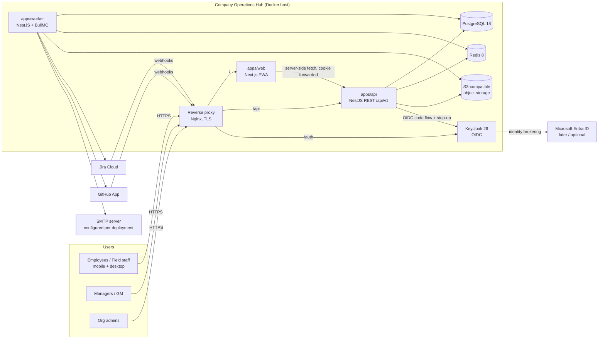
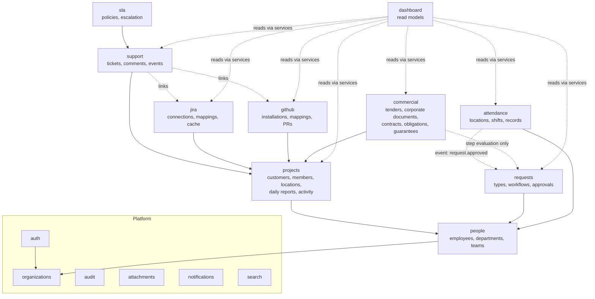
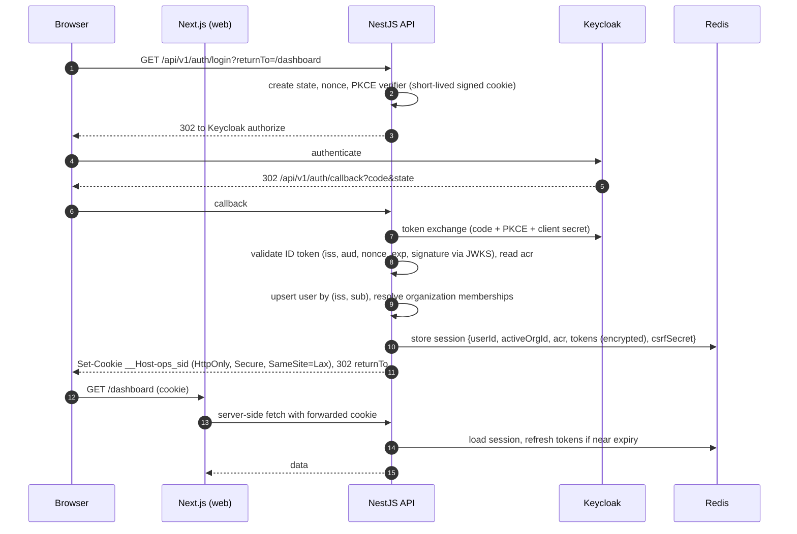
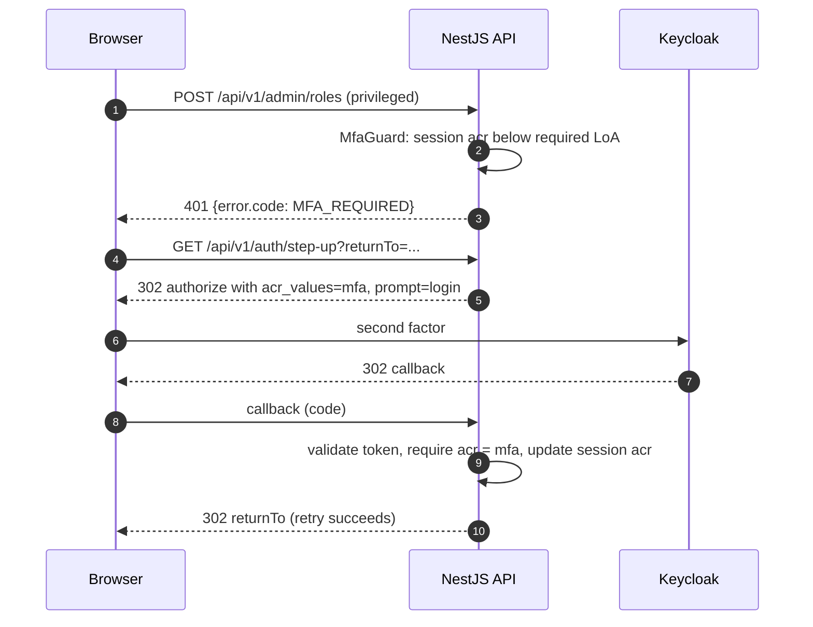

# Architecture

Status: Phase 0 baseline (remediated 2026-10-02). Changes require an ADR in `docs/adr/`.

---

## 1. System context



## 2. Architectural style

- **Modular monolith** (ADR-0001). One API deployable, one worker deployable, one web deployable, sharing one PostgreSQL database.
- **Runtime adapters vs. domain:** `apps/api` is the HTTP runtime adapter and `apps/worker` is the background runtime adapter. **All domain/application code lives in `packages/core`** (services, repositories, policies, state machines, integration ports/adapters) and is imported by both apps. Neither app contains business rules.
- Each business module in `packages/core/src/modules/<module>` owns its tables, services and public interface (`index.ts`). Modules interact only through:
  1. their exported **application services** (synchronous, in-process), or
  2. **domain events** written to the transactional outbox and processed asynchronously.
- No module imports another module's repositories or reads its tables. Enforced by `no-restricted-imports` patterns (only `modules/<x>/index.ts` is importable from outside `<x>`) and review (ADR-0014).
- **ESM everywhere** (`"type": "module"`, `module: nodenext`) — ADR-0013.

## 3. Runtime components

| Component | Responsibility | Scaling |
|---|---|---|
| `apps/web` | Next.js App Router UI + PWA shell. Server Components fetch from the API with the user's session cookie. No business rules; no secrets except its own runtime config. | Stateless; N replicas |
| `apps/api` | REST `/api/v1`, OpenAPI, OIDC relying party (BFF), authorization, validation, audit, webhook intake (verify → persist → enqueue), SSE stream (from Phase 3). | Stateless (sessions in Redis); N replicas |
| `apps/worker` | BullMQ processors: outbox relay, notifications, SLA/escalation, Jira/GitHub sync, reports, maintenance. | N replicas; per-queue concurrency |
| PostgreSQL 18 | System of record. | Vertical first; read replica later |
| Redis 8 | Sessions, BullMQ, rate-limit counters, SSE pub/sub, short-lived dashboard cache. **Not** a system of record. | Single instance with AOF; Sentinel later |
| Object storage | Attachments via the S3 API behind `StoragePort` (§13). | Deployment-chosen provider |
| Keycloak 26 | Authentication, MFA, step-up, SSO, optional IdP brokering. | Single instance + its own database |

### Queues

| Queue | Producers | Jobs | Phase |
|---|---|---|---|
| `maintenance` | scheduler, outbox relay | `outbox.relay`, `cleanup.expired-uploads`, `attachment-object.delete` (from `attachment.object.delete` events, P2); `retention.purge` (runs **only** for categories with an explicitly configured policy) | 1 (retention: 7) |
| `projects` | outbox relay | `project-activity.record` (from `project.activity.recorded` events; idempotent by `source_event_id`) | 2 |
| `notifications` | outbox relay | `notification.deliver` (in-app in Phase 1; email from Phase 3) | 1 |
| `sla` | scheduler, ticket events | `sla.evaluate.ticket`, `sla.sweep`, `escalation.evaluate` | 3 |
| `jira-sync` | outbox relay (admin actions, webhook intake, mapping changes, disconnect), repeatable schedulers | `jira.sync.run` (one bounded slice of an import/reconciliation run; re-enqueues itself), `jira.webhook.process`, `jira.webhooks.sync`, `jira.connection.cleanup`; scheduled `jira.schedule` (due reconciliations + stale-run watchdog, every ≤ 5 min) and `jira.webhooks.refresh` (daily) — §11a | 4 |
| `github-sync` | API (installation, webhook intake), scheduler | `github.installation.sync`, `github.webhook.process`, `github.reconcile.repo` | 5 |
| `requests` | outbox relay, scheduler | `request.effect.recorded` / `request.effect.revoked` (from `request.approved` / `request.effect.revoked` events; consumed by attendance from Phase 7: materialize or revoke the effect on past and current dates), scheduled `request.sla.sweep` (`REQUEST_SLA_SWEEP_INTERVAL_MS`) — §11c, §11d | 6 / 7 |
| `attendance` | scheduler | scheduled `attendance.missing-checkout.sweep` (`ATTENDANCE_SWEEP_INTERVAL_MS`, default 15 min; bounded per organization, idempotent `SYSTEM_MISSING_CHECKOUT` events, one in-app notice) — §11d | 7 |
| `commercial` | scheduler | scheduled `commercial.monitor` (`COMMERCIAL_MONITOR_INTERVAL_MS`, default 15 min; organizations with commercial records only, batches of 200; reminders deduplicated by `commercial_reminders`, calendar expiry of contracts and guarantees, recurring occurrence generation, health refresh, dashboard invalidation) — §11f | 10 |
| `reports` | scheduler, user exports | `daily-report.missing.check` (every 15 min; yesterday and today in each project's zone; notification dedupe per project, reporter and date), `export.generate` | 2 / 8 |

Job conventions: every job payload carries `organizationId` and the job re-validates it against the target record (`SECURITY.md` §4.4); deterministic `jobId` for deduplication where the job represents a state (e.g. `sla:<orgId>:ticket:<id>`); exponential backoff (5 attempts default); permanent errors (`4xx` except 408/429) are not retried; failed jobs retained and surfaced in **Admin → System → Jobs**.

### Transactional outbox

Business writes that must trigger async work insert an `outbox_events` row (with `organization_id`) **in the same transaction**. The relay job publishes them to BullMQ and marks them dispatched. We never commit a write without its follow-up job, and never enqueue a job for a rolled-back write.

## 4. Monorepo structure (target; created in Phase 1)

Phase 1A created the workspace skeleton below (apps, packages, `infra/compose`, `infra/docker`, `infra/nginx`, `ci.yml`, root config). Module directories, `apps/web` route groups, `e2e/`, `dependabot.yml` and production Compose/Dockerfiles are added by the later items that own them. The single source of truth for TypeScript settings is `packages/config/tsconfig/` (`base.json`, extended by `node.json`, `nestjs.json`, `nextjs.json`, `react-library.json`); every app and package extends one of these through `@company-ops/config`. There is no root `tsconfig.base.json` (tools that resolve `extends` through pnpm symlinks cannot follow a relative path back to the root); the root `tsconfig.json` only type-checks `scripts/`.

```text
company-operations/
├── apps/
│   ├── web/                         # Next.js 16 App Router, PWA
│   │   ├── src/app/                 # (public) and (app) route groups
│   │   ├── src/features/<module>/   # components + hooks per module
│   │   ├── src/i18n/                # next-intl request config (catalogs in packages/i18n)
│   │   ├── test/                    # component tests (Vitest + Testing Library)
│   │   └── e2e/                     # Playwright specs (+ axe)
│   ├── api/                         # HTTP runtime adapter (NestJS 12)
│   │   ├── src/main.ts, app.module.ts
│   │   ├── src/http/<module>/       # controllers, guards, interceptors, filters
│   │   ├── src/http/webhooks/       # Jira/GitHub intake (verify → persist → enqueue)
│   │   └── test/                    # HTTP integration tests (supertest + Testcontainers)
│   └── worker/                      # background runtime adapter (NestJS 12 app context)
│       ├── src/main.ts, worker.module.ts
│       ├── src/processors/<queue>/
│       └── test/
├── packages/
│   ├── core/                        # domain + application modules
│   │   ├── src/platform/            # tenancy (CLS), db access, raw SQL (db/sql/), outbox,
│   │   │                            # audit writer, storage port, email port, errors
│   │   ├── src/modules/{auth,organizations,people,projects,support,sla,requests,
│   │   │                attendance,jira,github,notifications,audit,attachments,
│   │   │                dashboard,search,admin}
│   │   └── test/                    # unit + repository/tenancy integration tests
│   ├── db/                          # Prisma schema, migrations, generated client (src/generated/), dev seed
│   ├── validation/                  # Zod 4 schemas shared by API (Standard Schema) and web
│   ├── api-client/                  # openapi-typescript output + openapi-fetch client (local TS 5.9.3)
│   ├── shared/                      # enums, permission catalog, error codes, pure utils (no I/O)
│   ├── ui/                          # shadcn/ui-generated components, tokens, Tailwind preset
│   ├── i18n/                        # message catalogs (en, ar) + typed keys
│   ├── config/                      # tsconfig bases, env schema helpers
│   └── eslint-config/               # flat configs: base, node, next
├── infra/
│   ├── docker/                      # Dockerfiles (api, worker, web), Keycloak realm export
│   ├── nginx/                       # reverse proxy config (dev TLS + prod)
│   └── compose/                     # docker-compose.dev.yml, docker-compose.prod.yml
├── .github/
│   ├── workflows/ci.yml             # lint, typecheck, test, build, openapi drift, e2e, gitleaks, codeql
│   └── dependabot.yml
├── docs/                            # PRD, ARCHITECTURE, DATA_MODEL, SECURITY, INTEGRATIONS,
│   └── adr/                         # ROADMAP, DEPLOYMENT, DEPENDENCIES, UI_UX; ADRs
├── package.json, pnpm-workspace.yaml, turbo.json, tsconfig.json, eslint.config.js
├── .nvmrc (24), .editorconfig, .gitattributes, .gitignore, .env.example
└── README.md
```

Dependency direction (enforced by lint rules):

- `apps/api`, `apps/worker` → `packages/core` → `packages/db`, `packages/shared`, `packages/validation`.
- `apps/web` → `packages/api-client`, `packages/ui`, `packages/shared`, `packages/validation`, `packages/i18n`.
- **`apps/web` never imports `packages/core` or `packages/db`.** `packages/core` never imports `apps/*`.

Deviations from the suggested layout (ADR-0001): `packages/core`, `packages/db`, `packages/validation`, `packages/api-client`, `packages/i18n`.

## 5. Module map



Every module depends on `audit`, `notifications` (via outbox events) and `attachments` where relevant; arrows omitted for clarity.

## 6. Authentication architecture (ADR-0002)

**Pattern: API as Backend-for-Frontend (confidential OIDC client) with server-side sessions.** Tokens never reach the browser.



**MFA step-up** (privileged capabilities, `SECURITY.md` §2.3):



Key points:
- Web and API are **same-site** behind the reverse proxy (`/` → web, `/api` → API), so the session cookie is first-party with `SameSite=Lax`.
- **CSRF**: state-changing requests send `X-CSRF-Token` (synchronizer token bound to the session, from `GET /api/v1/auth/csrf`) and pass `Origin` verification.
- **Session lifetime**: idle 30 min, absolute 12 h (configurable). Keycloak back-channel logout invalidates our session. Step-up `acr` expires with the session or after a configurable max age (default 12 h).
- **Logout**: RP-initiated logout to Keycloak's end-session endpoint + session deletion.
- **Entra ID**: later/optional identity provider inside Keycloak; no application change.

**As implemented in Phase 1** (differences from the diagrams above; details in `SECURITY.md` §3.3):
- The OIDC transaction (state, nonce, PKCE verifier) is stored server-side in Redis, keyed by an opaque handle in the `__Host-ops_oidc` cookie, not in a signed cookie.
- The session stores user, active organization, member, `authz_version`, role keys, effective permissions, `acr`, MFA time, IdP `sid`, the encrypted ID token (logout hint only) and the CSRF token. Access and refresh tokens are not kept and **tokens are not refreshed**. Membership status and `authz_version` are re-checked in PostgreSQL on every request.
- Step-up sends `acr_values=mfa` without `prompt=login`, so Keycloak reuses the password session and only asks for the second factor. ORG_ADMIN logins are redirected for `acr=mfa` before any session is created.
- The MFA check is part of `PermissionGuard`. The browser reaches the API through the web origin, so the callback URL is `${APP_PUBLIC_URL}/api/v1/auth/callback`. In production Nginx routes `/api` straight to the API. Without Nginx (development, E2E), the web app's `proxy.ts` forwards `/api/*` at request time to `API_INTERNAL_URL` and **removes client-supplied forwarding headers** (`Forwarded`, `X-Forwarded-*`, `X-Real-IP`), so the API's per-IP limits cannot be bypassed by spoofing them (`SECURITY.md` §5).
- Cookies are parsed by a small strict reader (duplicates rejected); `cookie-parser` is not used.
- Organization provisioning, the bootstrap CLI and the dev seed share application services in `packages/core` (`provisionOrganization`, `bootstrapOrganization`, `seedDemoData`).
- Employees are invited, never given passwords: creating an employee returns a single-use invitation link (only a SHA-256 hash is stored, 7-day expiry). The invitee signs in with Keycloak and the callback binds that Keycloak user to the invited membership.

## 7. Request pipeline (API)

```text
Nginx (TLS, body limits, real IP)
 → helmet / CORS (allow-list) / compression
 → request-id middleware (accept X-Request-Id if valid UUID, else generate; echo)
 → pino-http structured logging (redaction list)
 → session middleware (Redis)
 → AuthGuard (401 unless @Public)
 → TenantContext (activeOrgId from session → nestjs-cls)
 → ThrottlerGuard (Redis; per-user + per-IP; stricter for auth, webhooks, check-in)
 → PermissionGuard (@RequirePermission('support.assign') — coarse capability)
 → MfaGuard (privileged capabilities → MFA_REQUIRED if acr insufficient)
 → StandardSchemaValidationPipe (Zod schemas from packages/validation; ADR-0004)
 → Controller → application service (packages/core)
     → policy check (scope, project membership, ownership)
     → tenant-scoped repository
     → Prisma transaction (+ audit row + outbox event)
 → StandardSchemaSerializerInterceptor (explicit response schema; never raw Prisma models)
 → exception filter (error envelope; no stack traces)
```

Order as implemented in Phase 1: helmet / CORS / body limits → `nestjs-cls` middleware → pino-http (request id, redaction) → global guards `ThrottlerGuard` (per IP: `default`, `auth`, `webhook` buckets) → `SessionGuard` (deny by default; loads and revalidates the session, sets the CLS tenant) → `PrincipalRateLimitGuard` (per user: `user`, plus `sensitive` or `upload` where declared) → `CsrfGuard` → `PermissionGuard` (permission + MFA) → validation pipe → controller → core service (scope policy, list scope filters) → tenant-guarded Prisma client (+ audit row + outbox event in the same transaction). Core services map rows to explicit response views; the same Zod response schemas generate OpenAPI and are parsed against real responses in the integration tests. There are no test-only endpoints; an integration test asserts that the former `/security-probe/*` routes return 404.

## 8. API inventory (`/api/v1`)

High-level surface. Detailed contracts are generated as OpenAPI from the Zod schemas (`/api/v1/docs` in non-production). "P" = delivery phase (`ROADMAP.md`). Every endpoint is tenant-scoped to the session's active organization unless marked *platform* or *public*.

| Area | Base path | Main operations | P |
|---|---|---|---|
| Auth | `/auth` | `GET login`, `GET callback`, `GET step-up`, `POST logout`, `GET csrf`, `POST backchannel-logout` (*public*, Keycloak only) | 1 |
| Me | `/me` | `GET /me` (profile, active org, effective permissions + scopes, MFA state); `PUT /me/active-organization`; `GET/PATCH /me/profile` (own contact fields, locale, time zone) | 1 |
| Organization | `/organization` | `GET`, `PATCH` (name, time zone, work week, default locale) — the session's active organization | 1 |
| Employees | `/employees` | list/search (cursor), `GET /:id`, `POST` (creates profile + invited membership, returns the invitation link once), `PATCH /:id`, `PUT /:id/status` (enable/disable access), `POST/DELETE /:id/invitation` (reissue/revoke), `PUT /:id/avatar`, `GET /:id/avatar-url`; `GET /:id/projects` arrives in P2 | 1 |
| Departments | `/departments` | list, `GET /:id`, `POST`, `PATCH /:id`, `POST /:id/archive`, `POST /:id/unarchive` | 1 |
| Teams | `/teams` | list, `GET /:id`, `POST`, `PATCH /:id`, `POST /:id/archive`, `POST /:id/unarchive`, `GET /:id/members`, `PUT/DELETE /:id/members/:employeeId` | 1 |
| Job titles | `/job-titles` | list, `POST`, `PATCH /:id` | 1 |
| Roles | `/roles`, `/members/:memberId/roles` | list system roles; list/grant/revoke a member's roles (MFA, audited, escalation rules) | 1 |
| Projects | `/projects` | list (cursor; allow-listed filters/sorts), `GET /:id`, `POST`, `PATCH /:id`, `PUT /:id/status`, `PUT /:id/health`, `POST /:id/archive`, `POST /:id/restore`; `GET/POST /:id/members`, `PATCH/DELETE /:id/members/:employeeId`; `GET/POST /:id/locations`, `DELETE /:id/locations/:locationId`; `GET /:id/activity`; `GET/POST /:id/daily-reports`, `GET /:id/daily-reports/missing`; `GET /daily-reports/:id`; `GET /employees/:id/projects` | 2 |
| Customers | `/customers` | list, `GET /:id`, `POST`, `PATCH /:id` (incl. `archived`) | 2 |
| Work locations | `/work-locations` | list, `POST`, `PATCH /:id` (`attendance.config`); reused by attendance (P7) | 2 |
| Support | `/support/tickets` | list (queue views, allow-listed filters/sorts, cursor), `GET /:id`, `POST` (optional `Idempotency-Key`), `PATCH /:id`; `PUT /:id/assignment`, `GET /:id/assignees`; `POST /:id/transitions`; `GET /:id/history`; `GET/POST /:id/comments`, `PATCH /:id/comments/:commentId`; `GET/POST /:id/watchers`, `DELETE /:id/watchers/:memberId`; config `GET/POST/PATCH /support/{categories,components,calendars,sla-policies,escalation-rules}`; `GET /projects/:id/support`, `PUT /projects/:id/support-team`; Jira panel routes under `/:id/jira` (P4, see Jira row); GitHub panel routes under `/:id/github` (P5, see GitHub row) | 3 |
| Requests | `/requests`, `/request-types`, `/request-admin/types` | `GET /requests` (`view=mine` / in scope), `POST` (draft or submit, `Idempotency-Key`), `GET`/`PATCH /:id`, `POST /:id/submit`, `/:id/cancel`, `/:id/fulfillment`, `/:id/reassign`, `GET /:id/history`; `GET /request-types`, `/:id/form`; admin: types CRUD, `/:id/versions` (list, create draft, get, `PUT` draft, `/publish`, `/discard`) | 6 |
| Approvals | `/approvals`, `/approval-delegations` | `GET /approvals` (inbox), `/approvals/summary`, `POST /approvals/:approvalId/approve`, `/reject`; `GET`/`POST /approval-delegations`, `POST /:id/revoke` | 6 |
| Attendance | `/attendance` | `GET /today`; `POST /check-in`, `POST /check-out` (required `Idempotency-Key`, `attendance` rate-limit bucket); `GET /me/records`; `GET /records` and `GET /team/day` (scope); `GET /records/:id`; `GET /reviews`, `POST /events/:id/review`; `GET /export` (CSV, ≤ 62 days); `GET/POST /corrections` (becomes an `attendance_correction` request); `POST /admin/corrections` (fresh MFA); `GET/PUT /policy` (PUT: `org.settings.manage`, fresh MFA); `GET/POST /shifts`, `PATCH /shifts/:id`, `GET/POST /shift-assignments`, `POST /shift-assignments/:id/end` (`attendance.config`) | 7 |
| Jira | `/integrations/jira` | `GET /` (status), `POST /connect`, `GET /callback`, `GET /grants/:grantId/sites`, `POST /grants/:grantId/select`, `DELETE /connections/:id?version=`, `GET /projects` (live Jira project search), `GET/POST /mappings`, `PATCH/DELETE /mappings/:id`, `POST /mappings/:id/runs`, `GET /sync-runs`, `GET /sync-runs/:id`, `POST /sync-runs/:id/{cancel,retry}`, `GET /webhook-deliveries/failures` (all `integration.manage`, ORG, MFA); ticket-side: `GET /support/tickets/:id/jira`, `GET …/jira/search`, `POST …/jira/links`, `DELETE …/jira/links/:linkId`, `GET …/jira/issue-types`, `POST …/jira/issues` (`Idempotency-Key`); `GET /projects/:id/jira` (`INTEGRATIONS.md` §1.9) | 4 |
| GitHub | `/integrations/github` | As built: `GET /` (status), `POST /install`, `GET /setup`, `GET /callback`, `POST /installations/:id/refresh`, `DELETE /installations/:id?version=`, `GET /repositories`, `POST /mappings`, `DELETE /mappings/:id?version=`, `POST /repositories/:id/sync`, `GET /sync-runs`, `GET /sync-runs/:id`, `POST /sync-runs/:id/cancel`, `GET /webhook-deliveries` (all `integration.manage`, ORG, MFA); project-side `GET /projects/:id/github`, `GET …/github/pulls`, `GET …/github/jira-issues`, `POST …/github/pulls/:pullId/jira-links`, `POST …/github/jira-links/:linkId/{confirm,dismiss}`; ticket-side `GET /support/tickets/:id/github`, `GET …/github/search`, `POST …/github/links`, `DELETE …/github/links/:linkId`; retention `GET /organization/retention-policies`, `GET …/:category/preview`, `PUT/DELETE …/:category` (`org.settings.manage`, MFA) (`INTEGRATIONS.md` §2.6) | 5 |
| Webhooks | `/webhooks` | `POST /webhooks/jira/:connectionId` (*public*, JWT-verified, P4); `POST /webhooks/github` (*public*, HMAC-verified, P5) | 4 / 5 |
| Dashboard | `/dashboard` | As built: `GET /dashboard/me` (signed in), `GET /dashboard/team` (`attendance.team`), `GET /dashboard/support` (`support.view` beyond SELF), `GET /dashboard/projects` (`dashboard.project`), `GET /dashboard/executive` (`dashboard.executive`), `GET /dashboard/needs-attention` (signed in, per rule), `GET /dashboard/trends?metric=&range=` (per metric). The HR and technical views are the team and projects dashboards with HR's and the technical manager's scopes (ADR-0023); there is no per-project dashboard route (the project overview is the project screen) | 8 |
| Tenders | `/tenders` | list, `POST`, `GET /my-work`, `GET`/`PATCH`/`DELETE /:id` (DELETE: DRAFT only), `POST /:id/transition`, `POST /:id/bid-decision`, `GET /:id/bid-decisions`; requirements `GET/POST /:id/requirements`, `GET/PATCH/DELETE …/:requirementId`, `POST …/status`, `POST …/links`, `DELETE …/links/:linkId`; reviews `GET/POST /:id/reviews`, `POST …/:reviewId/decision`; `POST /:id/submission` and `…/corrections`, `GET /:id/submissions`, `POST /:id/award`, `/:id/loss`, `/:id/contract` (all four with `Idempotency-Key`); `GET/POST /:id/addenda`, `GET/POST /:id/clarifications`, `PATCH …/:clarificationId`; `GET/POST /:id/documents`, `GET/POST /:id/guarantees`, `GET /:id/timeline` | 10 |
| Contracts | `/contracts` | list, `POST`, `GET`/`PATCH /:id`, `POST /:id/transition`, `GET /:id/timeline`, `GET/POST /:id/renewal-actions` (decisions with `Idempotency-Key`); `GET/POST /:id/obligations`, `PATCH …/:obligationId`, `POST …/cancel`; `GET /:id/occurrences`, `POST …/:occurrenceId/status`; `GET/POST /:id/milestones`, `PATCH …/:milestoneId`, `POST …/status`; `GET/POST /:id/amendments`, `GET/PATCH …/:amendmentId`, `POST …/actions`; `GET/POST /:id/documents`, `GET/POST /:id/guarantees` | 10 |
| Commercial documents and guarantees | `/corporate-documents`, `/commercial-documents`, `/guarantees` | vault list, `POST`, `GET`/`PATCH /:id`, `POST /:id/versions`; tender/contract document `GET /:documentId`, `POST …/versions`; guarantee `GET`/`PATCH /:guaranteeId`, `POST …/status` | 10 |
| Commercial | `/commercial`, `/projects/:id/commercial`, `/dashboard/commercial` | `GET/PUT /commercial/settings` (PUT: `org.settings.manage`), `GET /commercial/reports/:report` (CSV); project Commercial tab; commercial dashboard (Needs Attention items through `/dashboard/needs-attention`) | 10 |
| Organization setup | `/organization/setup-checklist` | `GET` (derived from real state on every request; `org.settings.manage` at ORG) | 8 |
| Notifications | `/notifications` | list, `GET /unread-count`, `POST /:id/read`, `POST /read-all`; `GET /notifications/events/stream` (SSE, P3); `GET/PUT /notifications/preferences` (own preferences only, CSRF on `PUT`, P8) | 1 / 3 / 8 |
| Attachments | `/attachments` | `POST /upload-intents` (pre-signed PUT), `POST /:id/complete` (size, MIME sniff, SHA-256), `GET /:id`, `GET /:id/download-url` (short-lived URL, owner-authorized); `GET ?ownerType=&ownerId=`, `DELETE /:id` (daily-report attachments, P2; ticket attachments, P3) | 1 / 2 / 3 |
| Audit | `/audit` | `GET /audit/events` (filters: actor, entity, action, date range), `GET /audit/events/:id` | 1 |
| Search | `/search` | `GET /search?q=&types=&limit=&cursor=&locale=` (authorization in each entity's SQL `where`; 2–100 characters; per-user rate limit `RATE_LIMIT_SEARCH_PER_MINUTE`, refused queries count too) | 8 |
| Admin | `/admin` | `GET /admin/failed-jobs` (P1); custom roles CRUD (P9-8), `/admin/retention-policies` (P7), `/admin/setup-state` (P8) | 1 / 7 / 8 / 9 |
| Health | `/health` | `GET live`, `GET ready` (*public*, internal network) | 1 |
| Platform | `/platform` | org bootstrap / support access sessions — **deferred** (ADR-0010); first org via CLI | — |

### 8.1 Conventions

**Envelope**

```jsonc
// Single resource
{ "data": { } }

// List (cursor pagination, default)
{ "data": [ ], "page": { "nextCursor": "eyJpZCI6...", "hasMore": true, "limit": 25 } }

// Error
{
  "error": {
    "code": "ATTENDANCE_OUTSIDE_GEOFENCE",
    "message": "You are outside the allowed check-in area.",
    "details": { "distanceMeters": 412, "allowedRadiusMeters": 150 },
    "fieldErrors": [ { "path": "reason", "code": "too_small" } ],
    "requestId": "0191f6d0-..."
  }
}
```

**Pagination.** Cursor-based: `?limit=` (default 25, max 100) and `?cursor=` (opaque, base64url-encoded `(sortKey, id)`); stable ordering always ends with `id`. Offset pagination (`?page=&pageSize=`) is allowed only for small admin tables (< 1,000 rows), returning `page.total`. Totals are not computed for large lists.

**Filtering.** Explicit, documented query parameters per endpoint, each validated by the Zod schema (enums/allow-lists, ISO dates, UUIDs): e.g. `?status=OPEN,IN_PROGRESS&severity=CRITICAL&projectId=…&assigneeId=me&createdFrom=2026-10-01`. Multi-value = comma-separated. `me` is a server-resolved alias. No generic "filter by any column"; unknown parameters → `400 VALIDATION_FAILED`. Scope filters from the policy service are always applied **in addition** to user filters.

**Sorting.** `?sort=field:dir[,field:dir]` from a per-endpoint allow-list (e.g. `createdAt`, `updatedAt`, `priority`, `dueAt`); default `createdAt:desc`.

**Errors.** HTTP status + stable `error.code` from `packages/shared/src/errors.ts`:

| Status | Codes (examples) |
|---|---|
| 400 | `VALIDATION_FAILED` (with `fieldErrors`) |
| 401 | `UNAUTHENTICATED`, `SESSION_EXPIRED`, `MFA_REQUIRED` |
| 403 | `FORBIDDEN` (authenticated, lacks capability on a visible resource), `CSRF_INVALID` |
| 404 | `NOT_FOUND` (also for foreign-tenant or out-of-scope identifiers) |
| 409 | `CONFLICT` (unique), `VERSION_CONFLICT` (optimistic lock), `INVALID_TRANSITION` |
| 422 | Domain rule violations, e.g. `ATTENDANCE_OUTSIDE_GEOFENCE`, `ATTENDANCE_LOW_ACCURACY` |
| 429 | `RATE_LIMITED` (with `Retry-After`) |
| 5xx | `INTERNAL_ERROR`, `DEPENDENCY_UNAVAILABLE` (no internal details) |

User-facing text is resolved by the web app from translation keys keyed by `error.code`; `message` is an English fallback. Prisma errors are mapped (`P2002` → `CONFLICT`, `P2025` → `NOT_FOUND`) and never surfaced raw.

**Other.** IDs are UUIDv7 strings; timestamps are ISO-8601 UTC; business dates are `YYYY-MM-DD` in the org time zone. Mutations on versioned resources require `If-Match: <version>` or `version` in the body. Idempotency for create endpoints prone to double-submit (check-in, ticket create from mobile) via `Idempotency-Key` header stored for 24 h per user.

## 9. Frontend architecture

UX details are in `UI_UX.md`.

- **App Router** route groups: `(public)` for login/unauthorized/session-expired, `(app)` for the authenticated shell.
- **Server Components** load initial page data via a server-only API client (forwards cookie + request id). **Client Components** are interactive islands (tables, forms, check-in, notifications) using **TanStack Query** hydrated from the server payload.
- **Typed API contract**: API emits `openapi.json` at build; `packages/api-client` runs `openapi-typescript` (package-local TS 5.9.3, ADR-0005) and exports an `openapi-fetch` client. CI fails if the generated output is stale.
- **Forms**: React Hook Form + `@hookform/resolvers/zod` with schemas from `packages/validation`.
- **Permissions in UI**: `GET /api/v1/me` returns effective permissions + scopes; a `<Can permission="...">` helper hides affordances. UX only — the API is authoritative.
- **i18n**: `next-intl`, catalogs in `packages/i18n`; `dir="rtl"` for Arabic; logical Tailwind utilities only.
- **PWA**: `app/manifest.ts`, icons, theme color; minimal service worker for an offline fallback page (no offline data sync in V1).
- **Real-time (Phase 3+)**: one `EventSource` per tab; events invalidate TanStack Query keys or show toasts (§11).

## 10. Multi-tenancy (ADR-0003)

The normative rules, enforcement layers and the tenancy checklist (API requests, repositories, background jobs, SSE/pub-sub channels, Redis keys, dashboard caches, search, attachments, webhooks, outbox, scheduled jobs, audit access) are in **`SECURITY.md` §4**. Summary:

- `Organization` is the tenant root; tenant-owned tables have non-null `organization_id` leading their indexes.
- Tenant context is server-derived (session or validated job payload). Client-supplied `organizationId` is rejected.
- Every relation between tenant-owned entities preserves organization identity, enforced by services **and** composite foreign keys `(organization_id, x_id) → parent(organization_id, id)` (`DATA_MODEL.md` §2).
- Raw SQL only in `packages/core/src/platform/db/sql/`, with explicit `organization_id` binding; `$queryRawUnsafe`/`$executeRawUnsafe` banned.
- Foreign-tenant identifiers return `404`.
- PostgreSQL RLS was evaluated in Phase 9 and is not enabled in V1 (ADR-0025, compensating controls).

## 11. Real-time (Phase 3)

- SSE endpoint `GET /api/v1/notifications/events/stream` (session cookie). Heartbeat every 25 s; Nginx buffering disabled for that location.
- Workers and API publish to Redis channels that always include the org: `rt:org:<orgId>:user:<userId>` and `rt:org:<orgId>:perm:<permission>` (broad alerts are fanned out only to connected users whose effective permissions in that org match). A connection subscribes only to channels of its session's active org.
- Payloads are minimal (`{ type, entityType, entityId }`); the client refetches through authorized endpoints, so SSE never carries record data.

Implemented in Phase 3 (ADR-0018): `apps/api/src/realtime/` serves the stream and subscribes with a dedicated ioredis subscriber; `rt:org:<orgId>:perm:support.view` is subscribed only by members holding `support.view` at ORG scope. Publishers (API services and the worker) send after commit through the `RealtimePublisher` port, and a publishing failure is logged, never surfaced to the business operation. A stream re-checks its session every 60 s without extending it and closes when the session ends or the member's grants change; each API process allows five streams per user. The web app (`apps/web/src/lib/live-updates.ts`) keeps one `EventSource` per tab, reconnects with exponential backoff (up to 60 s), and invalidates the notification and ticket queries named by the event.

**Stream limit scope (Phase 4 review).** The five-streams-per-user limit is held in memory by each API process (`apps/api/src/realtime/`). With N API replicas a user can hold up to 5 × N streams. It is a resource-protection measure against one user exhausting a process's connections, **not a tenant-isolation or authorization boundary**: isolation comes from the session-bound, org-prefixed channel subscriptions and the permission checks above. Horizontal scaling would need a distributed limiter (for example a Redis counter with per-connection leases) if a global per-user cap is required; that is deliberately not built now. Phase 9 scaling review: kept as is. Production runs one or two API replicas behind nginx, which also caps connections per address (100), so the per-process limit stays adequate.

Phase 4 adds `jira.sync.progress` (`entityType: jira_sync_run`) on `rt:org:<orgId>:perm:integration.manage` after each sync page; the admin screens re-fetch runs and mappings. Ticket Jira history events reuse the existing ticket events.

## 11a. Jira integration (Phase 4)

Jira is a worker-side synchronizer around a rebuildable cache (`INTEGRATIONS.md` §1.9, ADR-0019). The API performs only short, user-initiated Jira calls (OAuth exchange, project search, ticket issue search, issue types, issue create) and the webhook intake, which verifies, records the delivery and enqueues without calling Jira. Everything else runs in the worker on the `jira-sync` queue: bounded sync slices with persisted checkpoints, webhook processing that re-fetches issues, webhook registration and refresh, connection cleanup, and the schedulers. All jobs arrive through the outbox and are re-scoped to the event's organization; each handler re-reads persisted state, so redelivery is safe. Coordination uses Redis: one slice per connection at a time, a per-connection token-refresh lock and a per-connection rate-limit pause. Tokens are decrypted only inside the adapter (`JiraClient`), which owns retries, backoff and error classification.

## 11b. GitHub integration (Phase 5)

GitHub follows the same shape (`INTEGRATIONS.md` §2.6, ADR-0020) around a rebuildable pull-request metadata cache (`packages/core/src/modules/github/`). The API performs only the setup round trip (App JWT and the installing user's short-lived token, revoked at once) and the webhook intake (`apps/api/src/http/github-raw-body.ts` captures the raw body with a byte cap; the controller verifies, records identifiers and enqueues through the outbox without calling GitHub). Everything else runs in the worker on the `github-sync` queue (concurrency 4): `github.installation.sync` (repository discovery), `github.webhook.process` (re-fetches the pull request, reviews and checks, with coalescing of covered refreshes), `github.reconcile.repo` (bounded initial-sync, reconciliation and manual re-sync slices with persisted checkpoints), and the `github.schedule` / `github.installations.refresh` schedulers with a stale-run watchdog. Jobs are re-scoped to the outbox event's organization and re-read persisted state. Coordination uses Redis: a per-installation token lock and encrypted token cache, and a per-installation rate-limit pause honoured by every process. The adapter (`GithubHttp`, `GithubTokenService`, `GithubClientFactory`) owns API versioning, retries, backoff, pagination limits and error classification; page rendering never calls GitHub. `github.sync.progress` (`entityType: github_sync_run`) is published on `rt:org:<orgId>:perm:integration.manage` after each slice. Retention runs on the `maintenance` queue (`retention.purge`, daily by default) through the `purge_integration_records` database function.

## 11c. Requests and approvals (Phase 6)

One generic engine (ADR-0021) in `packages/core/src/modules/requests/`. `engine/` is pure (form validation, condition evaluation through the shared evaluator in `packages/shared`, route planning, approver selection over a pre-loaded snapshot, ANY_ONE/ALL step decisions) and unit-tested without a database. The services around it (`request-type-admin`, `request`, `approval`, `delegation`, `request-sla-sweep`) load the snapshot, call the engine and persist the result in one transaction together with `request_events`, audit entries, outbox notifications and, on final approval, the `request_effects` row plus the `request.approved` outbox event. Decisions lock the request row with a conditional update, so concurrent approvers serialize and the workflow advances once. Approvers are resolved and frozen when a step activates; database triggers keep published versions, submitted requests, decided approvals and history immutable. Notifications use the Phase 3 outbox, email re-check and SSE (`request.changed` hints to the people involved); attachments use the Phase 2 storage foundation (owner `REQUEST`). The worker's `requests` queue sends SLA reminders and hands effects to attendance (§11d). The web app has `/requests` (My requests), `/requests/new`, `/requests/[id]`, `/approvals` (My approvals), `/approvals/delegations` and `/admin/request-types` (builder, versions, publish).

## 11d. Attendance (Phase 7)

`packages/core/src/modules/attendance/` (ADR-0022). `engine/` is pure and unit-tested: haversine geofencing with the accuracy rule (low accuracy is never `INSIDE`), DST-safe wall-time conversion, work-date resolution for overnight shifts, record derivation (status, mode, late/early and worked minutes from the shift snapshot, events and request effects) and day status (future days are never absent). `AttendanceService` owns Today, check-in/out, history, team views, record detail, reviews and the CSV export; `AttendanceCorrectionService` turns employee corrections into Phase 6 requests of the reserved `attendance_correction` type and applies administrator corrections; `ShiftService` and `AttendancePolicyService` hold configuration; `AttendanceEffectConsumer` materializes `request_effects` (worker, `requests` queue); `missing-checkout-sweep` runs on the `attendance` queue; coordinate retention is a category of the existing `retention.purge` (`purge_attendance_coordinates`, SECURITY DEFINER, bounded). Every write for one employee takes a transaction-scoped advisory lock (`lockAttendanceProfile`), appends to `attendance_events` (append-only by trigger and grants) and re-derives the `attendance_records` row in the same transaction; audit entries and outbox notifications are written in that transaction too. The client sends only its position (or why it has none); the server picks eligible locations, time, distance and result. The web app has `/attendance` (Today, History, Corrections), `/attendance/team` (Day, Records with export, Review queue), `/attendance/records/[id]` (summary and evidence, never coordinates) and `/admin/attendance` (policy, shifts, assignments); work locations stay on `/admin/work-locations`.

Performance review (Phase 7, 2026-10-04): every list filters, orders and pages in SQL (keyset cursors, page size at most 100) on indexes that start with `organization_id`. Today is a fixed handful of indexed queries: the employee, policy, two days of assignments, effects, records and eligible locations. History and team records use `(organization_id, member_id, work_date)` and `(organization_id, work_date, status)`; record detail reads at most 500 events through `(organization_id, record_id, recorded_at, id)`; the review queue uses `(organization_id, review_status, recorded_at)`. The team day view loads one page of profiles, then that page's records, effects and shift assignments in three batched queries (it made two queries per employee before this review). The missing-checkout sweep reads at most 500 open records per organization and pass through `(organization_id, status, scheduled_end_at)`, with one short transaction per flagged record under that employee's lock. Effect materialization writes at most 62 days per effect. Correction history uses `(organization_id, requester_member_id, …)` on the adjustment table and the Phase 6 request indexes. The export reads at most 10 001 rows in one query, with no per-row lookups.

## 11e. Dashboards, Needs Attention, search, setup checklist and preferences (Phase 8)

`packages/core/src/modules/dashboard/` (ADR-0023). `engine/` is pure and unit-tested (local-date ranges and buckets, attention ordering and deduplication, scope hashing, LIKE escaping). `DashboardService` builds the role dashboards from section builders (`dashboard-sections.ts`), `NeedsAttentionService` evaluates the rules, `SearchService` runs the per-entity searches, `SetupChecklistService` derives the checklist and `NotificationPreferenceService` owns preferences. Services are read-only except preferences (audited `notification.preferences.updated`). The web app has the home screen `/`, `/dashboards/{support,projects,team,executive}`, `/admin/setup`, `/notifications/preferences` and the search palette in the shell.

### Metric definitions

Every linked number is counted with the `where` builder and filter object of the list its link opens, in the caller's server-resolved scope. "Today" is the organization's local date (`organizations.time_zone`) unless stated.

| Section | Number | Definition | Opens |
|---|---|---|---|
| Me | Approvals waiting / overdue | Pending approval steps assigned to me (own or delegated) — overdue when `due_at` is before now | `/approvals`, `/approvals?overdue=true` |
| Me | My requests in approval | My requests in `PENDING_APPROVAL` | `/requests?status=PENDING_APPROVAL` |
| Me | My open tickets / assigned to me | Open tickets I reported / open tickets assigned to me (assigned only for members who work tickets) | `/support?view=open&reporterMemberId=…` / `…&assigneeMemberId=…` |
| Support | Open, critical | Queue views `open` and `critical` of the ticket list in the `support.view` scope | `/support?view=…` |
| Support | New, escalated, waiting for development / customer | Tickets in that status | `/support?view=all&status=…` |
| Support | SLA at risk / breached | Open tickets whose first-response or resolution clock is in that state (stored by the SLA sweep) | `/support?view=open&slaState=…` |
| Support | Resolved today | `resolved_at` within today's local window (a reopened ticket no longer counts) | `/support?view=all&resolvedFrom=…&resolvedTo=…` |
| Projects | Active projects; healthy / needs attention / at risk / critical | Projects in PLANNING, ACTIVE, ON_HOLD or MAINTENANCE in the `project.view` scope, by stored health | `/projects?status=…[&health=…]` |
| Projects | Missing reports today | Active and maintenance projects whose daily report the caller may view, members without today's report after the due time (not linked: a count across projects) | — |
| Development | Jira open / blocked / overdue | Cached issues of mapped projects in `jira.view` scope: not DONE / blocked and not DONE / due date before today (UTC, as on the project Jira tab) and not DONE | project Jira tab per project |
| Development | GitHub open / awaiting review / changes requested / failing checks | Cached open pull requests of mapped repositories in `github.view` scope (each pull request once); awaiting review excludes drafts | project GitHub tab per project |
| Attendance | Employees and day buckets (present, remote, on leave, on mission, late, not checked in, missing check-out) | The team-day list's derivation for today in each employee's zone, in the `attendance.team` scope | `/attendance/team?date=…[&bucket=…]#day` |
| Attendance | Check-ins to review | The low-accuracy review queue in scope | `/attendance/team#reviews` |
| Trends | Support created / resolved per day; check-ins per day | Stored `created_at` / current `resolved_at` bucketed by local date; check-ins by work date; today, 7, 30 or 90 days, zero-filled | — |

Integration freshness is always shown next to Jira and GitHub numbers: the connection's last successful sync (Jira) or the latest repository sync (GitHub), flagged stale after the threshold or when the connection needs attention. The dashboards never call Jira or GitHub.

### Invalidation

The worker bumps per-organization domain counters (`support`, `projects`, `requests`, `attendance`, `jira`, `github`) when it consumes the matching outbox events and after Jira/GitHub sync jobs; `dashboard.changed` outbox events carry domain-only payloads for changes that have no other event. The browser refetches dashboard queries on the existing SSE change hints, on window focus and every 60 s; SSE never carries dashboard data.

Performance review (Phase 8, 2026-10-04): every count is a `count` or `groupBy` on indexes that start with `organization_id`; no per-row loops (missing reports use three queries for all projects in scope, watchlist ticket counts are grouped by project). Search uses pg_trgm GIN indexes on the searched columns and a bounded `take` per entity; exact keys use the unique `(organization_id, number)` indexes. Query plans were checked with `EXPLAIN (ANALYZE)` on the development PostgreSQL 18 against session-only copies of `projects` (120 000 rows), `support_tickets` (200 000) and `employee_profiles` (102 000) spread over 100 organizations, with the same indexes: project health counts use `(organization_id, status)` (3 ms for ~800 projects in one organization); open ticket counts scan one organization's index range (6 ms for ~2 000 tickets); "resolved today" is an index-only scan of the partial `resolved_at` index (0.1 ms); `SUP-n` uses the unique `(organization_id, number)` index; name and title searches combine the organization index with the trigram GIN index in a `BitmapAnd` (0.2–0.6 ms for selective text, 16 ms for a word that half of all tickets contain). On the small seed data the planner prefers sequential scans, as expected.

## 11f. Tenders and contracts (Phase 10)

`packages/core/src/modules/commercial/` (ADR-0026). `engine/` is pure and unit-tested: tender and contract state machines, the readiness formula, the contract projection (baseline plus effective amendments and renewal actions), bounded recurrence with month-end clamping, deterministic health reasons, date rules (organization-local "today", 09:00-local reminder instants, notice deadlines) and decimal money. Services: `TenderService`, `TenderRequirementService`, `TenderReviewService` (review rounds over the Phase 6 `stepOutcome`, no request rows), `CorporateDocumentService`, `CommercialDocumentService` (versions over the attachment service), `ContractService`, `ContractWorkService` (obligations, occurrences, milestones), `AmendmentService`, `GuaranteeService`, `CommercialSettingsService`, `CommercialReportService`, `ProjectCommercialService`, plus the dashboard and Needs Attention builders and `commercial-monitor`. Contextual access (FULL / INVOLVED / `404`) is decided once in `commercial-access.ts`. Every mutation takes the aggregate's transaction lock (`lockCommercialAggregate`), checks the optimistic `version`, appends a business event to `tender_events` / `contract_events`, writes audit entries and outbox notifications in the same transaction and, for contracts, refreshes the stored projection and health. The web app has `/tenders`, `/tenders/new`, `/tenders/my-work`, `/tenders/[id]` (tabs), `/contracts`, `/contracts/new`, `/contracts/[id]` (tabs), `/documents` (a document opens in a dialog, deep-linked as `/documents?open=<id>`), `/dashboards/commercial`, `/admin/commercial` and the project Commercial tab.

Metrics (`/dashboards/commercial` and the executive cards) are counted with the same row filters as the lists they open (`tenderListWhere`, `contractListWhere`, `corporateDocumentListWhere`): tenders active, closing in 7 / 30 days, not ready, awaiting final approval, submitted this month, awarded and lost this year; contracts active, expiring in 90 days, renewal decision required, notice deadline approaching, with overdue obligations, with overdue milestones, expiring guarantees, at risk or critical; corporate documents expiring and expired; active contract value per currency only with the financial permission. The `commercial` dashboard domain counter is bumped on every commercial change.

Performance review (Phase 10, 2026-10-05): lists filter, sort and page in SQL with keyset cursors on indexes that start with `organization_id`; readiness and health are stored and recomputed in the write transaction, so lists and dashboards never aggregate requirements or sub-records per row; the monitor reads bounded batches through indexes on dates and statuses; search uses pg_trgm GIN indexes on tender and contract titles and corporate document titles plus the unique `(organization_id, number)` keys.

## 12. Email (Phase 3)

`EmailChannel` port in `packages/core/src/platform/email/`; the notification module renders templates (`packages/core/src/modules/notifications/email-templates.ts`, recipient locale, HTML-escaped) and the worker calls the port. V1 adapter: SMTP (`nodemailer`, `apps/worker/src/email/`) configured by env (`SMTP_HOST`, `SMTP_PORT`, `SMTP_SECURE`, `SMTP_USER`, `SMTP_PASSWORD` as secret, `SMTP_FROM`; an empty `SMTP_HOST` disables email and deliveries are recorded as `SKIPPED`; production without `SMTP_SECURE` requires STARTTLS). Development and e2e use Mailpit (SMTP 1025, UI 8025). Sending happens only in the worker (`notification.email.send` on the `notifications` queue): an email-flagged notification creates one `notification_deliveries` row in the same transaction, the job claims it (`PENDING → SENDING`), sends, and records `SENT` (with `sent_at`), `FAILED` (attempts, truncated error) or `SKIPPED`. BullMQ retries with exponential backoff; exhausted jobs appear on the failed-jobs admin screen. A row that is already `SENT` is never sent again. No provider-specific API in domain code.

The SLA sweep (`sla.sweep` on the `sla` queue, repeat every `SLA_SWEEP_INTERVAL_MS`, default 60 s) runs per organization in a system tenant context and is described in ADR-0018.

## 13. Object storage

`StoragePort` in `packages/core/src/platform/storage/` with operations `createUploadIntent`, `headObject`, `getDownloadUrl`, `deleteObject`. The only adapter is S3-API (`@aws-sdk/client-s3` + `@aws-sdk/s3-request-presigner`) configured by endpoint, region, bucket, credentials and path-style flag — vendor-neutral. Development/CI default: SeaweedFS (ADR-0008). Production provider is a deployment decision (any S3-compatible service meeting data-residency policy). Object keys are `org/<orgId>/<ownerType>/<uuid>`; never user-supplied file names. Verified adapter constraints (Phase 1A spike, `docs/storage-spike.md`): the `S3Client` uses `requestChecksumCalculation: 'WHEN_REQUIRED'` (the SDK default breaks pre-signed PUT uploads on any S3 provider) and upload URLs are pre-signed with `content-type` as a signed header.

Browser flow (P2, `apps/web/src/lib/uploads.ts`): upload intent → `PUT` straight to storage with progress (XHR) → `complete` (server verifies size, sniffed type and checksum) → the attachment becomes `AVAILABLE`. Pre-signed URLs use `S3_PUBLIC_ENDPOINT`; the web CSP allows that origin in `connect-src` and `img-src` through `STORAGE_PUBLIC_ORIGIN`. Deleting an attachment marks the row `DELETED` and enqueues `attachment.object.delete` in the same transaction; the worker removes the object (ADR-0017).

Project activity timelines can be rebuilt from retained outbox events: `pnpm activity:rebuild --org <slug> [--project <code>]` (`packages/core/src/maintenance/rebuild-activity-run.ts`).

## 14. Observability

As implemented in Phase 9 (ADR-0024, `docs/runbooks/observability.md`):
- **Logs**: pino JSON with `requestId`, `orgId` and `userId`. Redaction is central (`packages/shared/src/logging.ts`) and shared by the API, worker, CLIs and BullMQ error logging.
- **Health**: `GET /api/v1/health/live` and `/ready` (PostgreSQL, Redis, draining state); the worker serves the same on its internal port 4001.
- **Metrics**: Prometheus text format with the `ops_` prefix on internal listeners (`api:9464`, `worker:4001`), with no personal identifiers in labels. A small in-repo registry is used, not a client library.
- **Errors and tracing**: no Sentry or OpenTelemetry in V1 (no vendor SDK). Request ids, metrics and logs cover diagnostics.
- **Job visibility**: Admin → System → Jobs (BullMQ APIs; no extra dashboard dependency).

## 15. Caching

- TanStack Query on the client.
- Dashboard aggregates (Phase 8, ADR-0023): Redis keys `dash:v1:{orgId}:{dashboard}:{scopeHash}:{versionsHash}`; `scopeHash` is a SHA-256 of the exact list scopes read (plus the member id for personal sections), `versionsHash` embeds the per-organization domain counters `dash:ver:{orgId}:{domain}`. Authorization runs before every read; TTL 60 s; Redis errors and timeouts fall back to the source queries. `/dashboard/me` is not cached (cheap, member-bound queries); Needs Attention is cached under a personal key (member id in the scope hash).
- All other Redis keys are org-prefixed where they hold tenant data (`SECURITY.md` §4.4). Nothing else is cached until measured.
- Jira issues are cached in PostgreSQL (`jira_issues`), not Redis: the project Jira tab, the ticket panel and cache search read only the database; Jira is called only for explicit live search, issue types, create, and by the worker.

## 16. Cross-cutting conventions

| Concern | Convention |
|---|---|
| IDs | UUIDv7 (`@default(uuid(7))`), opaque to clients |
| Human numbers | Per-org counters (`SUP-1042`, `REQ-241`) via `organization_counters` (`UPDATE … RETURNING` in the same transaction) |
| Time | `timestamptz` UTC; business dates as `date` computed in the **org's configured time zone** (no default zone in code) |
| Money | `numeric(14,2)` + ISO currency code |
| Deletion | No hard deletes of business records; `archived_at` / status. Retention purge only by configured policy |
| Concurrency | Optimistic locking (`version` int) on tickets, requests, projects |
| Enums | DB enums only for stable lifecycle states; configurable taxonomies are tables |

## 17. Architectural decision records

See `docs/adr/README.md`.
