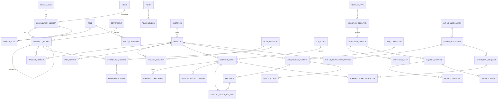

# Data Model

Status: Phase 0 logical model (remediated 2026-10-02). The physical schema lives in `packages/db/prisma/schema.prisma` (created in Phase 1) and evolves **only** through Prisma migrations.

Conventions (see also `ARCHITECTURE.md` §16):

- Table names `snake_case` plural (Prisma `@@map`); columns `snake_case` (`@map`); TypeScript fields `camelCase`.
- Primary key `id uuid` (UUIDv7). Every tenant table: `organization_id uuid not null` + FK to `organizations` + leading index + `UNIQUE (organization_id, id)` (§2).
- Relations between tenant tables use composite foreign keys (§2).
- `created_at`, `updated_at` (`timestamptz`, UTC) on every mutable table. Append-only tables (events, audit, deliveries) have `created_at` only.
- `version int` for optimistic concurrency on aggregates edited concurrently (tickets, requests, projects).
- Configurable taxonomies are tables, lifecycle states are enums.
- `(T)` = tenant-owned table.

## 0. Physical schema implemented in Phase 1

Migration `20261002170000_identity_tenancy_foundation` (generated by `prisma migrate dev --create-only`, then hand-extended; applied with `prisma migrate deploy`, never `db push`) creates:

| Table | Tenant | Key constraints |
|---|---|---|
| `organizations` | root | `slug` unique; CHECKs: slug pattern, `work_week` ⊆ {1..7} with 1–7 entries, `time_zone` length, `default_locale` ∈ {en, ar}. No application default for time zone or work week |
| `users` | global | unique `(idp_issuer, idp_subject)`; CHECK on identity lengths; email is not an identity key |
| `organization_members` | T | unique `(organization_id, id)`, `(organization_id, user_id)`; `authz_version int` (bumped on every grant change, drives session reload); composite FK `invited_by_member_id` |
| `roles` | T | unique `(organization_id, id)`, `(organization_id, key)`; CHECK key pattern; system roles materialized per org by `provisionOrganization` |
| `role_permissions` | T | unique `(organization_id, role_id, permission_key, scope)`; composite FK → `roles`; CHECK key pattern (catalog membership is enforced in code) |
| `member_roles` | T | unique `(organization_id, member_id, role_id)`; composite FKs → member, role, granting member |
| `audit_logs` | T, append-only | composite FK `actor_member_id`; indexes `(org, created_at desc)`, `(org, entity_type, entity_id)`, `(org, actor_member_id, created_at desc)`; CHECK action pattern |
| `platform_audit_logs` | platform, append-only | optional `target_organization_id`; CHECK action pattern |

All foreign keys are `ON UPDATE RESTRICT`; deletes are `RESTRICT` except grant rows (`role_permissions`, `member_roles`), which cascade from their role/member. Append-only enforcement (grants + triggers) is described in `SECURITY.md` §8. Integration tests insert cross-organization rows for every composite FK (member role → member/role/grantor, member → inviter, role permission → role, audit → actor member) and assert PostgreSQL rejects them (`P2003`).

Migration `20261002200000_people_attachments_notifications_outbox` adds the people, attachment, notification and outbox tables. Every relation between tenant tables is a composite FK to `(organization_id, id)`:

| Table | Tenant | Key constraints |
|---|---|---|
| `departments` | T | unique `(org, code)`; composite FKs → parent department, manager profile; CHECKs: name 1–120, code pattern, not its own parent (deeper cycles are rejected by the service with a recursive query) |
| `job_titles` | T | unique `(org, name)`; CHECK name 1–120 |
| `teams` | T | unique `(org, name)`; composite FKs → department, lead profile; `archived_at` |
| `team_members` | T | unique `(org, team_id, profile_id)`; composite FKs → team, profile (cascade) |
| `employee_profiles` | T | unique `(org, member_id)`, `(org, employee_number)`; composite FKs → member, department, job title, manager profile, avatar attachment; CHECKs: not own manager, name/contact lengths, employee-number pattern, locale ∈ {en, ar} |
| `member_invitations` | T | unique `token_hash` (SHA-256 hex CHECK); composite FKs → member, creating member; `accepted_at`/`accepted_by_user_id` set together (CHECK); `expires_at`, `revoked_at` |
| `organization_counters` | T | `(org, key)` primary key; atomic `INSERT … ON CONFLICT DO UPDATE … RETURNING` for employee numbers; CHECKs key pattern, value ≥ 0 |
| `attachments` | T | unique `storage_key`; CHECK `storage_key` starts with `org/<organization_id>/`; composite FK → uploading member; status `PENDING_UPLOAD → AVAILABLE / REJECTED / DELETED`; `AVAILABLE` requires content type, size and SHA-256 (CHECK); polymorphic owner (`owner_type`, `owner_id`) authorized in services |
| `notifications` | T | unique `(org, recipient_member_id, dedupe_key)`; composite FK → recipient member; index `(org, recipient, read_at, created_at desc)` |
| `outbox_events` | T | `organization_id` required; `available_at`, `dispatched_at`, `attempts`, `last_error`; index `(dispatched_at, available_at)` for the relay's `FOR UPDATE SKIP LOCKED` claim; CHECK event-type pattern |

`organization_members.user_id` becomes nullable for invitations (CHECK: only `INVITED` members may lack a user; the invitee's Keycloak user is bound when the invitation is redeemed). The `ops_app` runtime role receives DML through the default privileges of `infra/docker/postgres/init`; integration tests insert cross-organization rows for the new composite FKs and assert PostgreSQL rejects them.

PostgreSQL extensions `citext`, `pg_trgm` and `btree_gist` are created by the first migration (`CREATE EXTENSION IF NOT EXISTS`). `citext` is used by `organizations.slug` and `projects.code`; `pg_trgm` backs the Phase 8 search indexes and `btree_gist` the Phase 7 shift overlap exclusion. Email addresses are not identity keys (`users` are keyed by `(idp_issuer, idp_subject)`).

### Phase 2 — projects

Migration `20261003090000_projects` adds §4. Every relation between tenant tables is a composite FK to `(organization_id, id)` with `ON DELETE RESTRICT`; integration tests insert cross-organization rows for each of them and assert PostgreSQL rejects them.

| Table | Tenant | Key constraints and indexes |
|---|---|---|
| `customers` | T | unique `(org, name)`; CHECKs: name 1–200, contact/notes lengths; `archived_at` |
| `projects` | T | unique `(org, code)` (citext, CHECK pattern `^[A-Za-z0-9][A-Za-z0-9_-]{0,31}$`), `(org, number)`; composite FKs → customer, PM profile, TM profile, creating member; CHECKs: dates ordered, `version ≥ 1`, `(status = 'ARCHIVED') = (archived_at IS NOT NULL)`, policy is a JSON object, text lengths; indexes `(org, status)`, `(org, health)`, `(org, customer_id)`, `(org, project_manager_profile_id)`, `(org, technical_manager_profile_id)`, `(org, updated_at desc, id desc)`, `(org, name)` |
| `project_members` | T | unique `(org, project_id, profile_id)`; composite FKs → project, profile, adding member; CHECKs: allocation 1–100, dates ordered; index `(org, profile_id)` ("my projects", PROJECT reach) |
| `work_locations` | T | unique `(org, name)`; CHECKs: latitude/longitude ranges, radius 10–5000 m, lengths; index `(org, active)` |
| `project_locations` | T | unique `(org, project_id, work_location_id)`; composite FKs → project, location, adding member; index `(org, work_location_id)` |
| `daily_reports` | T | unique `(org, project_id, reporter_profile_id, report_date)`, `(org, number)`; composite FKs → project, reporter profile, submitting member; CHECKs: work performed 1–5000, counts ≥ 0, lengths; indexes `(org, project_id, report_date desc, id desc)`, `(org, reporter_profile_id, report_date desc)`, `(org, report_date)` |
| `project_activity` | T | unique `(org, source_event_id)` (idempotent consumer); composite FKs → project, actor member; CHECKs: dotted `type`, JSON-object `summary_params`; index `(org, project_id, occurred_at desc, id desc)` |

Deviations from the logical model in §4, decided in ADR-0017:

- `projects.time_zone` (nullable IANA zone; null means the organization's zone) is added, so that business dates follow the project's location.
- `daily_report_policy.reporterRoles` is an array of project roles (default `["FIELD"]`), not a single `reporterRole`.
- `status_reason`, `status_changed_at`, `health_changed_at`, `created_by_member_id`, `added_by_member_id` and `submitted_by_member_id` are added for accountability.
- `project_activity.source_event_id` is added (the outbox event id) to make the consumer idempotent and the timeline rebuildable.
- `projects.support_team_id` (added in Phase 3, below) and the GIN `search_vector` (P8) were not created in Phase 2.

### Phase 3 — support

Migration `20261004090000_support` adds §5 (without the Jira and GitHub link tables, which belong to Phases 4 and 5) and `notification_deliveries`. Every relation between tenant tables is a composite FK to `(organization_id, id)` with `ON DELETE RESTRICT`. An integration test inserts cross-organization rows for the ticket, comment, watcher, history, SLA-event, component and project support-team FKs and asserts PostgreSQL rejects them.

| Table | Tenant | Key constraints and indexes |
|---|---|---|
| `support_categories` | T | unique `(org, name)` (citext); CHECKs: name 1–120, description ≤ 1000; `active` |
| `support_components` | T | unique `(org, name)`; optional composite FK → project (project-scoped component); index `(org, project_id)`; same CHECKs as categories |
| `business_calendars` | T | unique `(org, name)`; `time_zone` (null = project, then organization zone); `working_hours` and `holidays` are JSON arrays (CHECK), validated by the shared Zod schema |
| `sla_policies` | T | unique `(org, name)`; composite FK → calendar; CHECKs: minutes 1–525 600 with first response ≤ resolution, threshold 1–99 %, `business_hours_only = (business_calendar_id IS NOT NULL)`, pause statuses exclude NEW and the closed statuses; index `(org, active, priority)` |
| `escalation_rules` | T | unique `(org, name)`; optional composite FK → SLA policy; CHECKs: level 1–5, threshold 1–525 600, JSON-object `match`/`notify`; index `(org, active)` |
| `support_tickets` | T | unique `(org, number)`, `(org, reporter_member_id, idempotency_key)`; composite FKs → project, reporter, category, component, team, assignee, SLA policy; CHECKs: title 1–200, description 1–10 000, resolution note ≤ 5000, `version ≥ 1`, escalation level 0–5, lifecycle timestamps match the status (resolved/verified/closed/cancelled), an SLA policy implies both due dates and both clock states; indexes `(org, status, severity)`, `(org, project_id, status)`, `(org, assignee_member_id, status)`, `(org, assigned_team_id, status)`, `(org, reporter_member_id, created_at desc)`, `(org, created_at desc, id desc)`, `(org, updated_at desc, id desc)`, `(org, category_id)`, `(org, component_id)`, `(org, sla_policy_id)` and the partial `(org, resolution_due_at) WHERE status NOT IN (RESOLVED, VERIFIED, CLOSED, CANCELLED)` for the sweep |
| `support_ticket_events` | T, append-only | composite FKs → ticket, actor; CHECKs: `type` pattern, JSON-object metadata; index `(org, ticket_id, created_at, id)`; `BEFORE UPDATE/DELETE/TRUNCATE` triggers and revoked `ops_app` grants |
| `support_ticket_comments` | T | composite FKs → ticket, author; CHECK body 1–10 000; `visibility` `PUBLIC_INTERNAL` or `INTERNAL_NOTE`; index `(org, ticket_id, created_at, id)` |
| `support_ticket_watchers` | T | unique `(org, ticket_id, member_id)`; composite FKs → ticket, member, adding member; index `(org, member_id)` |
| `sla_events` | T, append-only | composite FKs → ticket, escalation rule; partial unique `(org, ticket_id, kind, level) WHERE kind NOT IN (PAUSED, RESUMED)` (each condition once); index `(org, ticket_id, created_at)`; same triggers and grants as ticket events |
| `notification_deliveries` | T | unique `(org, notification_id, channel)` (one email per notification); composite FK → notification; status `PENDING → SENDING → SENT / FAILED / SKIPPED`; CHECKs: attempts ≥ 0, last error ≤ 500, `(status = 'SENT') = (sent_at IS NOT NULL)`; index `(org, status)` |

`projects.support_team_id` is a composite FK → `teams` with index `(org, support_team_id)`.

Deviations from the logical model in §5, decided in ADR-0018:

- `support_tickets` gains `sla_started_at` (the clock origin the sweep recomputes from), `cancelled_at`, `resolution_note`, `idempotency_key` and `updated_at`. `sla_policy_id` is chosen at creation and re-selected when a matched field (severity, priority, project, category) changes; the sweep recomputes due dates from the ticket's policy as currently configured. Breaches stay sticky.
- `support_ticket_events` columns are `from_value`/`to_value` (`from`/`to` are reserved words). Types are listed in `ticket-history.ts`, including `ATTACHMENT_ADDED`/`ATTACHMENT_REMOVED`; Jira and GitHub event types arrive with Phases 4 and 5.
- `support_ticket_comments.body` is plain text, not Markdown.
- `business_calendars` has a name and an optional time zone; `sla_policies` references a calendar (`business_calendar_id`).
- `sla_events` gains `metadata`; `level` is `0` for non-escalation kinds instead of null, so the unique index applies.
- `notification_deliveries` is new: per-channel delivery tracking for email (`ARCHITECTURE.md` §12).
- Ticket attachments use the existing `attachments` table with owner type `SUPPORT_TICKET`; there is no per-comment attachment.
- No GIN `search_vector` (P8-6) and no external search engine; the list's text filter is a case-insensitive title match (or an exact `SUP-<n>` key) applied to an already scoped, indexed result set.

### Phase 4 — Jira

Migration `20261005090000_jira` adds §8, `support_ticket_jira_links` (§5) and `jira_issue_create_requests`, and the `SUPPRESSED` value of `NotificationDeliveryStatus` (Phase 3 email-access hardening). Every relation is a composite FK to `(organization_id, id)` with `ON DELETE RESTRICT`; an integration test inserts cross-organization rows into every Jira table and asserts PostgreSQL rejects them. All Jira ids are numeric strings (CHECK `^[0-9]{1,20}$`).

| Table | Tenant | Key constraints and indexes |
|---|---|---|
| `jira_connections` | T | unique `(org, cloud_id)`; partial unique `(org) WHERE status <> 'DISCONNECTED'` (one live connection); status `ACTIVE, NEEDS_REAUTH, ERROR, DISCONNECTED`; CHECKs: token columns are `v1.` envelopes, ACTIVE requires both tokens and an expiry, `(status = DISCONNECTED) = (disconnected_at IS NOT NULL)`, site/cloud lengths and `site_url ~ '^https?://'`, error codes ≤ 64, `version ≥ 1`; columns `encryption_key_id`, `last_success_at`, `last_error_code/at`, `webhook_error_code`; index `(status)` |
| `jira_project_mappings` | T | unique `(org, connection_id, jira_project_id)`; composite FKs → connection, project, creator; `blocked_statuses text[]` (≤ 20), `last_deep_reconciled_at`, `removed_at` (CHECK: a removed mapping is not syncing), `version`; index `(org, project_id)` |
| `jira_issues` | T | unique `(org, connection_id, jira_issue_id)`; `mapping_id` nullable (issue moved out of mapped projects); `jira_project_id`, `issue_key`; length CHECKs on all text fields; indexes `(org, mapping_id, status_category)`, `(org, mapping_id, jira_updated_at desc)`, `(org, connection_id, issue_key)` |
| `jira_sync_runs` | T | partial unique `(org, mapping_id) WHERE status IN (QUEUED, RUNNING)` (one active run per mapping, any type); counters ≥ 0 incl. `records_unchanged`, `pages`, `consecutive_errors`; `cancel_requested`, `resumed_from_run_id`, `request_id`, `job_id`; `last_cursor` JSON object; CHECK `finished_at` set exactly for terminal statuses; indexes `(org, created_at desc, id desc)`, `(org, mapping_id, created_at desc)`, `(status, updated_at)` for the watchdog |
| `jira_sync_failures` | T, append-only | composite FK → run; `classification` `RETRYABLE/PERMANENT`; code 1–64, message 1–500 (sanitized, never a Jira body); `BEFORE UPDATE/DELETE/TRUNCATE` triggers; index `(org, run_id, created_at)` |
| `jira_webhook_registrations` | T | unique `(org, connection_id, jira_webhook_id)`; `jql_filter` ≤ 4000, `events text[]`, `expires_at`, `last_refreshed_at`; index `(expires_at)` |
| `jira_webhook_deliveries` | T | unique `(org, connection_id, delivery_key)`; identifiers only (`jira_issue_id`, `jira_project_id`, `webhook_timestamp`, `retry_count`), `payload` JSON object ≤ 4000 characters (matched webhook ids); status `RECEIVED, PROCESSED, IGNORED, FAILED` with `outcome`/`error_code`; index `(org, status, received_at desc)` |
| `support_ticket_jira_links` | T | unique `(org, ticket_id, issue_id)`; composite FKs → ticket, cached issue, creator; `link_type`, `created_via`; index `(org, issue_id)` (status-change fan-out) |
| `jira_issue_create_requests` | T | unique `(org, ticket_id, idempotency_key)`; `request_hash` (SHA-256 of the confirmed body), status `PENDING, CREATED, FAILED, UNKNOWN` with CHECK `(status = CREATED) = (jira_issue_id IS NOT NULL)`; composite FKs → ticket, mapping, requester |

`ops_app` privileges: no `UPDATE`/`DELETE`/`TRUNCATE` on `jira_sync_failures`; no `DELETE`/`TRUNCATE` on connections, mappings, issues, runs, deliveries and create requests; no `TRUNCATE` on registrations and links (the only rows the application deletes).

Deviations from the logical model in §5 and §8, decided in ADR-0019:

- `jira_connections.status` uses `ERROR` and `DISCONNECTED` instead of `DISABLED`; disconnect keeps the row (history, links) and wipes tokens.
- `jira_issues` has no `epic_key`, no trigram or `search_vector` index (cache search is an exact key or case-insensitive summary match within the ticket project's mappings, at most 20 rows); `is_blocked` derives from configured status names only (no `Flagged` field or issue links); `mapping_id` is nullable.
- `jira_sync_runs` adds `DEEP_RECONCILIATION`, `mapping_id` is required, and the active-run index is per mapping (not per mapping and type), so an import and a reconciliation never overlap. The cursor is `{ createdAfter | updatedAfter, lastIssueRowId, pageToken? }`.
- `jira_sync_failures` gains `classification`; `jira_webhook_deliveries` stores identifiers instead of a trimmed payload, and has no retention purge yet (follow-up).
- `support_ticket_jira_links.issue_id` references the cached `jira_issues.id`; the column is named `issue_id`.
- `jira_issue_create_requests` is new (database reservation for idempotent issue creation instead of a Redis guard).

### Phase 5 — GitHub

Migration `20261006090000_github` adds §9, `support_ticket_github_links` (§5) and `retention_policies` (§3, technical-record categories only), the `purge_integration_records` function, and re-points the `jira_sync_failures` append-only trigger to a variant that allows deletes only inside that function. Every relation is a composite FK to `(organization_id, id)` with `ON DELETE RESTRICT`; an integration test inserts cross-organization rows into every GitHub table and asserts PostgreSQL rejects them. GitHub ids are `bigint` with `> 0` CHECKs.

| Table | Tenant | Key constraints and indexes |
|---|---|---|
| `retention_policies` | T | unique `(org, category)`; `category` `WEBHOOK_DELIVERIES, SYNC_FAILURES`; `action` `DELETE_ROWS`; `retain_days` 7–3650; `last_purged_at/count`; `version` |
| `github_installations` | T (global id) | **unique `(github_installation_id)`** (one organization per installation); account login/id/type, `repository_selection`, granted `permissions` JSON object and `events`; status `ACTIVE, SUSPENDED, DELETED, DISCONNECTED` with CHECKs tying `suspended_at`/`deleted_at`/`disconnected_at` to the status; `installed_by_member_id`, `last_synced_at`, `last_error_code/at`, `version`; index `(status)` |
| `github_repositories` | T | unique `(org, github_repo_id)`; composite FK → installation; `node_id`, owner/name/full name, `private`, `archived`, `default_branch`, `html_url`; status `AVAILABLE, REMOVED, DELETED` with CHECK `(status = AVAILABLE) = (unavailable_at IS NULL)`; `sync_state`, `last_full_sync_at`, `last_reconciled_at`, `last_activity_at`; indexes `(org, installation_id, status)`, `(org, full_name)` |
| `github_repository_mappings` | T | unique `(org, repository_id, project_id)` (many-to-many); soft `removed_at`; `version`; index `(org, project_id)` |
| `github_pull_requests` | T | unique `(org, repository_id, github_pr_id)` and `(org, repository_id, number)`; metadata only (title ≤ 1000, refs, head SHA, author login, draft, state with CHECKs tying `merged_at`/`closed_at`); `review_state`, `requested_reviewers text[]` (≤ 100), `checks_state` + total/failed/pending counters (≥ 0); `jira_keys text[]` (GIN); `gh_updated_at` guard plus `details_sha`/`details_fetched_at` guard for summaries; indexes `(org, repository_id, state)`, `(org, state, review_state)`, `(org, repository_id, head_sha)` |
| `github_pr_jira_links` | T | unique `(org, pull_request_id, issue_id)`; FK → cached `jira_issues`; `source` `MANUAL, BRANCH_NAME, TITLE, BODY`; `state` `SUGGESTED, CONFIRMED, DISMISSED` (CHECK: decided states have `decided_at`; manual links are never `SUGGESTED`); index `(org, issue_id, state)` |
| `github_webhook_deliveries` | T | **unique `(delivery_id)`** (`X-GitHub-Delivery`); identifiers only (event, action, repository id, PR number, head SHA), status `RECEIVED, PROCESSED, IGNORED, FAILED` with `outcome`/`error_code` and CHECK `(status = RECEIVED) = (processed_at IS NULL)`; indexes `(org, status, received_at desc)`, `(org, received_at)` |
| `github_sync_runs` | T | partial unique `(org, repository_id) WHERE status IN (QUEUED, RUNNING)`; type `INITIAL_SYNC, RECONCILIATION, MANUAL_RESYNC`; counters ≥ 0; `last_cursor` JSON object; CHECK `finished_at` set exactly for terminal statuses; indexes `(org, created_at desc, id desc)`, `(org, repository_id, created_at desc)`, `(status, updated_at)` |
| `github_sync_failures` | T, append-only | composite FK → run; `classification`; code 1–64, message 1–500 (sanitized); `BEFORE UPDATE/DELETE/TRUNCATE` triggers (deletes only through the retention function); indexes `(org, run_id, created_at)`, `(org, created_at)` |
| `support_ticket_github_links` | T | unique `(org, ticket_id, pull_request_id)`; composite FKs → ticket, pull request, creator; index `(org, pull_request_id)`. Pull requests reached through the ticket's Jira links are derived on read, not stored |

`ops_app` privileges: no `UPDATE`/`DELETE`/`TRUNCATE` on `github_sync_failures`; no `DELETE`/`TRUNCATE` on installations, repositories, mappings, pull requests, PR–Jira links, deliveries and runs; no `TRUNCATE` on ticket links and retention policies (the only rows the application deletes); `EXECUTE` on `purge_integration_records`, which only deletes processed deliveries and sync failures older than an explicit policy, in batches of at most 5 000.

Deviations from the logical model in §3 and §9, decided in ADR-0020:

- `retention_policies` covers only the technical categories `WEBHOOK_DELIVERIES` and `SYNC_FAILURES` (attendance coordinates were added in Phase 7 with the `NULL_COORDINATES` action; audit logs and notifications are never purged by it); `retain_days` is 7–3650 instead of `> 0`, and `action` is `DELETE_ROWS` for these categories.
- `github_installations` adds `DISCONNECTED` and `DELETED` states with timestamps instead of deleting rows; `github_repositories` adds `status`/`unavailable_at` and sync bookkeeping, and is unique per organization rather than per installation.
- `github_pull_requests` uniqueness is `(org, repository_id, github_pr_id)`; it adds check counters, `node_id`, `details_sha` and `details_fetched_at`.
- `github_pr_jira_links` references the cached `jira_issues.id` and uses `state` (`SUGGESTED, CONFIRMED, DISMISSED`) instead of a `confirmed` boolean.
- `github_webhook_deliveries` stores identifiers and `outcome` instead of an `error` text; `github_sync_failures` is new.

### Phase 6 — Requests

Migration `20261007090000_requests` adds §6 plus `request_type_roles` and `request_effects`; `20261007100000_requests_step_approver_check` replaces the step approver CHECK with a NULL-safe version (fulfillment steps have no approver). Every relation is a composite FK to `(organization_id, id)` with `ON DELETE RESTRICT` (steps cascade only from their draft version, eligibility rows from their type). Request attachments use `attachments` with the existing owner type `REQUEST`; request numbers use the organization counter `REQ`.

| Table | Tenant | Key constraints and indexes |
|---|---|---|
| `request_types` | T | unique `(org, key)`, key `^[a-z][a-z0-9_]{1,49}$`; `name`/`description` localized JSON objects; `category` `HR, IT, FINANCE, ACCESS, OPERATIONS, OTHER`; allow-listed `icon`; `active` (default false); `version`; index `(org, active)` |
| `request_type_roles` | T | unique `(org, request_type_id, role_id)`; requester eligibility (no rows = everyone holding `request.create`); index `(org, role_id)` |
| `workflow_definitions` | T | unique `(org, request_type_id)` (1:1 with the type) |
| `workflow_versions` | T | unique `(org, definition_id, number)`; partial unique **one DRAFT** and **one PUBLISHED** per definition; `form_schema` object ≤ 64 KiB, `effects` object ≤ 4 KiB; `attachment_requirement` `NONE, OPTIONAL, REQUIRED` with `max_attachments` 0–20; `email_approvers`, `email_requester`; `revision`; CHECK tying `published_at`/`retired_at` to the status; trigger `workflow_versions_immutable` (PUBLISHED → RETIRED is the only change; non-drafts are never deleted) |
| `workflow_steps` | T | unique `(org, version_id, step_order)`, order 1–20; `kind` `APPROVAL, FULFILLMENT`; `mode` `ANY_ONE, ALL`; typed approver columns (`approver_type`, `approver_member_id`, `approver_role_id`, `project_field`) with a CHECK that exactly the columns of the type are set; `condition` object ≤ 8 KiB; `sla_hours` 1–720; trigger `workflow_steps_draft_only`; indexes `(org, approver_member_id)`, `(org, approver_role_id)` |
| `request_instances` | T | unique `(org, number)` and `(org, requester_member_id, idempotency_key)`; pinned `workflow_version_id`; `status` `DRAFT, PENDING_APPROVAL, APPROVED, REJECTED, CANCELLED, IN_FULFILLMENT, COMPLETED`; `form_data` object ≤ 32 KiB; `route smallint[]`, `current_step_order`; denormalized `project_id`, `starts_on`/`ends_on`; CHECKs tying `submitted_at`, `decided_at`, `completed_at`, `cancelled_at` and `current_step_order` to the status; trigger `request_instances_pinned` (after DRAFT: version, form data, route, type, requester, number, project, dates and submission time never change; never deleted); indexes `(org, requester, status)`, `(org, requester, created_at desc, id desc)`, `(org, status, submitted_at)`, `(org, request_type_id, starts_on, ends_on)`, `(org, workflow_version_id)`, `(org, project_id)`, `(org, created_at desc, id desc)` |
| `request_approvals` | T | unique `(org, request_id, step_order, approver_member_id)`; frozen `approver_member_id`; `status` `PENDING, APPROVED, REJECTED, SUPERSEDED`; `decided_by_member_id` + `delegation_id` (CHECK: a delegated decision is by someone other than the approver); comment ≤ 2000; `due_at`, `reminded_at`; trigger `request_approvals_frozen` (decided rows never change, never deleted); indexes `(org, approver, status, created_at desc, id desc)` (inbox), `(org, request_id, step_order)`, partial `(org, due_at) WHERE PENDING AND reminded_at IS NULL` (SLA sweep) |
| `approval_delegations` | T | CHECKs: not self, period ≤ 90 days, reason ≤ 500, revocation columns together; optional `request_type_id`; overlap and reverse-overlap rules are enforced in the service inside a transaction that first takes a per-organization delegation lock; indexes `(org, delegator, ends_at)`, `(org, delegate, ends_at)` |
| `request_events` | T, append-only | `type` `^[A-Z][A-Z_]{1,63}$`; `metadata` object ≤ 8 KiB; `BEFORE UPDATE/DELETE/TRUNCATE` triggers; index `(org, request_id, created_at, id)` |
| `request_effects` | T | unique `(org, request_id, kind)`; `kind` `ATTENDANCE`, `mode` `LEAVE, REMOTE, BUSINESS_MISSION, SHORT_LEAVE`, dates; FKs to the pinned version and the decision event; trigger `request_effects_guarded` (RECORDED → REVOKED once, never deleted); index `(org, kind, status, starts_on)` for Phase 7 |

`ops_app` privileges: no `UPDATE`/`DELETE`/`TRUNCATE` on `request_events`; no `DELETE`/`TRUNCATE` on request types, definitions, requests, approvals, delegations and effects (they are deactivated, cancelled, superseded or revoked); no `TRUNCATE` on eligibility rows, versions and steps (only drafts are deleted). The immutability triggers apply to every role, including the owner.

Deviations from the logical model in §6 are listed in ADR-0021 ("Deferred / deviations"): no `SUBMITTED` status or `SKIPPED` approval status (skipped steps are recorded as events and excluded from `route`), no `on_behalf_of_member_id`, effects and fulfillment on the version, typed approver columns, a single optional delegation request type, and `decided_by_member_id` + `delegation_id` instead of `delegated_from_member_id`.

### Phase 7 — Attendance

Migration `20261008090000_attendance_enums` adds the attendance enums and the new values of existing enums (`ATTENDANCE_COORDINATES` / `NULL_COORDINATES` retention, `CORRECTION` effect mode) in a separate migration, so they are committed before constraints use them; `20261008090100_attendance` adds the tables below, `request_effects.starts_at_minute` / `ends_at_minute` (short-permission window, CHECK: SHORT_LEAVE only, both or neither, end after start), the retention CHECK pairing `ATTENDANCE_COORDINATES` with `NULL_COORDINATES`, the `btree_gist` exclusion constraint and the guard functions. Every relation is a composite FK to `(organization_id, id)` with `ON DELETE RESTRICT`. Decisions: ADR-0022.

| Table | Tenant | Key constraints and indexes |
|---|---|---|
| `attendance_policies` | T | one row per organization; `max_accuracy_meters` 10–5000, `low_accuracy_action` / `missing_location_action` (`FLAG_FOR_REVIEW, REJECT`), `missing_checkout_after_minutes` 30–1440, `configured_by_member_id`, `version` |
| `shifts` | T | unique `(org, name)` (citext); `start_minute` / `end_minute` 0–1439 and different, `crosses_midnight` = end < start (CHECK); graces 0–240; `weekdays smallint[]` ⊆ 1–7, 1–7 entries; `active`, `version`; index `(org, active)` |
| `employee_shift_assignments` | T | `effective_from`, optional inclusive `effective_to` ≥ from; **EXCLUDE USING gist** `(org =, profile_id =, daterange(from, to, '[]') &&)` — no overlapping assignments; `created_by_member_id`, `version`; indexes `(org, profile_id, effective_from)`, `(org, shift_id)` |
| `attendance_records` | T | unique `(org, profile_id, work_date)`; `member_id`, `time_zone` snapshot; shift snapshot (`shift_id`, name, start/end minute, overnight, graces, `scheduled_start_at` / `scheduled_end_at`, all-or-nothing CHECKs); `status` `OPEN, COMPLETE, MISSING_CHECKOUT, EXCUSED, ABSENT, SCHEDULED`; `mode`; check-in/out instants and locations (check-out ≥ check-in); late/early/worked minutes ≥ 0; `needs_review`, `adjusted`, `missing_checkout_at` (required for MISSING_CHECKOUT), `source_request_id`, `version`; never deleted or truncated (triggers); indexes `(org, work_date, status)`, `(org, member_id, work_date desc)`, `(org, status, scheduled_end_at)` (sweep) |
| `attendance_events` | T, append-only | unique `(org, idempotency_key)`; `kind` `CHECK_IN, CHECK_OUT, ADJUSTED, ADJUSTMENT_REVERTED, SYSTEM_MISSING_CHECKOUT, EFFECT_APPLIED, EFFECT_REVOKED`; `recorded_at` / `effective_at` (server), `work_date`, `mode`; evidence: `work_location_id`, `latitude` / `longitude` `numeric(7,5)` / `numeric(8,5)` (both or neither, nullable for retention), `accuracy_meters`, `distance_meters`, `allowed_radius_meters`, `accuracy_threshold_meters`, `geofence_result` (present exactly for CHECK_IN/CHECK_OUT; `INSIDE` requires accuracy ≤ threshold and distance ≤ radius), `ip_address` ≤ 64, `user_agent` ≤ 512; review (`review_status` `NOT_REQUIRED, PENDING_REVIEW, ACCEPTED, REJECTED`, reviewer and time together); corrections (`reason_code` required for ADJUSTED / ADJUSTMENT_REVERTED, adjusted instants, `note` ≤ 1000, `adjustment_id`, `request_id`, `request_effect_id`); `actor_member_id`, `key_owner_member_id`; trigger `guard_attendance_event` rejects UPDATE/DELETE/TRUNCATE for every role except the one-time review decision and the retention function; indexes `(org, record_id, recorded_at, id)`, `(org, profile_id, recorded_at desc)`, `(org, review_status, recorded_at)` (queue), `(org, recorded_at)` (retention) |
| `attendance_adjustment_requests` | T | unique `(org, request_id)` (the Phase 6 request) and `(org, requester_member_id, idempotency_key)`; `reason_code`, requested and original check-in/out (at least one requested, out after in), `details` 1–2000, `applied_at` / `reverted_at` (reverted only after applied); trigger `guard_attendance_adjustment` (only `applied_at`, `reverted_at` and a missing `record_id` may be set, once each; never deleted); index `(org, profile_id, work_date)` |

`ops_app` privileges: no `UPDATE`/`DELETE`/`TRUNCATE` on `attendance_events` except `UPDATE` of the review columns (still limited by the trigger); no `DELETE`/`TRUNCATE` on records, adjustments, shifts, assignments and policies. `purge_attendance_coordinates(org, limit)` is `SECURITY DEFINER` (owner), `EXECUTE` granted to `ops_app` only, nulls at most 5000 coordinate pairs per call older than the organization's policy, skipping pending reviews and records with an open correction. The protection triggers apply to every role, including the owner.

Deviations from the logical model in §7 (ADR-0022): the policy is its own table instead of organization settings; records carry the shift snapshot and `member_id`; statuses add `SCHEDULED` and `EXCUSED`; events add `effective_at`, server-computed distance/radius/threshold snapshots, `key_owner_member_id` and request/effect/adjustment references; coordinates are rounded to 5 decimals and nulled by retention instead of moved.

### Phase 8 — Dashboards, search and preferences

Migration `20261009090000_dashboards_search_preferences` adds the only new table of Phase 8 and the search indexes. Dashboards, Needs Attention, trends and the setup checklist store nothing: they read existing tables (the dashboard cache lives in Redis, ADR-0023). Decisions: ADR-0023.

| Object | Tenant | Key constraints and indexes |
|---|---|---|
| `notification_preferences` | T | `member_id` (composite FK to `organization_members (organization_id, id)`), `category` `NotificationCategory` (`ACCESS, PROJECTS, DAILY_REPORTS, SUPPORT, REQUESTS, ATTENDANCE, INTEGRATIONS`), `channel` `NotificationPreferenceChannel` (`IN_APP, EMAIL`), `enabled`; unique `(org, member_id, category, channel)`; CHECK `notification_preferences_locked_check`: ACCESS (any channel) and INTEGRATIONS in-app can never be stored disabled. A missing row means enabled |
| Trigram indexes | — | GIN `gin_trgm_ops` on `projects.name`, `employee_profiles.full_name`, `support_tickets.title`, `jira_issues.issue_key`, `jira_issues.summary` (global search, `ILIKE` with escaped wildcards) |
| `support_tickets_resolved_at_idx` | — | partial `(organization_id, resolved_at) WHERE resolved_at IS NOT NULL` ("resolved today" and the support trend) |

`ops_app` privileges: no `DELETE`/`TRUNCATE` on `notification_preferences` (preferences are upserted, never deleted). `organizations.setup_state` stays unused: the checklist is derived from real state on every request.

Deviations from the logical model in §10 (ADR-0023): preferences are per notification **category** (derived from the notification type by `notificationCategory`) instead of per type; channels are IN_APP and EMAIL only; CRITICAL notifications are always delivered regardless of preferences (enforced in the service and the email worker, not storable). Search uses trigram indexes instead of `tsvector` columns.

### Phase 10 — Tenders, corporate documents and contracts

Migrations `20261010090000_commercial_enums`, `20261010090100_commercial`, `20261010090200_contract_renewal_decision` and `20261010090300_tender_requirement_delete_grant` are additive: new enums, tables, columns on the new `contracts` table, indexes, triggers, `ops_app` privileges and baseline grants for existing organizations' system roles. No existing table, column, constraint or row changes. Decisions: ADR-0026. Every table has `organization_id`, a unique `(organization_id, id)` and composite foreign keys to `(organization_id, id)` of its parents, members, projects and attachments.

| Object | Tenant | Key constraints and indexes |
|---|---|---|
| `tenders` | T | `number` from the organization's `TND` counter, unique `(org, number)`, display `TND-<year>-<number>`; `status` `TenderStatus`; `submission_deadline_at timestamptz` + `submission_deadline_time_zone` (both or neither, required from NEW on); estimate, bid and award values `numeric(19,4)` with ISO 4217 `currency`; stored readiness counters (`tenders_readiness_check`, `tenders_counters_check`); `related_project_id`; optimistic `version`; trigger `guard_tender`: only DRAFT rows can be deleted, the number never changes; GIN trigram on `title` |
| `tender_bid_decisions` | T | Append-only (trigger, `ops_app` without UPDATE/DELETE); BID / NO_BID with reason; a new decision is a new row |
| `tender_requirements` | T | Compliance matrix: category, mandatory, `status` `TenderRequirementStatus`, owner and reviewer members, due date; a requirement without document links may be deleted, one with links is marked NOT_APPLICABLE instead (the links' RESTRICT foreign key keeps it) |
| `tender_requirement_links` | T | A requirement uses a `commercial_document_versions` row or a `corporate_document_versions` row (exactly one); `removed_at` instead of delete |
| `tender_review_gates`, `tender_reviews` | T | Unique `(org, tender_id, round, gate)` and `(org, gate_id, reviewer_member_id)`; ANY_ONE / ALL; `tender_reviews_decided_check` |
| `tender_addenda`, `tender_clarifications`, `tender_submissions`, `tender_events` | T | Addenda numbered per tender and keep the previous deadline; submissions keyed by `(org, tender_id, idempotency_key)`; addenda, submissions and events are append-only |
| `commercial_documents`, `commercial_document_versions` | T | Exactly one of `tender_id` / `contract_id`; category and `DocumentClassification`; versions append-only, unique `(org, document_id, version_number)` and one version per attachment |
| `corporate_documents`, `corporate_document_versions` | T | Type, classification, owner, `current_version`, mirrored `current_expiry_date`; ACTIVE / ARCHIVED with `archived_at`; versions append-only with issue, valid-from and expiry dates; GIN trigram on `title` |
| `contracts` | T | `number` from the `CTR` counter, unique `(org, number)`; baseline `original_value`, `original_expiry_date`, `currency`, `source_tender_id`; projection `current_value`, `current_expiry_date`, `renewal_notice_deadline`; renewal type, notice period, `renewal_decision` / `renewal_decided_at` (both or neither); stored `health` and reasons; unique `(org, idempotency_key)` for create-from-tender; trigger `guard_contract`: never deleted, number fixed, currency, original value and source tender fixed after DRAFT; GIN trigram on `title` |
| `contract_amendments` | T | Numbered per contract; type, effective date, optional value delta and new expiry; DRAFT → UNDER_REVIEW → APPROVED → EFFECTIVE / REJECTED / CANCELLED with author and approver (`contract_amendments_check`) |
| `contract_obligations`, `contract_obligation_occurrences` | T | Recurrence NONE / MONTHLY / QUARTERLY / YEARLY with optional `recurrence_until` and `generated_through`; occurrences unique `(org, obligation_id, due_date)` |
| `contract_milestones` | T | Due date, approval required, status, owner |
| `guarantees` | T | Exactly one of `tender_id` / `contract_id`; type, issuer, amount and currency, issue and expiry dates; status ACTIVE / EXPIRED / RELEASED / CANCELLED (EXPIRING is derived) |
| `contract_renewal_actions`, `contract_events` | T | Append-only; renewal decisions keyed by `(org, contract_id, idempotency_key)` |
| `commercial_reminders` | T | Unique `(org, entity_type, entity_id, kind, threshold_days, due_on)`: each reminder is sent once; no UPDATE/DELETE for `ops_app` |
| `commercial_settings` | T | One row per organization (unique `organization_id`): reminder threshold arrays (at most 10 values, 0–3650 days); optimistic `version` |

`ops_app` privileges: no UPDATE/DELETE/TRUNCATE on the append-only tables and `commercial_reminders`; no DELETE/TRUNCATE on the other commercial tables except `tenders` (only DRAFT tenders, guarded by trigger) and `tender_requirements` (requirements without document links); asserted by `production-roles.int.test.ts`.

Every other table in this document is still **logical only** and arrives with its phase.

---

## 1. Overview ER diagram (core relationships)



---

## 2. Tenancy keys and composite foreign keys (ADR-0003)

**Invariant: every relation between tenant-owned entities preserves organization identity.**

1. Every tenant table declares `UNIQUE (organization_id, id)` (in addition to `PRIMARY KEY (id)`).
2. Every foreign key from a tenant table to another tenant table is composite and includes the child's own `organization_id`:

   ```sql
   -- example: support_tickets.project_id → projects
   ALTER TABLE support_tickets
     ADD CONSTRAINT support_tickets_project_fk
     FOREIGN KEY (organization_id, project_id)
     REFERENCES projects (organization_id, id);
   ```

   Prisma: `project Project? @relation(fields: [organizationId, projectId], references: [organizationId, id])` with `@@unique([organizationId, id])` on `Project`. A nullable `project_id` with `MATCH SIMPLE` (default) is unconstrained only when `project_id` is null, which is the intended behavior.
3. Child tables that today reference a parent only by `parent_id` (e.g. `support_ticket_events.ticket_id`, `project_members.project_id`, `request_approvals.request_id`, `jira_issues.mapping_id`) carry their own `organization_id` and use the composite FK. Uniqueness constraints listed below as `(parent_id, x)` are physically `(organization_id, parent_id, x)`.
4. **Covered relations (minimum):** employee profile ↔ department / job title / manager / work location; team members; project ↔ customer / members / locations / PM & TM profiles / support team; daily reports ↔ project / reporter; tickets ↔ project / reporter / assignee / team / category / component / SLA policy; ticket events / comments / watchers / Jira links / GitHub links; SLA events / escalation rules; request type ↔ definition ↔ version ↔ steps ↔ instances ↔ approvals / events / delegations; attendance records ↔ profile / shift / locations / source request; attendance events / adjustments; Jira connection ↔ mappings ↔ issues ↔ sync runs / failures / webhook deliveries / registrations; GitHub installation ↔ repositories ↔ mappings ↔ PRs ↔ PR–Jira links; notifications ↔ recipient; member roles ↔ member / role; role permissions ↔ role.
5. **Not FK-protectable (polymorphic):** `attachments.owner_id`, `audit_logs.entity_id`, `notifications.entity_id`, `project_activity.entity_id`, `outbox_events.aggregate_id`. These are protected by tenant-scoped services, the Prisma guard extension and negative tests (`SECURITY.md` §4).
6. **Global exceptions** (no `organization_id`): `users`, `platform_audit_logs`, `github_installations.installation_id` uniqueness (global by GitHub semantics; the row itself is tenant-owned).

## 3. Platform & identity

### organizations
| Column | Type | Notes |
|---|---|---|
| id | uuid | |
| slug | citext unique | URL-safe identifier |
| name | text | |
| default_locale | text | `en` (default), `ar` |
| time_zone | text **not null** | IANA zone chosen at organization creation. No application default; the **development seed only** uses `Africa/Cairo` |
| work_week | smallint[] **not null** | ISO weekdays chosen at creation; the **development seed only** uses `{7,1,2,3,4}` (Sunday–Thursday) |
| status | enum `OrgStatus` | `ACTIVE`, `SUSPENDED` |
| settings | jsonb | Validated by a Zod schema: feature flags, upload limits, attendance geolocation settings (`maxAccuracyMeters`, `lowAccuracyAction` = `FLAG_FOR_REVIEW` \| `REJECT`; baseline `FLAG_FOR_REVIEW`), step-up max age |
| setup_state | jsonb | Reserved and unused: the Phase 8 checklist is derived from real state on every request (ADR-0023) |

### retention_policies (T)
`(organization_id, category)` unique; `category` enum (`ATTENDANCE_COORDINATES`, `AUDIT_LOGS`, `WEBHOOK_DELIVERIES`, `NOTIFICATIONS`, `SYNC_FAILURES`), `retain_days int` (check > 0), `action` enum (`NULLIFY_FIELDS`, `DELETE_ROWS`), `configured_by_member_id`, `configured_at`. **No row = no purge** for that category. Proposed examples shown to admins (not applied): attendance coordinates 730 days (24 months), audit logs 2555 days (7 years). Changes are audited and require MFA. Operational tables `jira_webhook_deliveries` / `github_webhook_deliveries` follow the same rule (`WEBHOOK_DELIVERIES`).

### platform_audit_logs (platform, append-only)
`actor_user_id?`, `actor_type` (`USER`, `SYSTEM`, `CLI`), `action` (e.g. `platform.organization.created`), `target_organization_id?`, `metadata jsonb` (redacted), `request_id?`, `ip inet?`, `created_at`. Only written by platform operations (ADR-0010); never readable through tenant endpoints.

### support_access_sessions (platform) — **deferred** (ADR-0010)
Boundary defined now, not built in V1: `requested_by_user_id`, `target_organization_id`, `reason`, `approved_by_member_id?`, `starts_at`, `expires_at` (≤ 60 min default), `mode` (`READ_ONLY`), `ended_at?`. Every request made under a session is audited in both `platform_audit_logs` and the target org's `audit_logs`.

### users (global identity — not tenant-owned)
| Column | Type | Notes |
|---|---|---|
| id | uuid | |
| idp_issuer | text | OIDC `iss` |
| idp_subject | text | OIDC `sub`; **unique (idp_issuer, idp_subject)** |
| email | citext | from IdP; not used as identity key |
| display_name | text | |
| platform_role | enum `PlatformRole?` | `SUPER_ADMIN` only; null for everyone else |
| last_login_at | timestamptz | |

### organization_members (T)
Links a user to an organization. All org-level data references `member_id` (not `user_id`) so the same human can belong to multiple orgs with separate profiles.

| Column | Type | Notes |
|---|---|---|
| organization_id, user_id | uuid | **unique (organization_id, user_id)** |
| status | enum `MemberStatus` | `INVITED`, `ACTIVE`, `DISABLED` |
| invited_by_member_id | uuid? | |

### employee_profiles (T) — 1:1 with organization_members
`employee_number` (unique per org), `full_name`, `work_email`, `phone` (nullable, visibility-controlled), `department_id`, `job_title_id`, `manager_profile_id` (self-FK, cycle-checked in service), `employment_status` enum (`ACTIVE`, `ON_LEAVE`, `SUSPENDED`, `TERMINATED`), `employment_type` enum (`FULL_TIME`, `PART_TIME`, `CONTRACTOR`), `join_date date`, `primary_work_location_id`, `avatar_attachment_id`, `time_zone`, `locale`.

Indexes: `(organization_id, department_id)`, `(organization_id, manager_profile_id)`, `(organization_id, employment_status)`, GIN on `search_vector` (name, employee number, email).

### departments (T), job_titles (T), teams (T), team_members (T)
- `departments`: `name`, `code` (unique per org), `parent_department_id?`, `manager_profile_id?`, `archived_at`.
- `job_titles`: `name` unique per org.
- `teams`: `name`, `department_id?`, `lead_profile_id?`. `team_members`: unique `(team_id, profile_id)`.

### roles (T), role_permissions (T), member_roles (T) — ADR-0012
- `roles`: `organization_id` **not null**. System role templates are defined in code (`packages/shared/src/roles.ts`) and **materialized per organization** at creation. `key` (e.g. `PROJECT_MANAGER`, unique per org), `name`, `template_key?` (template it was materialized from), `is_system` (system-derived roles cannot be deleted; their grants are editable by `role.manage` holders within the catalog). Custom roles (Phase 9, P9-8) have `is_system = false`, a generated `key` (`CUSTOM_<10 hex>`) and no `template_key`. Their names are unique per organization, and they can be deleted only while no member grant, request type or approval step references them. `ORG_ADMIN` is immutable (`SECURITY.md` §15i).
- `role_permissions`: `(organization_id, role_id, permission_key, scope)` unique; `permission_key` validated against the code-defined catalog (`packages/shared/src/permissions.ts`); `scope` enum `SELF | TEAM | DEPARTMENT | PROJECT | ORG`.
- `member_roles`: `(organization_id, member_id, role_id)` unique; `granted_by_member_id`, `granted_at`. Optional `department_id` qualifier for `DEPARTMENT_MANAGER`.

Permissions themselves are **code-defined** (not a table) so authorization logic and catalog cannot drift; the V1 baseline grants per role are in `SECURITY.md` §2.

### organization_counters (T)
`(organization_id, key)` PK, `value bigint`. Keys: `SUP`, `REQ`, `DR`, `PRJ`.

### idp_group_role_mappings (T)
`(organization_id, idp_group, role_id)` — optional mapping applied at login.

---

## 4. Projects

### customers (T)
`name`, `type` enum (`GOVERNMENT`, `PRIVATE`, `INTERNAL`), `contact_name?`, `contact_email?`, `notes`, `archived_at`.

### projects (T)
| Column | Type | Notes |
|---|---|---|
| code | citext | **unique (organization_id, code)**, e.g. `CAIRO-WATER` |
| number | int | from counter → `PRJ-12` |
| name, description | text | |
| customer_id | uuid? | |
| status | enum `ProjectStatus` | `PLANNING, ACTIVE, ON_HOLD, MAINTENANCE, COMPLETED, ARCHIVED` |
| health | enum `ProjectHealth` | `HEALTHY, NEEDS_ATTENTION, AT_RISK, CRITICAL` (manually set; system *suggests*) |
| health_note | text? | reason for last health change |
| start_date, target_end_date | date | |
| project_manager_profile_id | uuid? | |
| technical_manager_profile_id | uuid? | |
| support_team_id | uuid? | default assignment team for tickets |
| time_zone | text? | IANA zone for this project's business dates; null = organization zone (ADR-0017) |
| daily_report_policy | jsonb | `{ required: bool, weekdays: [], dueLocalTime: "18:00", reporterRoles: ["FIELD"] }` (ADR-0017) |
| notes | text | |
| version | int | |

Indexes: `(organization_id, status)`, `(organization_id, health)`, `(organization_id, project_manager_profile_id)`, GIN `search_vector`.

### project_members (T)
`(project_id, profile_id)` unique; `project_role` enum (`PROJECT_MANAGER, TECHNICAL_MANAGER, DEVELOPER, SUPPORT, FIELD, QA, OBSERVER`), `allocation_percent?`, `start_date`, `end_date?`. Index `(organization_id, profile_id)` for "my projects".

### work_locations (T) — shared with attendance
`name`, `type` enum (`OFFICE, CUSTOMER_SITE, PROJECT_SITE, OTHER`), `latitude numeric(9,6)`, `longitude numeric(9,6)`, `allowed_radius_meters int` (check 10–5000), `address?`, `time_zone?`, `active bool`.

### project_locations (T)
`(project_id, work_location_id)` unique.

### daily_reports (T)
| Column | Type | Notes |
|---|---|---|
| number | int | `DR-88` |
| project_id, reporter_profile_id | uuid | |
| report_date | date | org/project local date; **unique (project_id, reporter_profile_id, report_date)** |
| system_status | enum `DailyReportStatus` | `NORMAL, DEGRADED, ISSUE, CRITICAL` |
| work_performed, operational_notes, customer_notes, problems | text | |
| processed_requests_count, failed_requests_count | int? | manually entered |
| follow_up_required | bool | |
| submitted_at | timestamptz | |

"Missing reports" are computed (expected per `daily_report_policy` × members holding a reporter role × reporting weekdays, from each member's start date, in the project's time zone) — not stored rows. A `daily-report.missing.check` job emits notifications. `report_date` is the business date in the project's effective time zone; `submitted_at` is UTC. Reports cannot be edited after submission and can be submitted up to 7 days back (ADR-0017).

### project_activity (T) — read model
Append-only feed: `project_id`, `occurred_at`, `source` enum (`SUPPORT, JIRA, GITHUB, DAILY_REPORT, PROJECT, REQUEST`), `type`, `entity_type`, `entity_id`, `summary_params jsonb` (i18n params, not rendered text), `actor_member_id?`. Index `(organization_id, project_id, occurred_at desc)`. Populated by outbox consumers; rebuildable.

---

## 5. Support

### support_categories (T), support_components (T)
Configurable taxonomies. `support_components` optionally scoped per project (system/component of the customer system).

### support_tickets (T)
| Column | Type | Notes |
|---|---|---|
| number | int | **unique (organization_id, number)** → `SUP-1042` |
| project_id | uuid? | nullable for internal IT tickets |
| reporter_member_id | uuid | |
| source | enum | `FIELD, CUSTOMER_PHONE, CUSTOMER_EMAIL, MONITORING, INTERNAL, OTHER` |
| category_id, component_id | uuid? | |
| title, description | text | |
| severity | enum `Severity` | `LOW, MEDIUM, HIGH, CRITICAL` — **technical/business impact** |
| priority | enum `Priority` | `P4, P3, P2, P1` — **order of work**, set by triage |
| impact | enum | `SINGLE_USER, MULTIPLE_USERS, SITE, ALL_USERS` |
| status | enum `TicketStatus` | `NEW, TRIAGED, IN_PROGRESS, ESCALATED, WAITING_FOR_DEVELOPMENT, WAITING_FOR_CUSTOMER, RESOLVED, VERIFIED, CLOSED` (+ `CANCELLED`) |
| assigned_team_id, assignee_member_id | uuid? | |
| escalation_level | smallint | 0 = none |
| sla_policy_id | uuid? | resolved at creation; re-resolved on severity/priority change |
| first_response_due_at, resolution_due_at | timestamptz? | |
| first_responded_at, resolved_at, verified_at, closed_at | timestamptz? | |
| sla_paused_total_seconds | int | accumulated pause time |
| sla_paused_since | timestamptz? | |
| first_response_sla_state, resolution_sla_state | enum `SlaState` | `ON_TRACK, AT_RISK, BREACHED, PAUSED, MET` |
| version | int | |

Indexes: `(organization_id, status, severity)`, `(organization_id, project_id, status)`, `(organization_id, assignee_member_id, status)`, `(organization_id, resolution_due_at) WHERE status NOT IN (RESOLVED, VERIFIED, CLOSED, CANCELLED)` (partial, for SLA sweeps), GIN `search_vector`.

Status transitions are defined in a pure state machine (`packages/core/src/modules/support/ticket-state-machine.ts`) and unit-tested.

### support_ticket_events (T) — append-only
`ticket_id`, `actor_member_id?` (null for system/integration), `type` (e.g. `CREATED, STATUS_CHANGED, SEVERITY_CHANGED, ASSIGNED, ESCALATED, JIRA_LINKED, JIRA_STATUS_SYNCED, GITHUB_PR_LINKED, SLA_BREACHED, COMMENTED`), `from jsonb?`, `to jsonb?`, `metadata jsonb`, `created_at`. The runtime role `ops_app` has no `UPDATE`/`DELETE`/`TRUNCATE` (revoked in the migration), and append-only triggers block changes even by the owner. Phase 9 proves the separate production roles in `production-roles.int.test.ts`.

### support_ticket_comments (T)
`ticket_id`, `author_member_id`, `body` (markdown, sanitized on render), `visibility` enum (`PUBLIC_INTERNAL`, `INTERNAL_NOTE`) — "public" means visible to all with ticket access incl. reporter; internal notes only to support roles. `edited_at?`.

### support_ticket_watchers (T)
`(ticket_id, member_id)` unique.

### support_ticket_jira_links (T)
`(ticket_id, jira_issue_id)` unique (`jira_issue_id` → `jira_issues.id`), `link_type` enum (`CAUSED_BY, FIX_TRACKED_BY, RELATED`), `created_by_member_id`, `created_via` enum (`LINKED_EXISTING, CREATED_FROM_TICKET`).

### support_ticket_github_links (T)
`(ticket_id, pull_request_id)` unique, `created_by_member_id`, `source` enum (`MANUAL, INFERRED_VIA_JIRA`).

### sla_policies (T)
`name`, `priority int` (match order), `match jsonb` (`{ severities?: [], priorities?: [], projectIds?: [], categoryIds?: [] }`), `first_response_minutes`, `resolution_minutes`, `at_risk_threshold_percent` (default 75), `business_hours_only bool`, `pause_statuses TicketStatus[]` (default `{WAITING_FOR_CUSTOMER}`), `active`.

### business_calendars (T) — optional
Working hours per weekday + holidays, used when `business_hours_only`.

### escalation_rules (T)
`sla_policy_id?`, `match jsonb`, `level smallint`, `trigger` enum (`RESOLUTION_ELAPSED_PERCENT, UNRESOLVED_AFTER_MINUTES, FIRST_RESPONSE_BREACHED`), `threshold int`, `notify jsonb` (`{ roles: ["PROJECT_MANAGER"], projectRoles: [], memberIds: [] }`).

### sla_events (T) — append-only
`ticket_id`, `kind` enum (`FIRST_RESPONSE_AT_RISK, FIRST_RESPONSE_BREACHED, RESOLUTION_AT_RISK, RESOLUTION_BREACHED, PAUSED, RESUMED, ESCALATED`), `level?`, `escalation_rule_id?`, `created_at`. **Unique (ticket_id, kind, level)** where applicable → escalation and breach notifications fire exactly once per condition (anti-spam).

---

## 6. Requests & approvals

### request_types (T)
`key` (unique per org, e.g. `LEAVE`, `LAPTOP`), `name` (i18n map jsonb), `category` (`HR, IT, FINANCE, ACCESS, OPERATIONS, OTHER`), `icon`, `active`, `active_definition_id`, `effects` jsonb — declarative side effects on approval (e.g. `{ "attendance": "LEAVE" }`, `{ "attendance": "REMOTE" }`), `fulfillment_required bool`.

### workflow_definitions (T)
`request_type_id`, `name`, `current_version_id?`.

### workflow_versions (T) — immutable once published
| Column | Type | Notes |
|---|---|---|
| definition_id | uuid | |
| version | int | **unique (definition_id, version)** |
| status | enum | `DRAFT, PUBLISHED, RETIRED` |
| form_schema | jsonb | Constrained field DSL (text, textarea, number, money, date, date-range, select, multiselect, checkbox, attachment); validated by a Zod meta-schema |
| published_at, published_by_member_id | | |

### workflow_steps (T)
`version_id`, `order smallint`, `name`, `approver_rule jsonb` — one of: `{ type: "DIRECT_MANAGER" }`, `{ type: "DEPARTMENT_MANAGER" }`, `{ type: "PROJECT_MANAGER", projectField: "projectId" }`, `{ type: "ROLE", role: "HR_ADMIN" }`, `{ type: "MEMBER", memberId }`; `condition jsonb?` (simple expression tree on form values: `{ field: "amount", op: "gt", value: 5000 }` with `and/or`), `mode` enum (`ANY_ONE, ALL`), `sla_hours?`, `is_fulfillment bool`.

### request_instances (T)
`number` → `REQ-241`, `request_type_id`, `workflow_version_id` (**pinned at submission**), `requester_member_id`, `on_behalf_of_member_id?`, `project_id?`, `status` enum (`DRAFT, SUBMITTED, PENDING_APPROVAL, APPROVED, REJECTED, CANCELLED, IN_FULFILLMENT, COMPLETED`), `form_data jsonb` (validated against the pinned `form_schema`), `current_step_order?`, `submitted_at`, `decided_at`, `completed_at`, `starts_on date?`, `ends_on date?` (denormalized for leave/WFH calendars), `version`.

Indexes: `(organization_id, requester_member_id, status)`, `(organization_id, status, submitted_at)`, `(organization_id, request_type_id, starts_on, ends_on)`.

### request_approvals (T)
One row per resolved approver per step: `request_id`, `step_order`, `approver_member_id` (resolved at step activation and **frozen**), `delegated_from_member_id?`, `status` enum (`PENDING, APPROVED, REJECTED, SKIPPED, SUPERSEDED`), `comment`, `decided_at`, `due_at`. Index `(organization_id, approver_member_id, status)` powers **"Needs My Approval"**. Unique `(request_id, step_order, approver_member_id)`.

### approval_delegations (T)
`delegator_member_id`, `delegate_member_id`, `starts_at`, `ends_at`, `request_type_ids uuid[]?`.

### request_events (T) — append-only
`request_id`, `actor_member_id?`, `type` (`CREATED, SUBMITTED, STEP_ACTIVATED, APPROVED, REJECTED, DELEGATED, CANCELLED, FULFILLMENT_STARTED, COMPLETED, COMMENTED`), `metadata`, `created_at`.

---

## 7. Attendance

### shifts (T)
`name`, `start_local_time time`, `end_local_time time`, `crosses_midnight bool`, `late_grace_minutes`, `early_leave_grace_minutes`, `weekdays smallint[]`.

### employee_shift_assignments (T)
`profile_id`, `shift_id`, `effective_from date`, `effective_to date?`. Exclusion constraint (btree_gist) preventing overlapping assignments per profile.

### attendance_records (T) — one per employee per local work day
| Column | Type | Notes |
|---|---|---|
| profile_id | uuid | |
| work_date | date | in org/employee time zone; **unique (profile_id, work_date)** |
| mode | enum `AttendanceMode` | `OFFICE, SITE, REMOTE, BUSINESS_MISSION, LEAVE` |
| shift_id | uuid? | snapshot of applicable shift |
| check_in_at, check_out_at | timestamptz? | server time |
| check_in_location_id, check_out_location_id | uuid? | |
| is_late, is_early_leave | bool | computed server-side |
| late_minutes, early_leave_minutes | int | |
| status | enum | `OPEN, COMPLETE, MISSING_CHECKOUT, ABSENT, EXCUSED` |
| source_request_id | uuid? | approved leave/WFH/mission request |

Indexes: `(organization_id, work_date)`, `(organization_id, profile_id, work_date desc)`.

### attendance_events (T) — append-only evidence
`record_id`, `type` enum (`CHECK_IN, CHECK_OUT, ADJUSTED`), `server_time`, `client_time?`, `latitude?`, `longitude?`, `accuracy_meters?`, `matched_location_id?`, `distance_meters?`, `geofence_result` enum (`INSIDE, OUTSIDE, LOW_ACCURACY, NOT_REQUIRED, PERMISSION_DENIED`), `accuracy_threshold_meters` (org setting snapshot at evaluation), `review_status` enum (`NOT_REQUIRED, PENDING_REVIEW, ACCEPTED, REJECTED`) — `PENDING_REVIEW` when result is `LOW_ACCURACY` and the org's `lowAccuracyAction` is `FLAG_FOR_REVIEW`, `reviewed_by_member_id?`, `reviewed_at?`, `ip`, `user_agent`, `idempotency_key` (**unique (organization_id, idempotency_key)** — prevents double-tap duplicates).

`LOW_ACCURACY` is never recorded as `INSIDE`. Coordinates are kept until a `retention_policies` row for `ATTENDANCE_COORDINATES` exists; only then does `retention.purge` null them after `retain_days`, keeping result fields.

### attendance_adjustment_requests (T)
`record_id?`, `profile_id`, `work_date`, `requested_check_in_at?`, `requested_check_out_at?`, `reason`, `status` (`PENDING, APPROVED, REJECTED`), `decided_by_member_id`, `decided_at`, `comment`. Approval applies an `ADJUSTED` event (original evidence is never overwritten).

---

## 8. Jira integration

> Implemented in Phase 4; the physical schema and deviations are in "Phase 4 — Jira" above.

### jira_connections (T)
`cloud_id` (Atlassian site ID), `site_url`, `site_name`, `auth_type` enum (`OAUTH2_3LO`; `DC_PAT` reserved), `access_token_enc`, `refresh_token_enc`, `token_expires_at`, `scopes text[]`, `connected_by_member_id`, `status` enum (`ACTIVE, NEEDS_REAUTH, DISABLED`), `last_error?`. **Unique (organization_id, cloud_id).** `*_enc` columns are AES-256-GCM envelopes (see `SECURITY.md` §7).

### jira_project_mappings (T)
`connection_id`, `project_id` (internal), `jira_project_id`, `jira_project_key`, `jira_project_name`, `sync_enabled`, `import_state` enum (`NOT_STARTED, RUNNING, COMPLETED, FAILED`), `last_full_sync_at`, `last_reconciled_at`. **Unique (connection_id, jira_project_id)**; a Jira project maps to at most one internal project per org; an internal project may map to several Jira projects.

### jira_issues (T)
| Column | Notes |
|---|---|
| connection_id, mapping_id | |
| jira_issue_id | **unique (connection_id, jira_issue_id)** — immutable identity |
| key | indexed `(organization_id, key)`; mutable (moves) |
| summary, issue_type, status_name, status_category (`TODO, IN_PROGRESS, DONE`), priority_name | |
| assignee_account_id, assignee_display_name, reporter_display_name | |
| jira_created_at, jira_updated_at, due_date, resolution, resolved_at | |
| labels text[], parent_issue_id?, epic_key? | |
| is_blocked bool | derived (status name or `Flagged` field / "is blocked by" link, configurable per mapping) |
| url | browse URL |
| last_synced_at, sync_hash | hash of normalized payload — skip no-op updates |
| deleted_in_jira_at | soft tombstone from `issue_deleted` webhook |

Upserts are `ON CONFLICT (connection_id, jira_issue_id) DO UPDATE ... WHERE jira_issues.jira_updated_at <= EXCLUDED.jira_updated_at` → out-of-order webhook deliveries cannot regress state.

Indexes: `(organization_id, mapping_id, status_category)`, `(organization_id, mapping_id, jira_updated_at desc)`, GIN trigram on `key`, GIN `search_vector` on summary.

### jira_sync_runs (T)
`id` (syncRunId), `connection_id`, `mapping_id?`, `type` enum (`INITIAL_IMPORT, RECONCILIATION, MANUAL_RESYNC`), `status` enum (`QUEUED, RUNNING, SUCCEEDED, PARTIALLY_FAILED, FAILED, CANCELLED`), `started_at`, `finished_at`, `records_estimated` (approximate-count), `records_processed`, `records_created`, `records_updated`, `records_failed`, `last_cursor jsonb` (`{ createdAfter, lastIssueId }`), `error_summary`, `requested_by_member_id?`. Partial unique index: one `RUNNING|QUEUED` run per `(mapping_id, type)`.

### jira_sync_failures (T)
`run_id`, `jira_issue_id?`, `error_code`, `message` (sanitized), `created_at` — per-record failures for PARTIALLY_FAILED runs.

### jira_webhook_deliveries (T)
`connection_id`, `webhook_identifier` / `delivery_key` (Jira-provided id, or SHA-256 of `webhookEvent + issue.id + timestamp` when absent), `event_type`, `received_at`, `processed_at?`, `status` (`RECEIVED, PROCESSED, IGNORED, FAILED`), `payload jsonb` (trimmed), `error?`. **Unique (connection_id, delivery_key).** Purged only per a configured `WEBHOOK_DELIVERIES` retention policy.

### jira_webhook_registrations (T)
`connection_id`, `jira_webhook_id`, `jql_filter`, `events text[]`, `expires_at` — refreshed by `jira.webhook.refresh` before the 30-day expiry.

---

## 9. GitHub integration

### github_installations (T)
`installation_id bigint` **unique (globally)**, `account_login`, `account_type` (`Organization`, `User`), `repository_selection` (`all`, `selected`), `permissions jsonb`, `status` (`ACTIVE, SUSPENDED, DELETED`), `installed_by_member_id?`. The org binding is created by the signed `state` round-trip during installation (see `INTEGRATIONS.md`).

### github_repositories (T)
`installation_id`, `github_repo_id bigint` (**unique (organization_id, github_repo_id)**), `full_name`, `default_branch`, `private`, `archived`, `html_url`, `last_activity_at`.

### github_repository_mappings (T)
`(repository_id, project_id)` unique; a repo may serve several projects (shared platform code), a project may have several repos.

### github_pull_requests (T)
`repository_id`, `github_pr_id bigint` (**unique (repository_id, github_pr_id)**), `number`, `title`, `state` (`OPEN, CLOSED, MERGED`), `draft`, `author_login`, `head_ref`, `base_ref`, `review_state` (`NONE, REVIEW_REQUIRED, CHANGES_REQUESTED, APPROVED`), `requested_reviewers text[]`, `checks_state` (`UNKNOWN, PENDING, SUCCESS, FAILURE`), `head_sha`, `html_url`, `gh_created_at`, `gh_updated_at`, `merged_at`, `closed_at`, `jira_keys text[]` (inferred from branch/title/body), `last_synced_at`. Out-of-order guard on `gh_updated_at`.

Indexes: `(organization_id, repository_id, state)`, `(organization_id, state, review_state)`, GIN on `jira_keys`.

### github_pr_jira_links (T)
`(pull_request_id, jira_issue_id)` unique, `source` enum (`MANUAL, BRANCH_NAME, TITLE, BODY`), `confirmed bool` — inferred links shown as "suggested" until confirmed or until the key matches an issue in a mapped Jira project of the same internal project.

### github_webhook_deliveries (T)
`delivery_id` (`X-GitHub-Delivery` GUID) **unique**, `installation_id`, `event`, `action`, `received_at`, `processed_at`, `status`, `error`. Purged only per a configured `WEBHOOK_DELIVERIES` retention policy.

### github_sync_runs (T)
Same shape as `jira_sync_runs` with `repository_id`.

---

## 10. Cross-cutting

### attachments (T)
`owner_type` enum (`SUPPORT_TICKET, SUPPORT_COMMENT, REQUEST, DAILY_REPORT, EMPLOYEE_AVATAR`), `owner_id`, `storage_key` (`org/<orgId>/<ownerType>/<uuid>` — never derived from the user file name), `original_filename` (sanitized, display only), `content_type` (sniffed server-side), `size_bytes`, `checksum_sha256`, `status` (`PENDING_UPLOAD, AVAILABLE, REJECTED, DELETED`), `uploaded_by_member_id`, `scan_status` (`NOT_SCANNED, CLEAN, INFECTED` — ClamAV hook optional). Index `(organization_id, owner_type, owner_id)`.

### notifications (T)
`recipient_member_id`, `type` (e.g. `REQUEST_APPROVED`, `TICKET_SLA_AT_RISK`), `entity_type`, `entity_id`, `params jsonb` (i18n params), `severity` (`INFO, WARNING, CRITICAL`), `dedupe_key` (**unique (recipient_member_id, dedupe_key)**), `read_at?`, `created_at`. Index `(organization_id, recipient_member_id, read_at, created_at desc)`.

### notification_deliveries (T)
`notification_id`, `channel` (`EMAIL`; later `WEB_PUSH, TEAMS, SLACK`), `status` (`PENDING, SENDING, SENT, FAILED, SKIPPED, SUPPRESSED` — `SUPPRESSED` from Phase 4: the recipient lost access to the subject before sending; terminal, never retried), `attempts`, `last_error`, `sent_at`.

### notification_preferences (T)
As built (Phase 8): `member_id`, `category`, `channel` (`IN_APP, EMAIL`), `enabled`; unique per member, category and channel. ACCESS, in-app INTEGRATIONS and every CRITICAL notification cannot be disabled (see "Phase 8" in §0).

### outbox_events (T)
`organization_id`, `aggregate_type`, `aggregate_id`, `event_type`, `payload jsonb` (identifiers only, no secrets), `created_at`, `dispatched_at?`, `attempts`. Partial index on `dispatched_at IS NULL`. Consumers re-load data in the event's organization context.

### audit_logs (T, append-only)
`organization_id` **not null** (platform actions go to `platform_audit_logs`, §3), `actor_user_id?`, `actor_member_id?`, `actor_type` (`USER, SYSTEM, INTEGRATION`), `action` (dotted, e.g. `attendance.check_in`, `integration.jira.connected`), `entity_type`, `entity_id`, `request_id`, `metadata jsonb` (redacted; diffs of changed fields), `ip inet?`, `user_agent?`, `created_at`. Indexes `(organization_id, created_at desc)`, `(organization_id, entity_type, entity_id)`, `(organization_id, actor_member_id, created_at desc)`. Monthly range partitioning considered when > 50M rows.

### announcements (T)
`title`, `body`, `audience jsonb` (all / departments / projects), `published_at`, `expires_at`.

---

## 11. Query-pattern → index map (high-traffic)

| Screen / job | Query | Index |
|---|---|---|
| Needs My Approval | pending approvals for member | `request_approvals (organization_id, approver_member_id, status)` |
| Support inbox | open tickets by status/severity | `support_tickets (organization_id, status, severity)` |
| SLA sweep (1/min) | open tickets with due time < now + window | partial `support_tickets (organization_id, resolution_due_at)` |
| Project overview | open tickets, Jira open/blocked, open PRs per project | `(organization_id, project_id, status)`, `jira_issues (organization_id, mapping_id, status_category)`, `github_pull_requests (organization_id, repository_id, state)` |
| Company today | attendance records for date | `attendance_records (organization_id, work_date)` |
| My history | records per profile | `attendance_records (organization_id, profile_id, work_date desc)` |
| Notifications bell | unread count | `notifications (organization_id, recipient_member_id, read_at, created_at desc)` |
| Jira upsert | by external id | unique `(connection_id, jira_issue_id)` |
| Global search | `ILIKE` per entity in scope | GIN `gin_trgm_ops` on project names, employee names, ticket titles, Jira keys and summaries; unique `(organization_id, number)` for `SUP-n` / `REQ-n` |
| Dashboard counts | `count` / `groupBy` per list filter | existing list indexes (`support_tickets (organization_id, status, severity)` and `(organization_id, assignee_member_id, status)`, `projects (organization_id, status)` and `(organization_id, health)`, `request_approvals (organization_id, approver_member_id, status, …)`, `attendance_records (organization_id, work_date, status)`), partial `support_tickets (organization_id, resolved_at)` |

## 12. Required PostgreSQL extensions

`citext`, `pg_trgm`, `btree_gist`. (UUIDv7 is generated by Prisma client-side; PostgreSQL 18 `uuidv7()` is used for raw-SQL inserts.)
