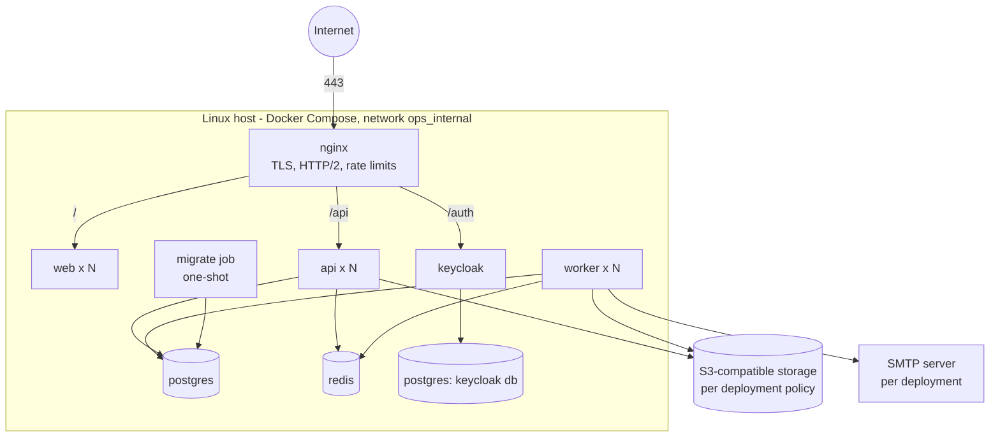

# Deployment

Status: implemented (Phase 9).
- **Development (Phase 1):** dev Compose file (`infra/compose/docker-compose.dev.yml`), dev Nginx config and test stacks.
- **Production (Phase 9):**
  - Images: `infra/docker/app.Dockerfile`, built with `scripts/release/build-images.sh`.
  - Compose and proxy: `infra/compose/docker-compose.prod.yml` with opt-in overlays, and the TLS proxy (`infra/nginx/prod`).
  - Database and identity: production PostgreSQL roles (`infra/docker/postgres/prod-init`) and the production Keycloak realm (`infra/docker/keycloak/realms-prod`).
  - Operations: secret provisioning (`scripts/ops/init-secrets.sh`), backups (`infra/backup`), smoke test (`scripts/release/smoke.ts`) and the rehearsal harness (`scripts/release/rehearse.ts`).
- **Runbooks:** step-by-step operations are in `docs/runbooks/`. This document is the overview: `deploy.md` (installation, upgrade, rollback), `secrets.md`, `backup-restore.md`, `keycloak.md`, `tls-and-proxy.md`, `redis.md`, `database-roles.md`, `observability.md`, `performance.md`.

---

## 1. Targets

| Target | Description |
|---|---|
| Local development | Infra in Docker Compose; apps via `pnpm dev` (hot reload) |
| Self-hosted / on-prem | Single Linux server (VPS or customer data center) running the full stack with Docker Compose |
| Cloud (later) | Same images on a container service with managed PostgreSQL/Redis/S3 — no architecture change |

No Kubernetes.

## 2. Local development

Prerequisites (see `ROADMAP.md` §Local environment prerequisites for the step-by-step fix of the current machine):

- **Node.js 24 LTS** (`.nvmrc` = `24`; verified version 24.21.0).
- **pnpm 12.8.1**, installed via the official pnpm installation instructions (pnpm.io/installation). On Windows the documented method is `npx get-pnpm`. The version is also pinned in root `package.json` `packageManager` (Phase 1). **No Corepack dependency.**
- Docker Engine / Docker Desktop with Compose v2.

Workflow (verified from an empty database at the end of Phase 1):

```bash
pnpm install
pnpm env:init            # .env from .env.example; replaces __SECRET:<NAME>__ placeholders with random dev values
pnpm infra:up            # docker compose --env-file .env -f infra/compose/docker-compose.dev.yml up -d --wait
pnpm db:migrate:deploy   # apply committed migrations as ops_migrator (use `pnpm db:migrate` only when authoring a migration)
pnpm db:seed             # dev-only demo data; refuses unless ALLOW_DEMO_SEED=true and NODE_ENV is not production
pnpm dev                 # web :3000 (proxies /api to API_INTERNAL_URL), api :4000, worker (outbox relay + jobs)
```

Instead of the demo seed, a real first organization is created with the bootstrap CLI (P1-5). It creates the organization with its system roles and an invited ORG_ADMIN, writes a platform audit record and prints a single-use invitation link once. It never sets passwords. It is idempotent: re-running it changes nothing while an admin is active or an invitation is open (`--reissue` replaces an open invitation). With `NODE_ENV=production` it also requires `--confirm-production <slug>`.

```bash
pnpm bootstrap --slug acme --name "Acme Ltd" --time-zone Africa/Cairo --work-week 7,1,2,3,4 \
  --admin-name "Jane Admin" --admin-email jane@acme.example
```

Tests: `pnpm test` (unit), `pnpm test:integration` (Testcontainers PostgreSQL/Redis/Keycloak; needs Docker), `pnpm test:e2e` (builds web/API/worker, starts PostgreSQL, Redis and Keycloak containers plus the built apps on ports 3210/4210, and drives Chromium; run `pnpm --filter @company-ops/e2e exec playwright install chromium` once). The test stacks use their own disposable containers and never the dev Compose stack or any local PostgreSQL service.

Demo sign-in (Keycloak realm `company-ops`, password = `KC_DEMO_USER_PASSWORD` from your `.env`):
`org.admin` (ORG_ADMIN, TOTP enrollment at first login), `gm`, `hr`, `employee`, `disabled` (disabled
membership, rejected), `outsider` (no membership, rejected). Open `http://localhost:3000/api/v1/auth/login`.

The realm is imported only when it does not exist yet (`--import-realm`, strategy `IGNORE_EXISTING`).
After editing `infra/docker/keycloak/realms/company-ops-realm.json`, or after changing `OIDC_CLIENT_SECRET`
/ `KC_DEMO_USER_PASSWORD`, reset the disposable dev data: `pnpm infra:down`, then
`docker volume rm company-ops-dev_postgres-data company-ops-dev_redis-data` (this project's dev volumes
only; Keycloak's database lives in the same PostgreSQL container), then `pnpm infra:up`, migrate and seed.
For Keycloak back-channel logout to reach a locally running API, the API must listen on an address the
container can reach via `host.docker.internal` (`OIDC_BACKCHANNEL_LOGOUT_URL`).

`--env-file .env` is required because the Compose file lives in `infra/compose/` and Compose otherwise
looks for `.env` next to it. `.env.example` holds placeholders only; `.env` is git-ignored.

## 3. Development services

Images are pinned by tag **and** digest (verified 2026-10-02, `DEPENDENCIES.md` §6).

| Service | Image | Port(s) | Notes |
|---|---|---|---|
| PostgreSQL | `postgres:18.6@sha256:5a5a84b1…` | 5432 (host port overridable with `POSTGRES_HOST_PORT`) | App DB (`company_ops`, roles `ops_migrator` / `ops_app`) + separate Keycloak DB, created by `infra/docker/postgres/init` |
| Redis | `redis:8.10.2@sha256:6f81e891…` | 6379 | AOF enabled, password required |
| Keycloak | `quay.io/keycloak/keycloak:26.8.0@sha256:b0f60d48…` | 8080 | `start-dev --import-realm` with `infra/docker/keycloak/realms/company-ops-realm.json` (ACR→LoA mapping, step-up flow, `ops-api` client, demo users). Health on management port 9000, not published |
| SeaweedFS (S3 API) | `chrislusf/seaweedfs:4.48@sha256:4e61d15f…` | 8333 (S3) | Dev/CI object storage (ADR-0008) |
| Mailpit | `axllent/mailpit:v1.31.3@sha256:ed9b00c6…` | 1025 (SMTP), 8025 (UI) | Captures all dev mail |
| Nginx (optional `proxy` profile) | `nginx:1.30.5-alpine@sha256:0985e772…` | 443 | LAN HTTPS for phone geolocation testing |

Digests above are abbreviated for readability; Compose files use the full digests listed in `DEPENDENCIES.md` §6.

All published ports bind to `127.0.0.1`, except Nginx 443 (LAN access is its purpose). Every service has a
Compose health check; `pnpm infra:up` waits until all are healthy.

**Testing geolocation on a phone**: browsers expose geolocation only on secure origins. `localhost` qualifies on the dev machine; for a phone on the LAN, run the optional `proxy` profile (Nginx with a locally-trusted certificate) and browse to `https://<lan-host>`.

## 4. Production topology (single host)



- Only Nginx publishes ports (80/443). Everything else is on an internal network.
- TLS: Let's Encrypt or customer-provided certificates (government environments often require their own CA).
- Keycloak runs in production mode (`kc.sh start --import-realm`, `KC_HOSTNAME` on the public host under `/auth`, `KC_PROXY_HEADERS=xforwarded`) behind the proxy with its own database. Its admin console and master realm are not routed publicly. Administer it through an SSH tunnel (`docs/runbooks/keycloak.md`).
- As implemented, there are two networks:
  - `edge`: proxy and web;
  - `data` (`internal: true`, no outbound route): PostgreSQL, Redis, migrate and backup;
  - API, worker and Keycloak are attached to both. Only the proxy publishes ports.
- Object storage: any S3-compatible service accessed through the vendor-neutral `StoragePort` (ADR-0008). The production provider is chosen per deployment to satisfy §7.
- Email: SMTP server configured per deployment (§6).

## 5. Images

One multi-stage Dockerfile, `infra/docker/app.Dockerfile`, with one target per image. `bash scripts/release/build-images.sh <tag>` builds all four with the same tag and refuses `latest`. Docker Engine 23+ (BuildKit) is required to build; hosts need Engine 24+ and Compose 2.20+ (`docs/runbooks/deploy.md`).

| Image | Build | Runtime |
|---|---|---|
| `ops-api` | frozen-lockfile install → `turbo build` → `pnpm deploy --prod` bundle (Prisma CLI and engines removed, imports re-verified) | `node:24.21.0-bookworm-slim` (digest-pinned), Debian updates applied, npm/corepack/yarn removed, `USER node`, `HEALTHCHECK` → `/api/v1/health/live`; includes the `ops-bootstrap` and `ops-activity-rebuild` CLIs |
| `ops-worker` | same pattern | same base, internal health and metrics port 4001 |
| `ops-web` | Next.js `output: 'standalone'` | same base, `USER node`, `HEALTHCHECK` → `/healthz` |
| `ops-migrate` | `pnpm deploy --prod` of `apps/migrate` (Prisma CLI) | runs `prisma migrate deploy` as `ops_migrator`, then exits |

Rules (all enforced):
- no dev dependencies and no package managers in runtime layers;
- application files owned by root and not writable by `node`;
- read-only root filesystem with a `/tmp` tmpfs; all capabilities dropped; `no-new-privileges`;
- `NODE_ENV=production`; configuration only through the environment and Docker secrets.

CI fails on fixable HIGH/CRITICAL Trivy findings and publishes CycloneDX SBOMs (`SECURITY.md` §13).

## 6. Configuration

All configuration is environment-based and validated at startup (process exits with a clear message on invalid config). Secrets support `*_FILE` variants.

Key variables (full list in `.env.example`, Phase 1):

```text
NODE_ENV, PUBLIC_URL, CORS_ORIGINS
DATABASE_URL                     # ops_app role
DATABASE_MIGRATION_URL           # ops_migrator role (migrate job only)
REDIS_URL
OIDC_ISSUER_URL, OIDC_CLIENT_ID, OIDC_CLIENT_SECRET(_FILE)
APP_ENCRYPTION_KEY(_FILE), APP_ENCRYPTION_KEYS_PREVIOUS
S3_ENDPOINT, S3_REGION, S3_BUCKET, S3_ACCESS_KEY_ID, S3_SECRET_ACCESS_KEY(_FILE), S3_FORCE_PATH_STYLE
SMTP_HOST, SMTP_PORT, SMTP_SECURE, SMTP_USER, SMTP_PASSWORD(_FILE), SMTP_FROM
JIRA_OAUTH_CLIENT_ID, JIRA_OAUTH_CLIENT_SECRET(_FILE)
GITHUB_APP_ID, GITHUB_APP_SLUG, GITHUB_APP_CLIENT_ID, GITHUB_APP_CLIENT_SECRET(_FILE), GITHUB_APP_PRIVATE_KEY(_FILE), GITHUB_WEBHOOK_SECRET(_FILE)
SWAGGER_ENABLED                  # false in production by default
ALLOW_DEMO_SEED                  # must be unset in production; seed refuses when NODE_ENV=production
```

Added in Phase 1A: `API_PORT` (default 4000) and `LOG_LEVEL` (default `info`) for the API/worker, and
development-only Compose variables `POSTGRES_PASSWORD`, `POSTGRES_HOST_PORT`, `OPS_APP_DB_PASSWORD`,
`OPS_MIGRATOR_DB_PASSWORD`, `REDIS_PASSWORD`, `KEYCLOAK_DB_PASSWORD`, `KC_BOOTSTRAP_ADMIN_USERNAME`,
`KC_BOOTSTRAP_ADMIN_PASSWORD`.

Added in Phase 1B (the names above are the Phase 0 plan; these are the implemented names):
`APP_PUBLIC_URL` (replaces `PUBLIC_URL`), `TRUST_PROXY_HOPS`, `API_INTERNAL_URL` (web → API proxy target),
`OIDC_ISSUER` (replaces `OIDC_ISSUER_URL`), `OIDC_CLIENT_ID`, `OIDC_CLIENT_SECRET`,
`OIDC_ALLOW_INSECURE_HTTP` (development only; rejected in production), `OIDC_BACKCHANNEL_LOGOUT_URL`
(realm import only), `KC_DEMO_USER_PASSWORD` (realm import only), `APP_ENCRYPTION_KEY` and
`APP_ENCRYPTION_KEY_ID` (session ID-token encryption), `SESSION_IDLE_TIMEOUT_MINUTES`,
`SESSION_ABSOLUTE_TIMEOUT_MINUTES`, `MFA_MAX_AGE_MINUTES`, `RATE_LIMIT_DEFAULT_PER_MINUTE`,
`RATE_LIMIT_AUTH_PER_MINUTE` and `ALLOW_DEMO_SEED`. `SESSION_SECRET` is not needed: session ids are random opaque tokens stored hashed in Redis.

Added later in Phase 1: `RATE_LIMIT_USER_PER_MINUTE`, `RATE_LIMIT_SENSITIVE_PER_MINUTE`,
`RATE_LIMIT_UPLOAD_PER_MINUTE`, `RATE_LIMIT_WEBHOOK_PER_MINUTE` (buckets in `SECURITY.md` §5);
`S3_PUBLIC_ENDPOINT` (browser-reachable endpoint for pre-signed URLs); worker `OUTBOX_POLL_INTERVAL_MS`,
`OUTBOX_BATCH_SIZE`, `OUTBOX_LEASE_MS`, `OUTBOX_MAX_ATTEMPTS`, `JOB_MAX_ATTEMPTS`. Work week values are ISO
weekdays (1 = Monday … 7 = Sunday). The test-only `SECURITY_PROBE_ENABLED` switch was removed together with
its endpoints.

Added in Phase 2: `STORAGE_PUBLIC_ORIGIN` (web app). Browsers upload and download attachments directly
against `S3_PUBLIC_ENDPOINT`, so the web CSP must allow that origin in `connect-src` (uploads) and `img-src`
(employee photos). Set it to the **origin only** of `S3_PUBLIC_ENDPOINT` (scheme, host, port; any path is
ignored). Leave it unset when storage is served from the application's own origin. Restrict the bucket's
CORS rules to `APP_PUBLIC_URL` with methods `PUT` and `GET` and the `content-type` header; development
SeaweedFS without CORS rules accepts any origin, which is not acceptable in production.

Added in Phase 3 (worker): `SMTP_HOST`, `SMTP_PORT`, `SMTP_SECURE`, `SMTP_USER`, `SMTP_PASSWORD`, `SMTP_FROM`
and `SLA_SWEEP_INTERVAL_MS` (default 60000). Leave `SMTP_HOST` empty to disable email; deliveries are
then recorded as `SKIPPED` and in-app notifications still work. Production relays need `SMTP_SECURE=true`
(port 465) or STARTTLS, which the worker requires when `NODE_ENV=production`; `SMTP_PASSWORD` comes from
the secret store. Development uses Mailpit (`SMTP_HOST=localhost`, `SMTP_PORT=1025`, UI on 8025). The
API needs no new variables: live updates use the existing `REDIS_URL`, and Nginx must not buffer
`/api/v1/notifications/events/stream` (`proxy_buffering off`, read timeout above the 25 s heartbeat).

Added in Phase 6 (worker): `REQUEST_SLA_SWEEP_INTERVAL_MS` (default 300000, 10 s–1 h), how often overdue
approvals are reminded (once per assignment). Requests reuse the existing outbox, SMTP, Redis (live
`request.changed` hints on the notification stream) and object storage (request attachments); the API
needs no new variables. Run `prisma migrate deploy` to apply `20261007090000_requests` and
`20261007100000_requests_step_approver_check` before starting the new API and worker. Production
organizations start without request types: administrators create and publish them (holding
`request.admin`, which needs a fresh second factor); the six demo types come from the development seed only.

Added in Phase 7 (attendance, ADR-0022): `RATE_LIMIT_ATTENDANCE_PER_MINUTE` (API, default 10 per user;
check-in and check-out share it) and `ATTENDANCE_SWEEP_INTERVAL_MS` (worker, default 900000, 1–60 minutes;
how often open days past their deadline are marked as missing a check-out). Run `prisma migrate deploy`
to apply `20261008090000_attendance_enums` and `20261008090100_attendance` before starting the new API
and worker. After deployment an administrator must save the location accuracy policy
(`/admin/attendance`, `org.settings.manage` with a fresh second factor): until then check-ins that need a
location are refused. Work locations, shifts and shift assignments are configured by `attendance.config`
holders; the Attendance correction request type is created on first use. Coordinate retention
(`ATTENDANCE_COORDINATES`, 30–3650 days) is off until a policy is saved; it clears coordinates only and
keeps the attendance evidence and audit history. Browsers expose geolocation only on secure origins, so
production must serve the web app over HTTPS (`localhost` is allowed in development).

Added in Phase 8 (dashboards, search, setup checklist, notification preferences, ADR-0023):
`RATE_LIMIT_SEARCH_PER_MINUTE` (API, default 60 per user; refused queries count too; the palette debounces
typing by 250 ms). Run `prisma migrate deploy` to apply `20261009090000_dashboards_search_preferences`
(the `notification_preferences` table and GIN trigram indexes on project names, employee names, ticket
titles and Jira keys/summaries) before starting the new API and worker; on large existing tables, build those
indexes ahead of the release with `CREATE INDEX CONCURRENTLY` under the same names (§9). The dashboard
cache uses the existing Redis with org-prefixed `dash:` keys and a 60-second TTL; it needs no
configuration, and a Redis outage only makes dashboards slower (they fall back to PostgreSQL). Members
start with every notification channel enabled; nothing needs to be seeded.

Added in Phase 9 (production hardening):
- **Variables:**
  - `*_FILE` for every secret (below);
  - `API_OPS_PORT`: internal metrics listener, `0` = off; production Compose sets `9464`;
  - `WORKER_OPS_PORT`: worker health and metrics, default `4001`.
- **Production Compose files:**
  - `infra/compose/compose.env.example`: Compose-level settings (image registry and tag, public host and ports, host paths, Keycloak tunnel port, PostgreSQL and Redis sizing);
  - `infra/compose/app.env.example`: application settings for API and worker, with secrets only as files.
- **Opt-in overlays:** `docker-compose.prod.smtp.yml`, `docker-compose.prod.jira.yml`, `docker-compose.prod.github.yml`, `docker-compose.prod.private-ca.yml` (`NODE_EXTRA_CA_CERTS` for an internal CA) and `docker-compose.prod.external-data.yml`.
- **Rate limits:** the defaults are production values (measured in `docs/runbooks/performance.md`). Rehearsals that need to exceed them override them only in their own env file.

Added in Phase 10 (tenders and contracts, ADR-0026): `COMMERCIAL_MONITOR_INTERVAL_MS` (worker, default
900000, 1 minute–1 day): how often the commercial monitor sends deadline, due-date and expiry reminders,
expires contracts and guarantees whose dates have passed, generates recurring obligation occurrences and
refreshes contract health. The API needs no new variables; commercial status changes use the existing
`RATE_LIMIT_SENSITIVE_PER_MINUTE` bucket. Run `prisma migrate deploy` to apply
`20261010090000_commercial_enums`, `20261010090100_commercial`, `20261010090200_contract_renewal_decision` and
`20261010090300_tender_requirement_delete_grant` before starting the new API and worker. The migrations only add types, tables, indexes, organization counters
and the new permission grants for existing system roles (§2.5 of `SECURITY.md`); no existing row is
rewritten. Reminder thresholds start at the defaults and can be changed per organization in
`/admin/commercial` (`org.settings.manage`). Back up the database before the upgrade
(`docs/runbooks/backup-restore.md`); the upgrade was rehearsed on a restored copy of a Phase 9 database.

Added in Phase 4 (Jira Cloud, `INTEGRATIONS.md` §1.9, ADR-0019):
- **API and worker:** `JIRA_OAUTH_CLIENT_ID`, `JIRA_OAUTH_CLIENT_SECRET` (secret store; both empty = integration disabled, one without the other is rejected). `JIRA_AUTH_BASE_URL`/`JIRA_API_BASE_URL` exist only for the test double; production rejects anything but `https://auth.atlassian.com` / `https://api.atlassian.com`.
- **Shared key:** the worker reads `APP_ENCRYPTION_KEY`, `APP_ENCRYPTION_KEY_ID` and `APP_ENCRYPTION_KEYS_PREVIOUS` with the same values as the API (the API encrypts tokens at consent; the worker decrypts and stores rotated tokens). A lost or changed key without its previous entry forces every connection to `NEEDS_REAUTH`.
- **Worker only:** `JIRA_RECONCILE_INTERVAL_MS` (default 1 h), `JIRA_DEEP_RECONCILE_INTERVAL_MS` (default 7 days), `JIRA_WEBHOOK_REFRESH_INTERVAL_MS` (default 1 day).
- **API only:** `RATE_LIMIT_JIRA_PER_MINUTE` (default 30, per user).
- **Atlassian app:** create an OAuth 2.0 (3LO) app in the Atlassian developer console with the Jira API scopes `read:jira-work`, `write:jira-work`, `manage:jira-webhook` (plus `offline_access`, requested at consent), and register the callback `<APP_PUBLIC_URL>/api/v1/integrations/jira/callback` (shown on the admin page).
- **Webhooks:** Jira delivers to `<APP_PUBLIC_URL>/api/v1/webhooks/jira/<connectionId>`, so `APP_PUBLIC_URL` must be a public `https` origin whose `/api` reaches the API; otherwise the integration runs on reconciliation alone. For a non-distributed Atlassian app, deliveries arrive only if the administrator who connects Jira is the app owner; enable distribution otherwise.
- **Operations:** the admin page shows connection state, webhook state and the last error; *Sync history* shows runs and failures, with Retry (resumes from the checkpoint) and Cancel. *Full resync* rebuilds a mapping's cache from Jira. After restoring a database backup, run *Sync now* on each mapping (or wait for the hourly reconciliation) to catch up with Jira; tokens restored from a backup may already be rotated, in which case the connection moves to `NEEDS_REAUTH` and needs *Reauthorize*.

**Live Jira verification checklist (not yet performed).** Phase 4 is verified only against the deterministic test double. Before the first production connection, run these against a **non-production** Jira Cloud site you control (never an uncontrolled production site):
1. Connect: consent screen lists the four scopes, the callback succeeds, and the site appears (choose a site when the account has several).
2. Map a small project; the initial import's count matches Jira and the progress bar finishes.
3. Edit an issue in Jira: a webhook arrives (check the API log for no `Jira webhook rejected`), the issue updates within seconds, and a linked ticket shows "Jira status changed".
4. Leave the instance running over an access-token lifetime (about 1 hour): the next sync refreshes the token without `NEEDS_REAUTH`.
5. Create an issue from a ticket: one issue with the confirmed text and the back-link, no internal note.
6. Revoke the app in the Atlassian account's connected apps: the connection becomes `NEEDS_REAUTH` once and administrators are notified; *Reauthorize* recovers.
7. Disconnect: the dynamic webhook disappears from `GET /rest/api/3/webhook` for the app.

Added in Phase 5 (GitHub App, `INTEGRATIONS.md` §2.6, ADR-0020):
- **API:** `GITHUB_APP_ID`, `GITHUB_APP_SLUG`, `GITHUB_APP_CLIENT_ID`, `GITHUB_APP_CLIENT_SECRET`, `GITHUB_APP_PRIVATE_KEY`, `GITHUB_WEBHOOK_SECRET` (all six, or `GITHUB_APP_ID` empty to disable the integration), `GITHUB_WEBHOOK_MAX_BYTES` (default 5 MiB), `RATE_LIMIT_GITHUB_PER_MINUTE` (default 30, per user).
- **Worker:** `GITHUB_APP_ID`, `GITHUB_APP_CLIENT_ID`, `GITHUB_APP_PRIVATE_KEY`, `GITHUB_RECONCILE_INTERVAL_MS` (default 30 min), `GITHUB_INSTALLATION_SYNC_INTERVAL_MS` (default 6 h), `GITHUB_PR_HISTORY_DAYS` (default 90), `RETENTION_PURGE_INTERVAL_MS` (default 1 day), `RETENTION_PURGE_BATCH_SIZE` (default 1000). The worker also needs the same `APP_ENCRYPTION_KEY*` values as the API (installation tokens are cached encrypted in Redis and shared).
- `GITHUB_API_BASE_URL`/`GITHUB_WEB_BASE_URL` exist only for the test double; production rejects anything but `https://api.github.com` / `https://github.com`.
- **Registering the App:** create one GitHub App per deployment from `infra/github/app-manifest.template.json` (replace `ops.example.com` with the public host). Permissions must stay Metadata, Pull requests, Checks and Commit statuses **read** with Contents **none**; do not set *Request user authorization during installation* (the setup URL starts it). Generate a private key and a high-entropy webhook secret and store them, with the client secret, in the secret store, never in the repository.
- **Key rotation:** add a second private key on the App settings page, deploy it (`GITHUB_APP_PRIVATE_KEY[_FILE]`), restart API and worker, then delete the old key on GitHub. Cached installation tokens stay valid until they expire. For the webhook secret, set the new value on GitHub and in the deployment at the same time; deliveries signed with the other value in between are rejected (`401`) and are recovered by reconciliation or by redelivering them from the App's *Advanced* page.
- **Webhooks** arrive at `<APP_PUBLIC_URL>/api/v1/webhooks/github` (public `https`). Nginx must pass the body unmodified and allow at least `GITHUB_WEBHOOK_MAX_BYTES` (`client_max_body_size`). Without webhooks, data is still correct within the reconciliation interval.

**Live GitHub verification checklist (not yet performed).** Phase 5 is verified only against the deterministic test double. Before production use, run these with a **test** GitHub App installed on a test organization with throwaway repositories (never an uncontrolled production organization):
1. Install from the admin page: GitHub's install screen lists the four read permissions and no Contents; the user-authorization step completes and the installation shows *Active* with its repositories.
2. Forge `…/integrations/github/setup?installation_id=<another id>` in a fresh session: it must end at `github=error`, with nothing bound.
3. Map a repository: the initial sync imports open pull requests and those closed in the last 90 days.
4. Open a pull request with a Jira key in the branch: it appears within seconds (check the API log for no `GitHub webhook rejected`) and the key is confirmed when the issue is in a mapped Jira project.
5. Submit a review and let CI run: the review and checks summaries change.
6. Redeliver a delivery from the App's *Advanced* page: it is acknowledged as a duplicate and nothing changes.
7. Remove the repository from the installation, then suspend and unsuspend the installation: states and administrator notifications follow; history stays.
8. Rotate the private key as above without downtime.

**Project activity rebuild.** The project timeline is a read model of retained outbox events. After a
restore or a consumer bug fix, rebuild it with `pnpm activity:rebuild --org <slug> [--project <code>]`
(uses `DATABASE_URL`; rebuilds inside the organization's tenant context and is idempotent). Do not purge
`project.activity.recorded` outbox events while timelines must stay rebuildable (ADR-0017).

**Client IP behind proxies.** Set `TRUST_PROXY_HOPS` to the number of proxies in front of the API that
append the connecting address to `X-Forwarded-For`; the API then uses the entry that many hops from the
right, so client-supplied values to the left are ignored. Nginx routes `/api` directly to the API with
`proxy_set_header X-Forwarded-For $proxy_add_x_forwarded_for` (`infra/nginx/prod`, `infra/nginx/dev.conf`; `TRUST_PROXY_HOPS=1`). Without Nginx, the web server's `/api` proxy
(`API_INTERNAL_URL`) removes client forwarding headers, so per-IP limits key on the web server's address
(per-user limits still apply). Never expose the API port directly with `TRUST_PROXY_HOPS` > 0.

**Revoking access** (no refresh tokens, ADR-0002): disable the membership in the app (`Employees → Account
access`), which takes effect on that member's next request. To end all of a person's sign-ins, also
disable the user in Keycloak and sign out their Keycloak sessions; back-channel logout removes the
application sessions.
`*_FILE` secret variants (a path to a mounted secret file, at most 64 KiB; setting both forms is rejected) exist for **every** secret since Phase 9. That covers `DATABASE_URL`, `DATABASE_MIGRATION_URL`, `REDIS_URL`, `OIDC_CLIENT_SECRET`, `APP_ENCRYPTION_KEY`, `APP_ENCRYPTION_KEYS_PREVIOUS`, both S3 keys, `SMTP_PASSWORD`, and the Jira and GitHub secrets (`packages/config/src/secret-files.ts`). Sessions need no secret: their ids are random and the cookie is not signed. Production Compose passes only the `_FILE` form, from Docker secrets created by `scripts/ops/init-secrets.sh` (`docs/runbooks/secrets.md`). In production the apps also refuse placeholder or weak secrets, non-HTTPS public URLs and enabled Swagger. Each app validates only the variables it reads (schemas in
`packages/config`); variables for later phases are added to `.env.example` by the phase that reads them.

There are **no** environment defaults for organization time zone, work week or retention; those are per-organization settings (`PRD.md` §12-C, §12-E).

## 7. Data residency and retention (deployment policy)

- **Data residency is a deployment decision**, not an application feature. Every stateful dependency (PostgreSQL, Redis, object storage, SMTP, Keycloak) can run on-prem or in-country; the application has no hard-wired cloud services.
- Outbound connections from the stack: Jira Cloud (if connected), GitHub (if installed), configured SMTP and object storage. There is no telemetry or error-tracking service (ADR-0024 §6).
- Jira Cloud and GitHub data are cached locally; their residency is governed by Atlassian/GitHub terms and is outside this platform's control.
- Backups (§10) must be stored in a location satisfying the same policy.
- **Retention** is configured per organization in the application (`SECURITY.md` §11). Nothing is purged until a policy is explicitly configured. Backup retention (§10) is an operator setting and must be consistent with the organization's configured policy.

## 8. Release procedure

The exact commands are in `docs/runbooks/deploy.md`. This list is the summary, and every step was rehearsed on the production Compose stack:
1. Build images with an immutable tag (`scripts/release/build-images.sh <git-sha or semver>`); CI runs the Trivy gate and produces SBOMs. Push them to the operator's registry and set `OPS_VERSION`.
2. On the host: `dc pull` (or load the images).
3. Take a pre-deploy backup: `dc --profile backup run --rm backup` (§10).
4. Apply migrations: `dc run --rm migrate` (expand-only migrations, §9).
5. Start the new release: `dc up -d api worker web`. With two API replicas (`--scale api=2`) and a rolling restart, the rehearsal served 988 of 988 requests without an error.
6. Smoke test: `node scripts/release/smoke.ts --url https://<host>` (13 checks: TLS, redirects, headers, health, login redirect, API envelope, Keycloak exposure). Then sign in once.
7. Roll back by setting the previous `OPS_VERSION` and running `dc up -d` (expand-only migrations keep the old release compatible). Restore the pre-deploy backup only when a migration itself must be undone.

## 9. Database migration policy

- All changes via `prisma migrate dev` → committed SQL in `packages/db/prisma/migrations/`. Production uses `prisma migrate deploy` only. Never `db push` outside local prototyping; never manual DDL in production.
- **Expand → migrate → contract** for destructive changes (add → backfill in a resumable job → switch reads → drop in a later release).
- CI: migrations apply cleanly on an empty DB and on a DB at the previous release; a lint step flags `DROP` / `ALTER … TYPE` / `SET NOT NULL` without an ADR note in the PR.
- Composite tenant FKs (`DATA_MODEL.md` §2) are part of the initial migration; adding a new tenant relation requires its composite FK in the same migration.
- Grants and append-only triggers for audit tables live in the migration itself. The `REVOKE`s apply only if a role named `ops_app` exists when the migration runs (the dev init script creates it first); deployments using another runtime role name must apply equivalent grants. Production roles are created by `infra/docker/postgres/prod-init/01-roles-and-databases.sh` (bundled PostgreSQL, first start) or by running the same statements on an external server. `ops_migrator` owns the schema **without** `CREATEDB`. `ops_app` gets `CONNECT`, schema `USAGE` and default DML privileges. `ops_backup` is read-only (`docs/runbooks/database-roles.md`).
- **Migration rehearsal (Phase 9):** the migrate image applied the full migration history to an empty production database, and `prisma migrate status` reported it up to date. The same check passed against a restored backup. Schema drift against `schema.prisma` is checked with `prisma migrate diff` in the release gate.
- Large-table indexes use `CREATE INDEX CONCURRENTLY` in a dedicated migration (raw SQL in migration files is reviewed like any other raw SQL).

## 10. Backups & restore

| Data | Method | Frequency | Retention (operator-configurable) |
|---|---|---|---|
| PostgreSQL (app) | `backup` service (`infra/backup/pg-backup.sh`, read-only `ops_backup`): `pg_dump -Fc`, verified, row counts, manifest, checksums; then the operator's encrypted off-host copy. Provider PITR when using managed PostgreSQL | Nightly (systemd timer) and before every deploy | 14 days on the host (`OPS_BACKUP_RETENTION_DAYS`); off-host e.g. 30 daily, 12 monthly |
| PostgreSQL (Keycloak) | same run (`keycloak.dump`: users, credentials, realm) | same | same |
| Object storage | Provider versioning/replication or a sync to a second location | Continuous / nightly | e.g. 30 days of versions |
| Secrets and configuration | Organization's secret manager / encrypted offline copy | On change | — |
| Redis | **Not backed up**: sessions, queues and caches are rebuilt (`docs/runbooks/redis.md`) | — | — |

Recovery objectives are an RPO of 24 h (minutes with provider PITR) and an RTO of 30 minutes on the same host or 4 hours on a new host (`docs/runbooks/backup-restore.md`).

Drill results (`rehearse.ts restore-drill`):
- **Scratch restore:** 56,674 rows; backup 3 s, restore 5 s; checksums, row counts and migration status all verified.
- **Restore into the running production stack:** 59,674 rows, identical counts, smoke 13/13 afterwards. The procedure uses a rename swap, so the previous database stays available until the restore is confirmed.

Repeat the drill quarterly and after PostgreSQL major upgrades.

## 11. Monitoring

Details: `docs/runbooks/observability.md` and ADR-0024. No monitoring service is bundled; the operator connects these signals.
- **Health:** container health checks on every service. Point an external uptime monitor at `/api/v1/health/ready` and `/healthz`.
- **Metrics:** Prometheus metrics on internal ports (`api:9464`, `worker:4001`), covering HTTP rate, errors and latency, queues, outbox lag, process memory and event-loop utilization. Labels carry no personal identifiers.
- **SLOs:** 99.5 % non-5xx; p95 under 250 ms; oldest pending outbox event under 60 s; a verified daily backup. The runbook includes example alert rules.
- **Logs:** JSON to stdout with central redaction, Docker `local` driver with rotation, correlated by `X-Request-Id`.
- **Error tracking:** no Sentry or OpenTelemetry in V1 (ADR-0024 §6).

## 12. Failure recovery (rehearsed on the production stack; runbooks in `docs/runbooks/`)

| Failure | Behaviour / action |
|---|---|
| Worker or API process crash | Docker restarts the container (`restart: unless-stopped`; `init: true`, so a crashed Node process ends the container). Rehearsed with SIGKILL: the worker was ready again after 4 s and the API after 3 s, and the proxy answered `503` with `Retry-After` in between. `docker kill`/`docker stop` count as manual stops and are not restarted; use `dc up -d` afterwards |
| Worker restart | Jobs return to the queue (stalled-job detection). Processors are idempotent, and graceful shutdown drains active jobs |
| API restart / deploy | Readiness turns `503` while draining. With two replicas no request fails; with one, the proxy answers `503` with `Retry-After` for a few seconds (static page for browsers) |
| PostgreSQL outage | Readiness `503`, and requests fail fast with `503 DEPENDENCY_UNAVAILABLE`; the worker also reports not ready. Rehearsed with a 25 s stop: API and worker served again 2 s after PostgreSQL returned, with no restart |
| Redis outage | Same behaviour. Rehearsed with a 25 s stop: recovery 6 s after Redis returned, and existing sessions survived (AOF) |
| Redis data loss | Users sign in again. Scheduled jobs are re-created on worker start. Requeue recently dispatched outbox events with the SQL in `docs/runbooks/redis.md` (rehearsed: 10,913 events drained in 23 s) |
| Jira / GitHub outage | Webhook intake still stores deliveries, processors back off, and reconciliation fills gaps |
| Expired Jira token | Connection → `NEEDS_REAUTH`, admins notified, syncs paused |
| Bad deploy | Roll back to the previous `OPS_VERSION` (§8) |
| Data corruption or loss | Restore from backup (`docs/runbooks/backup-restore.md`), end sessions, *Sync now* the integrations and rebuild activity timelines (`ops-activity-rebuild`) |
| Compromised secret | Rotation procedures and the session flush in `docs/runbooks/secrets.md` (rehearsed) |
