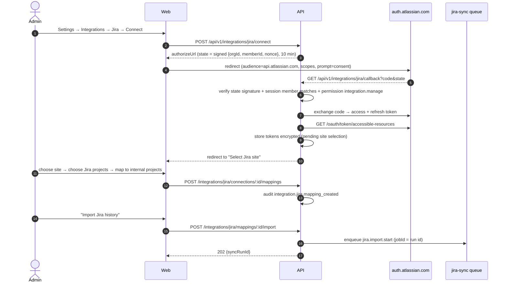
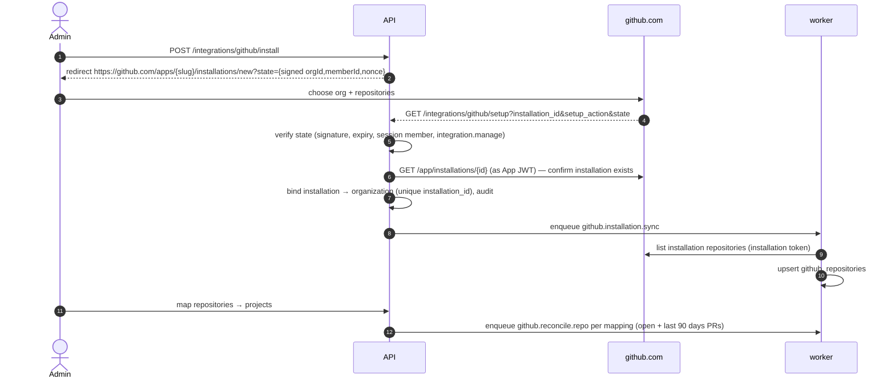

# Integrations — Jira & GitHub

Status: Phase 0 strategy, verified against official Atlassian and GitHub documentation on 2026-10-02. **Jira Cloud is implemented (Phase 4)**: the as-built contract, the re-verification of every Atlassian API used (2026-10-03) and the deviations from the Phase 0 plan are in §1.9, which wins where it differs from §1.1–1.8. Email is §3. GitHub (§2) is not built yet.

Guiding rules:
- **Jira owns development issue state. GitHub owns repository/PR state.** Our data is a synchronized, read-oriented, **rebuildable** cache.
- All external calls happen in **workers**. HTTP handlers never call Jira/GitHub synchronously except two short, user-initiated, bounded calls: Jira issue **search** (typeahead for linking) and Jira issue **create** from a ticket. Both have a bounded timeout (15 s as built, §1.9.6) and clear error mapping. Phase 4 adds two equally bounded, user-initiated calls: the administrator's Jira project search and the issue-type list of the create dialog.
- Every write from external data is an **idempotent upsert keyed by immutable external IDs**, guarded against out-of-order updates.
- Tokens/secrets never leave the backend, are encrypted at rest, and never logged.

Both integrations sit behind ports in `packages/core/src/modules/{jira,github}/ports/` so adapters (Jira Data Center, GitHub Enterprise Server) can be added without touching domain code.

---

## 1. Jira

### 1.1 Deployment (confirmed)

**Jira Cloud — confirmed by stakeholders on 2026-10-02** (`PRD.md` §10 R6). Integration uses an **OAuth 2.0 (3LO) app** registered in the Atlassian developer console. A Jira Data Center adapter is out of V1 scope; the `JiraClient` port keeps that option open without domain changes.

Self-hosted customers register **their own** Atlassian OAuth app and supply `JIRA_OAUTH_CLIENT_ID` / `JIRA_OAUTH_CLIENT_SECRET` / callback URL via env. The SaaS deployment uses one distributed app.

> **Constraint (Atlassian docs):** for **non-public (not distributed) OAuth apps**, dynamic webhooks are delivered only if the user who registered the webhook is the **app owner**. Therefore either (a) the admin who clicks *Connect Jira* must be the developer-console owner of the app, or (b) the app's *Distribution* must be enabled ("sharing"). Setup docs and the connect screen state this explicitly. The scheduled reconciliation (§1.7) keeps data correct even if webhooks are not delivered.

### 1.2 OAuth scopes (minimum)

| Scope | Why |
|---|---|
| `read:jira-work` | Read projects, issues, search (JQL), approximate count |
| `read:jira-user` | ~~Assignee/reporter display names~~ — **not requested (Phase 4)**: issue search and fetch already return `displayName` for assignee/reporter under `read:jira-work`; no user endpoint is called (§1.9.2) |
| `write:jira-work` | **Only** for "Create Jira issue from ticket" (can be omitted if the org disables that feature) |
| `manage:jira-webhook` | Register/refresh/delete dynamic webhooks |
| `offline_access` | Refresh tokens (rotating) |

All REST calls go to `https://api.atlassian.com/ex/jira/{cloudId}/rest/api/3/...`.

### 1.3 Connection flow



Token handling: refresh tokens **rotate**; the new refresh token is persisted in the same DB transaction as the new access token, under a per-connection Redis lock to avoid concurrent refresh races. `invalid_grant` → connection `NEEDS_REAUTH`, admins notified, syncs paused (not retried).

### 1.4 Historical import algorithm

Jira Cloud's `/rest/api/3/search` has been **removed**; the enhanced search `POST /rest/api/3/search/jql` paginates with `nextPageToken` and **returns no total**. Estimated totals come from `POST /rest/api/3/search/approximate-count`.

Page tokens are opaque and may expire, so they are **not** used as the durable resume cursor. Instead we checkpoint on `created` (monotonic for a project) and rely on idempotent upserts for overlap.

```text
run = create JiraSyncRun(type=INITIAL_IMPORT, status=QUEUED)   -- partial unique index: 1 active run per mapping
estimated = approximate-count("project = {jiraProjectId}")
run.records_estimated = estimated; status = RUNNING

cursor = run.last_cursor ?? { createdAfter: null }
loop:
  jql = "project = {jiraProjectId}"
        + (cursor.createdAfter ? " AND created >= \"{cursor.createdAfter as yyyy-MM-dd HH:mm}\"" : "")
        + " ORDER BY created ASC, key ASC"
  page = search/jql(jql, fields=[summary, issuetype, status, priority, assignee, reporter,
                                 created, updated, duedate, resolution, resolutiondate,
                                 labels, parent], maxResults=100, nextPageToken)
  in one DB transaction per page:
     upsert each issue ON CONFLICT (connection_id, jira_issue_id)
       DO UPDATE ... WHERE existing.jira_updated_at <= excluded.jira_updated_at
     count created / updated / unchanged (sync_hash) ; record per-issue failures
     run.records_* += ... ; run.last_cursor = { createdAfter: max(created) on page }
  publish progress event (SSE) every page
  if no nextPageToken: break
  enqueue next page as a NEW job (jobId = run:{id}:page:{n})   -- keeps jobs short, crash-safe
finish: SUCCEEDED | PARTIALLY_FAILED (records_failed > 0) | FAILED
```

Properties:
- **Restartable**: a crashed/failed run resumes from `last_cursor`; JQL `created >=` has minute precision, so the first resumed page re-reads up to a minute of issues, which the upsert absorbs (no duplicates — unique constraint).
- **Bounded**: 100 issues per request, one page per job; respects `Retry-After` on `429` with jittered backoff; global per-connection concurrency = 1 for import, separate from webhook processing.
- **Progress**: `processed / ≈estimated` shown with a "≈" and a percentage clamped to 99% until completion (estimate may drift).
- **Cancellable**: `CANCELLED` status checked between pages.

### 1.5 Incremental updates — webhooks

- On mapping creation, the worker registers a dynamic webhook: `POST /rest/api/3/webhook` with `url = {PUBLIC_URL}/api/v1/webhooks/jira/{connectionId}`, `jqlFilter = "project in (…mapped project IDs…)"`, events `jira:issue_created`, `jira:issue_updated`, `jira:issue_deleted`. Mapping changes update the registration.
- Webhooks expire after **30 days** → `jira.webhook.refresh` (daily) calls `PUT /rest/api/3/webhook/refresh` for registrations expiring within 7 days.
- **Authentication**: OAuth 2.0 app webhooks carry a JWT in `Authorization`, signed with the app's client secret. We verify signature, expiry and that the token is for our app (exact claims and algorithm confirmed against Atlassian docs in the Phase 4 spike) before processing; unsigned/invalid → `401` and a rate-limited security log.
- **Handler** (`POST /api/v1/webhooks/jira/:connectionId`): verify → compute `delivery_key` → insert `jira_webhook_deliveries` (unique; duplicate → `200` no-op) → enqueue `jira.webhook.process` (jobId = delivery id) → `202`. Target < 100 ms, no Jira API calls.
- **Processor**: re-fetches the issue by ID (`GET /rest/api/3/issue/{id}?fields=…`) instead of trusting payload fields (authoritative + consistent mapping code with import), then upserts. `issue_deleted` sets `deleted_in_jira_at`. If the issue's project is not mapped (moved), the issue is detached from the mapping.
- **Linked-ticket effects**: when a linked issue's `status_category` changes (e.g. → `DONE`), we append `JIRA_STATUS_SYNCED` to each linked ticket's event history and notify the assignee/watchers. **We never auto-change the support ticket status** — a human (or explicit org rule, later) moves it to RESOLVED/VERIFIED.

### 1.6 Ticket ↔ Jira features

| Feature | Endpoint | Behaviour |
|---|---|---|
| Search Jira | `GET /api/v1/support/tickets/:id/jira/search?q=` | Local cache first (key/summary FTS within mapped projects); falls back to live `search/jql` with `text ~ "q" OR key = "Q"` limited to the project's mapped Jira projects, 20 results |
| Link existing | `POST /api/v1/support/tickets/:id/jira-links` `{ jiraIssueId \| key, linkType }` | Ensures issue is cached (fetch if missing), creates link, event + audit |
| Create from ticket | `POST /api/v1/support/tickets/:id/jira-issues` `{ mappingId, issueType, summary, description }` | Calls `POST /rest/api/3/issue` with an **idempotency guard** (`ticketId + hash(summary)` cached 10 min in Redis to prevent double-submit), description in ADF containing a back-link to the ticket; caches + links |
| Unlink | `DELETE …/jira-links/:linkId` | Event + audit; Jira untouched |

Deep links: `https://{site}/browse/{KEY}` everywhere. No comments, sprints, boards or backlogs are replicated.

### 1.7 Reconciliation (safety net)

- `jira.reconcile.project` runs hourly per mapping (staggered): `project = X AND updated >= "{last_reconciled_at − 10 min}" ORDER BY updated ASC`, same upsert path. This catches missed webhooks (including the app-owner restriction case above).
- Weekly deep reconciliation compares `approximate-count` with local counts and, on drift > 1 %, schedules a `MANUAL_RESYNC` run.
- Deleted-issue detection: weekly ID sweep using `search/jql` with `fields=["id"]` and `reconcileIssues` not required; IDs absent from Jira but present locally are tombstoned.

### 1.8 Derived signals

- `status_category` from Jira's status category (`new`→TODO, `indeterminate`→IN_PROGRESS, `done`→DONE).
- **Blocked**: configurable per mapping — status names (e.g. `Blocked`), the `Flagged` field, or inward "is blocked by" links to unresolved issues. Default: status name contains "block" OR flagged.
- **Overdue**: `due_date < today (org TZ)` AND `status_category != DONE`.

These are operational signals only. No per-developer counts are shown on dashboards.

### 1.9 Phase 4 implementation (as built, ADR-0019)

Code: `packages/core/src/modules/jira/` (adapter, services, sync engine, webhook intake/processor/registrar), `apps/api/src/features/jira.controller.ts`, `apps/worker/src/processors/jira/`, `apps/web/src/components/{jira-admin,ticket-jira-panel,project-jira-tab}.tsx`. Schema: migration `20261005090000_jira` (DATA_MODEL "Phase 4 — Jira").

#### 1.9.1 Atlassian sources and verification (2026-10-03)

Every Atlassian contract below was re-read on **2026-10-03** from the official documentation. Code comments cite the page next to the call.

| Concern | Official source | What we rely on |
|---|---|---|
| OAuth 2.0 (3LO) | `developer.atlassian.com/cloud/jira/platform/oauth-2-3lo-apps/` | `GET https://auth.atlassian.com/authorize` with `audience=api.atlassian.com`, `prompt=consent`, `state`; `POST https://auth.atlassian.com/oauth/token` (`authorization_code`, `refresh_token`); **rotating refresh tokens** (each refresh returns a new refresh token; the old one stops working); `GET https://api.atlassian.com/oauth/token/accessible-resources` → `id` (cloudId), `url`, `name`, `scopes`; REST base `https://api.atlassian.com/ex/jira/{cloudId}/rest/api/3` |
| Issue search | REST v3 "Issue search" group | `POST /search/jql` (the old `GET/POST /search` is **removed**), paginated with `nextPageToken`, **no total**; `POST /search/approximate-count` for estimates |
| Issues | REST v3 "Issues" group | `POST /issue/bulkfetch` (≤ 100 ids), `GET /issue/{id}?fields=…`, `POST /issue` (ADF description), `GET /issue/createmeta/{projectIdOrKey}/issuetypes` (the old `createmeta` without a project path is deprecated) |
| Projects | REST v3 "Projects" group | `GET /project/search` (paginated `startAt`/`maxResults`, `isLast`), `GET /project/{id}` |
| Dynamic webhooks | `developer.atlassian.com/cloud/jira/platform/webhooks/` ("Registering a webhook using the REST API (for Connect and OAuth 2.0 apps)", "Authentication") | `POST/GET/DELETE /webhook`, `PUT /webhook/refresh`; registrations expire after **30 days**; JQL filter limited to supported clauses (`project in (…)`); at most **5 webhooks per app, user and site**; deliveries for OAuth 2.0 apps carry `Authorization: Bearer <JWT>` signed **HS256 with the app's client secret**; `X-Atlassian-Webhook-Identifier` (stable across retries) and `X-Atlassian-Webhook-Retry` headers; non-distributed apps receive deliveries only for webhooks registered by the app owner |
| Rate limits | `developer.atlassian.com/cloud/jira/platform/rate-limiting/` | `429` (and some `503`) with `Retry-After`; clients must back off with jitter; quotas are per app and site |

#### 1.9.2 Connection, OAuth and tokens

- **Scopes requested:** `read:jira-work write:jira-work manage:jira-webhook offline_access` (`JIRA_SCOPES`). `read:jira-user` is not requested (deviation from §1.2: display names come with issues). A site whose grant lacks a required scope is rejected at site selection.
- **Flow:** `POST /api/v1/integrations/jira/connect` returns the authorize URL. The `state` is 32 random bytes, stored only as a hash in Redis for 10 minutes, single use, and bound to the organization, member and user that started it. A state presented by another session, organization or user is rejected (`reason=forbidden`). `GET /api/v1/integrations/jira/callback` needs the same signed-in `integration.manage` session and always redirects to `/admin/integrations/jira?jira=connected|select-site&grant=…|error&reason=<code>`; codes and tokens never appear in a URL we produce. With several accessible sites, the token set is parked under a 10-minute single-use **grant** and `POST …/grants/:grantId/select` binds one site. Reconnecting the same site (`(organization, cloud_id)` unique) updates the existing row, so mappings, cache and links resume. One live connection per organization (partial unique index).
- **Site URL handling:** the site URL and cloudId come only from `accessible-resources` (never from user input or payloads); only `https://` site URLs are accepted (a DB CHECK enforces `^https?://`, the service enforces https outside the test double). Deep links are built as `{siteUrl}/browse/{encodeURIComponent(key)}`. All API calls go to the fixed Atlassian API base; no URL taken from a Jira response (`self`, avatars) is ever fetched.
- **Tokens:** access and refresh tokens are AES-256-GCM envelopes (`v1.`, `APP_ENCRYPTION_KEY`, rotation via `APP_ENCRYPTION_KEYS_PREVIOUS`) with AAD `organization|connection|field`, so a ciphertext copied to another row or field does not decrypt. Refresh happens 60 s before expiry under a per-connection Redis lock; the holder re-reads the row (another worker may already have rotated) and writes the new access + refresh token in one versioned update. `invalid_grant`, a revoked grant or undecryptable tokens set `NEEDS_REAUTH` once and notify integration administrators; syncs pause (no retries) until an administrator reauthorizes. A `401` on an API call triggers exactly one forced refresh and retry.
- **States:** `ACTIVE`, `NEEDS_REAUTH` (reauthorize keeps everything), `ERROR` (last sync error recorded; syncs continue), `DISCONNECTED` (stops sync at once, cancels runs, then `jira.connection.cleanup` deletes the webhooks registered before the disconnect and wipes the tokens; cache and links stay for history). The admin page shows the state, last success and last error.

#### 1.9.3 Webhooks

- **Registration** (`jira.webhooks.sync`, after mapping changes, and `jira.webhooks.refresh`, daily): one registration per connection with `jqlFilter = project in (<mapped numeric ids>)` and events `jira:issue_created|updated|deleted`, delivered to `{API public URL}/api/v1/webhooks/jira/{connectionId}`. A changed project set registers the new webhook **before** deleting the old one. Registrations are refreshed with `PUT /webhook/refresh` when fewer than 7 days of the 30-day lifetime remain. Registration needs an `https` public URL (or the test double); otherwise the connection runs on reconciliation alone and the admin page says so.
- **Authentication model:** HS256 JWT in `Authorization: Bearer`, verified against `JIRA_OAUTH_CLIENT_SECRET` with a constant-time comparison; only `HS256` is accepted (no `none`, no algorithm confusion); `exp`/`nbf` are enforced with 60 s leeway when present; tokens over 8 192 characters are rejected. Atlassian documents no further claims, so none are required. Because the secret is per app (not per connection), the endpoint additionally binds a delivery to the connection in the path: an unknown or disconnected connection gets `404`, and a delivery whose `matchedWebhookIds` names none of that connection's registrations gets `403`.
- **Dedupe and replay:** the delivery key is `X-Atlassian-Webhook-Identifier` (else a SHA-256 of event, issue id and timestamp), unique per connection; a repeat is acknowledged `200` without new work. Only identifiers are stored (no summary or body). Processing **re-fetches the issue** from Jira with the connection's own token and applies it through the same out-of-order-safe upsert as import, so a replayed or forged body can at most cause a re-fetch of an issue in that organization's own site.
- **Handler budget:** verify → tenant from the connection row → insert delivery + outbox event in one transaction → `202`. No Jira call in the request. Unmapped projects and non-issue events are recorded as `IGNORED` (`200`).

#### 1.9.4 Search, import and reconciliation

- **JQL** is built only from numeric project/issue ids, validated keys and server-formatted timestamps (`jira-jql.ts`); free text is escaped into a `text ~ "…"` string literal. Users never send JQL.
- **Runs** (`jira_sync_runs`): `INITIAL_IMPORT`, `RECONCILIATION`, `DEEP_RECONCILIATION`, `MANUAL_RESYNC`; at most one active run per mapping (partial unique index; a second request is `409 INVALID_TRANSITION`). The worker processes **bounded slices** (pages of up to 100 issues) and re-enqueues itself, so jobs stay short and crash-safe; only one slice per connection runs at a time (Redis lock).
- **Checkpoint:** `last_cursor = { createdAfter | updatedAfter, lastIssueRowId, pageToken? }`. Page tokens are an optimization only; the durable cursor is the timestamp plus the last row id, with an overlap (2 minutes for import, 10 minutes for reconciliation) absorbed by idempotent upserts keyed by `(connection_id, jira_issue_id)` and guarded by `jira_updated_at`. Retry of a failed or cancelled run resumes from its checkpoint.
- **Cadence:** a scheduler tick (every 5 minutes, at most `JIRA_RECONCILE_INTERVAL_MS`) queues incremental reconciliation for imported mappings whose last pass is older than `JIRA_RECONCILE_INTERVAL_MS` (default 1 h) and deep reconciliation older than `JIRA_DEEP_RECONCILE_INTERVAL_MS` (default 7 days), and re-enqueues runs without progress for 10 minutes (lost job or crashed worker). Deep reconciliation walks cached issues in id order with `bulkfetch` (100 per call), tombstones issues Jira no longer returns, then compares `approximate-count` with the local count and queues a `MANUAL_RESYNC` on drift above 1 %.
- **Progress:** each page records counters and publishes `jira.sync.progress` (identifiers only) to holders of `integration.manage`; the UI re-fetches the run. While a run is active and live updates are unavailable, the mapping list falls back to a 10 s refetch of our own API (never Jira).

#### 1.9.5 Ticket links and issue creation

| Feature | Endpoint (`/api/v1`) | Behaviour |
|---|---|---|
| Panel | `GET support/tickets/:id/jira` | Links with cached issue state; `visible:false` for viewers without `jira.view` on the ticket; one query for links + issues, one for mappings |
| Search | `GET support/tickets/:id/jira/search?q=&source=cache\|jira` | `cache` searches cached issues of the ticket project's mapped Jira projects; `jira` runs one `search/jql` limited to those projects (20 results) and caches what it returns. Triggered on submit, never per keystroke |
| Link | `POST support/tickets/:id/jira/links` `{ issueId, linkType }` | `issueId` is the cached issue's id from a search; it must belong to a mapping of the ticket's project; `CAUSED_BY`, `FIX_TRACKED_BY`, `RELATED` (default); ≤ 50 links per ticket; duplicate → `409` |
| Unlink | `DELETE support/tickets/:id/jira/links/:linkId` | Removes the link only (Jira untouched); history event `JIRA_UNLINKED` |
| Issue types | `GET support/tickets/:id/jira/issue-types?mappingId=` | `createmeta/{project}/issuetypes`, sub-task types excluded |
| Create | `POST support/tickets/:id/jira/issues` + `Idempotency-Key` | Reserves `jira_issue_create_requests (ticket, key)` first; same key + same body returns the original result, same key + different body → `409`. `POST /issue` is **never retried automatically**; an attempt interrupted for over 2 minutes becomes `UNKNOWN` and the user is told to check Jira before retrying. The description is exactly the text the user confirmed (prefilled from the public ticket description) plus a back-link to the ticket, in ADF. **Internal notes, comments and attachments are never sent.** |

Linking or creating never changes the ticket's status or the issue's status. History events: `JIRA_LINKED`, `JIRA_UNLINKED`, `JIRA_CREATED`, `JIRA_STATUS_SYNCED` (only shown to viewers with `jira.view`).

#### 1.9.6 Errors, retries and rate limits

- Every failure is classified (`jira-errors.ts`): `rate_limited` (429, or 503 with `Retry-After`), `unavailable` (other 5xx, network), `timeout` (15 s per request), `unauthorized` (one forced refresh), `reauth_required`, `forbidden`, `not_found`, `invalid_request` (field **names** only), `malformed` (response failed schema validation). Response bodies are never copied into errors, logs or the database.
- Idempotent requests (GET, search, bulkfetch, approximate-count, webhook refresh) retry up to 4 times with exponential backoff (base 1 s, max 30 s, jitter ×0.7–1.3), honouring `Retry-After`. Token exchange and issue create are never retried by the HTTP layer.
- A `rate_limited` response pauses **all** calls for that connection (Redis, `Retry-After` or 60 s); sync slices reschedule after the pause (capped at 5 minutes per delay) instead of failing.
- Per-issue problems (unparseable issue, store failure) are recorded in append-only `jira_sync_failures` and the run ends `PARTIALLY_FAILED`; run-level failures end `FAILED` with a code and summary, retryable from the UI.
- Inbound protection: requests that call Jira live are additionally limited per user (`RATE_LIMIT_JIRA_PER_MINUTE`, default 30) so one user cannot exhaust the organization's shared Jira quota; webhooks use the separate webhook bucket.

#### 1.9.7 Signals, source of truth and recovery

- **Source of truth:** Jira owns issues. `jira_issues` is a rebuildable cache of a fixed field set (key, summary, type, status + category, priority, assignee/reporter display names, dates, labels, parent); a full re-sync rebuilds it. We own mappings, links, runs and create requests. Comments, descriptions, sprints, boards and attachments are not replicated.
- **Signals:** status category (`new`→TODO, `indeterminate`→IN_PROGRESS, `done`→DONE). **Blocked** = status name in the mapping's configured list (case-insensitive), or, when the list is empty, a name containing "block" (deviation from §1.8: the `Flagged` field and issue links are not read). **Overdue** = due date before today in the organization's time zone and not DONE. A status-category change of a linked issue appends `JIRA_STATUS_SYNCED` to each linked ticket and notifies its assignee and watchers; the ticket status is never changed automatically.
- **Recovery:** missed webhooks are caught by incremental reconciliation; deletions and project moves by deep reconciliation; lost jobs by the stale-run watchdog; a failed run is retried from its checkpoint; a broken cache is rebuilt with *Full re-sync*; a revoked grant needs *Reauthorize*. The admin page lists recent runs, per-run failures and failed webhook deliveries.

#### 1.9.8 Test double and live verification status

- `FakeJira` (`packages/core/src/testing/fake-jira.ts`) is a deterministic in-process HTTP server implementing the contracts in §1.9.1: OAuth authorize/token/rotation/revocation, accessible-resources, project search, `search/jql` with page tokens, approximate count, bulkfetch, issue get/create/createmeta, webhook register/refresh/delete with HS256-signed deliveries, and injected failures (429 + `Retry-After`, 5xx, timeouts, malformed bodies). Unit, integration (core, API, worker) and Playwright suites all run against it; `JIRA_AUTH_BASE_URL`/`JIRA_API_BASE_URL` point at it in tests and must be Atlassian's in production (enforced by env validation).
- **No live Jira site was available in Phase 4.** None of the operations above has been executed against a real Jira Cloud site; they are implemented against the documented contracts and verified only against the test double. Before production use, run the checklist in DEPLOYMENT §6 against a non-production Jira site (consent, site selection, import of a small project, webhook delivery and JWT verification, refresh-token rotation, issue create, revoke → `NEEDS_REAUTH`). Never point a test at an uncontrolled production site.

---

## 2. GitHub

### 2.1 GitHub App (not PATs)

One GitHub App per deployment (self-hosted customers create their own from a provided **app manifest** in `infra/github-app-manifest.json`).

| Permission | Level | Why |
|---|---|---|
| Metadata | Read | Mandatory; repo list |
| Pull requests | Read | PR state, reviews, requested reviewers |
| Checks | Read | Check runs / suites on PR head |
| Commit statuses | Read | Legacy CI statuses on PR head |
| **Contents** | **None** | Not requested — no source code access |

Subscribed events: `installation`, `installation_repositories`, `repository` (archived/renamed), `pull_request`, `pull_request_review`, `check_suite`, `check_run`, `status`.

Secrets (deployment env, never DB): `GITHUB_APP_ID`, `GITHUB_APP_PRIVATE_KEY(_FILE)`, `GITHUB_WEBHOOK_SECRET`, `GITHUB_APP_SLUG`.

### 2.2 Installation flow



The `installation_id` query parameter alone is **never trusted** (it can be forged); binding requires our signed `state` *and* confirming the installation via the App API. Webhooks for an installation not bound to any org are stored and ignored.

### 2.3 Webhook handling

`POST /api/v1/webhooks/github`:
1. Read **raw body**; verify `X-Hub-Signature-256` = `sha256=HMAC(secret, body)` with constant-time compare (`@octokit/webhooks` `verify`). Missing/invalid → `401`.
2. Insert `github_webhook_deliveries` with `X-GitHub-Delivery` (unique). Duplicate → `200` no-op.
3. Enqueue `github.webhook.process` (jobId = delivery id) → `202`.

Processor: resolve org via installation binding; upsert PR by `(repository_id, github_pr_id)` with `gh_updated_at` out-of-order guard; for review/check events, recompute `review_state` / `checks_state` from the API (`GET /repos/{o}/{r}/pulls/{n}/reviews`, `GET /repos/{o}/{r}/commits/{sha}/check-runs`) rather than incrementally from payloads.

Redelivery: GitHub does not auto-retry failed deliveries; a scheduled `github.reconcile.repo` (every 30 min for mapped repos: PRs updated since last run, `sort=updated`, paginated with `Link` headers) closes gaps. Admins can trigger it manually.

Installation tokens are minted on demand (1 h validity), cached in Redis for 50 min, never persisted.

### 2.4 Jira ↔ PR association

1. **Inference** (on every PR upsert): regex `\b[A-Z][A-Z0-9_]+-\d+\b` over branch name, title, body (first 10 kB) → `jira_keys`. Keys matching an issue in a Jira project mapped to the **same internal project** create `github_pr_jira_links(source=…, confirmed=true)`; other matches are stored as *suggestions* (`confirmed=false`).
2. **Manual**: users with `github.link` can link/unlink/confirm.
3. Ticket view shows PRs via (a) direct ticket↔PR links and (b) PRs linked to the ticket's Jira issues (labelled "via WATER-425").

### 2.5 Project GitHub view

Open PRs, PRs awaiting review (`review_state = REVIEW_REQUIRED` and not draft), changes requested, failed checks (`checks_state = FAILURE`), recently merged (14 days), last activity per repo. No source browser, no diff view — deep links to GitHub.

### 2.6 Phase 5 implementation (as built, ADR-0020)

§2.1–2.5 are the Phase 0 plan. Where they differ from this section, this section and ADR-0020 apply.

#### 2.6.1 GitHub sources and verification (2026-10-03)

Re-read on docs.github.com on 2026-10-03 (REST API version `2026-03-10`, sent as `X-GitHub-Api-Version` on every call; `2022-11-28` is supported until 2028-03-10):
- "Generating a JSON Web Token (JWT) for a GitHub App": RS256, `iat` 60 s in the past, `exp` at most 10 minutes ahead, `iss` = client ID (App ID also accepted).
- "Generating an installation access token for a GitHub App": `POST /app/installations/{id}/access_tokens`, valid one hour, `expires_at` returned; token length is not fixed.
- "About the setup URL": `installation_id` can be spoofed; verify it with a user access token of the installing user (`GET /user/installations`).
- "Generating a user access token for a GitHub App" (web flow, `state`) and "Delete an app token" (`DELETE /applications/{client_id}/token`).
- "Validating webhook deliveries": HMAC-SHA256 hex digest in `X-Hub-Signature-256` (`sha256=` prefix), constant-time comparison; `X-Hub-Signature` (SHA-1) is legacy. Published test vector used in unit tests.
- "Webhook events and payloads", "Handling webhook deliveries" and "Redelivering webhooks": `X-GitHub-Delivery` is stable across redeliveries; GitHub does not redeliver automatically; payloads are capped at 25 MB; respond within 10 s.
- "Choosing permissions for a GitHub App" and the REST pages for installations, repositories, pulls, reviews, check runs, combined status and rate limits (primary limits via `x-ratelimit-*`, secondary limits via `retry-after` or a one-minute wait).

#### 2.6.2 App, permissions and configuration

- One App per deployment from `infra/github/app-manifest.template.json` (replaces the planned `infra/github-app-manifest.json`). Metadata, Pull requests, Checks, Commit statuses **read**; **Contents none**. Events: `repository`, `pull_request`, `pull_request_review`, `check_suite`, `check_run`, `status`, plus `installation` and `installation_repositories`, which GitHub always sends to Apps. Other events are acknowledged and ignored.
- Configuration and key rotation: DEPLOYMENT §6. `GITHUB_APP_CLIENT_ID` and `GITHUB_APP_CLIENT_SECRET` are additional to §2.1 (JWT issuer and the user-authorization step). Secrets support `*_FILE`.

#### 2.6.3 Installation setup

1. `POST /api/v1/integrations/github/install` (`integration.manage` at organization scope, fresh MFA) stores a random single-use state for 10 minutes, bound to organization, member, user and the session, and returns `https://github.com/apps/{slug}/installations/new?state=…`.
2. GitHub returns to `GET …/integrations/github/setup?installation_id&setup_action&state`. A valid state is consumed and re-issued with the installation id; the browser goes to GitHub user authorization. Without a valid state, only an installation already bound to this organization is refreshed (*Redirect on update*). `setup_action=request` (an org owner must approve) is shown as pending.
3. `GET …/integrations/github/callback?code&state` exchanges the code for a user token, requires the installation in `GET /user/installations`, revokes the token, reads `GET /app/installations/{id}` with the App JWT, binds the installation to the organization (globally unique; another organization's installation is refused) and audits it. Repository discovery and the admin page follow.

Every outcome is a redirect to `/admin/integrations/github?github=<outcome>[&reason=<code>]`; no token or secret ever reaches the browser.

#### 2.6.4 Tokens

App JWTs are signed in memory (540 s, re-signed 60 s early). Installation tokens are created on demand, cached in memory and AES-256-GCM-encrypted in Redis until 5 minutes before `expires_at`, created under a per-installation lock, renewed once on `401`, and never persisted, returned or logged.

#### 2.6.5 Webhooks

`POST /api/v1/webhooks/github` (public, CSRF-exempt, per-IP rate limit): raw body with a byte cap (`413`), `X-Hub-Signature-256` verification (`401`), header and payload validation (`400`), unknown installation or unsupported event → `200 ignored` without storing, duplicate `X-GitHub-Delivery` → `200 duplicate`, otherwise the delivery identifiers are stored and an outbox event queues `github.webhook.process` → `202 queued`. The tenant comes only from the stored installation binding. The worker re-fetches from GitHub; check/status/review deliveries already covered by a newer refresh are coalesced (`checks_current`). The admin page lists deliveries (identifiers, event, outcome, error code; never payloads).

#### 2.6.6 Sync, reconciliation and failures

Initial sync (open PRs + closed within `GITHUB_PR_HISTORY_DAYS`), reconciliation every `GITHUB_RECONCILE_INTERVAL_MS` (PRs updated since the last run, 10-minute overlap) and manual re-sync run as bounded, resumable slices; one active run per repository; stale runs are re-queued after 10 minutes. Repository discovery runs every `GITHUB_INSTALLATION_SYNC_INTERVAL_MS`. Rate limits pause the installation until the reset; per-PR failures are recorded and the run ends `PARTIALLY_FAILED`. Review state = each reviewer's latest decisive review (changes requested > review required > approved); checks = check runs (latest per name) plus commit statuses, failing > pending > passing.

#### 2.6.7 Jira association, links and views

- Inference and confirmation rules: ADR-0020 "Jira association". Manual link/confirm/dismiss on the project tab (`github.link`).
- Project GitHub tab (`github.view` on the project): mapped repositories with sync health, counts, pull requests with review/check summaries, signals (`DRAFT`, `AWAITING_REVIEW`, `CHANGES_REQUESTED`, `FAILING_CHECKS`, `STALE_SYNC`), Jira associations and deep links. Ticket panel: pull requests via confirmed Jira links of the ticket and direct links, only from the ticket project's repositories.
- Read from the local cache only; page rendering never calls GitHub.

#### 2.6.8 Test double and live verification status

- `FakeGithub` (`packages/core/src/testing/fake-github.ts`) implements the contracts above over real HTTP, with control routes (`/__fake/*`) used only by tests; it is not reachable from production code.
- **No GitHub App, organization or credentials were available in Phase 5.** Nothing has been executed against GitHub.com. Run the checklist in DEPLOYMENT §6 with a test App and test organization before production use.

---

## 3. Email (Phase 3)

- **Provider abstraction**: domain code depends only on the `EmailChannel` port (`packages/core/src/platform/email/`). No provider SDK is referenced outside its adapter.
- **V1 adapter: SMTP** (`nodemailer`), configured per deployment via env: `SMTP_HOST`, `SMTP_PORT`, `SMTP_SECURE`, `SMTP_USER`, `SMTP_PASSWORD` (secret / `_FILE`), `SMTP_FROM`. The production SMTP provider is a deployment choice (`PRD.md` §12-B).
- **Development**: Mailpit (`axllent/mailpit:v1.31.3`) captures all mail (SMTP port 1025, web UI 8025).
- Templates rendered in the recipient's locale (en/ar) from the notification's type and parameters only (`packages/core/src/modules/notifications/email-templates.ts`); interpolated values are HTML-escaped and subjects are single-line. Comment bodies and internal notes are never emailed.
- Sent only by the worker via the `notifications` queue (`notification.email.send`), with retry and backoff; each email has a `notification_deliveries` row (`PENDING → SENDING → SENT / FAILED / SKIPPED`, attempts, truncated last error) and a stable `Message-ID` derived from the delivery id, so a delivery is never sent twice and a crash-retry duplicate can be dropped by mail systems. An empty `SMTP_HOST` disables email (deliveries are `SKIPPED`). Bounces are not processed in V1.
- **Implemented in Phase 3** (ADR-0018): the adapter is `apps/worker/src/email/smtp-email-channel.ts` (15 s connection, greeting and socket timeouts; STARTTLS required in production unless `SMTP_SECURE=true`). The worker integration suite and the Playwright suite send through a real Mailpit container and assert on the captured messages.

## 4. Future channels (designed for, not built)

`NotificationChannel` port: `InApp` (Phase 1), `Email` (Phase 3), `WebPush` (VAPID), `MicrosoftTeams`, `Slack`. Preferences (Phase 8) are keyed by channel.

## 5. Integration test strategy

- Adapters tested with **deterministic HTTP fakes** — no live calls in CI. Jira (Phase 4) uses the `FakeJira` HTTP server (§1.9.8) and GitHub (Phase 5) the `FakeGithub` server (§2.6.8) rather than `undici` `MockAgent`, so the same doubles serve unit, integration and browser tests through real HTTP.
- Scenarios: multi-page Jira import, resume after crash mid-run, duplicate issues across overlapping pages, out-of-order webhook (older `updated` must not overwrite newer), webhook replay (same delivery key), invalid JWT/HMAC rejection, `429` with `Retry-After`, `invalid_grant` → `NEEDS_REAUTH`, GitHub duplicate delivery, forged installation id on setup callback, PR key inference.
